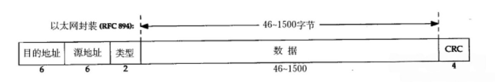
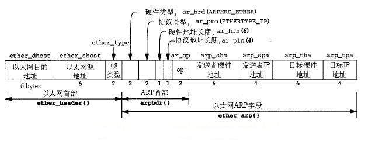

+++
date = 2026-09-08
title = "数据链路层如何完成局域网内的数据交付"
description = ""
slug = ""
authors = []
tags = ["数据链路层", "MAC", "ARP", "以太网"]
series = ["Linux"]
featuredImage = "assets/cover.png"
toc = true
+++

# 数据链路层如何完成局域网内的数据交付

> 原创 于 2026-09-08 13:20:59 发布 · 公开 · 96 阅读 · 4 · 4 · 本内容遵循CC 4.0 BY-SA版权协议 版权声明：本文为博主原创文章，遵循 CC 4.0 BY-SA 版权协议，转载请附上原文出处链接和本声明。 GEO检测 · 编辑
> 文章链接：https://blog.csdn.net/2401_87889177/article/details/163510873

在学习TCP/IP协议时，很多初学者容易产生一个疑问：

> 既然网络层已经有了IP地址，为什么还需要MAC地址？

IP地址可以帮助我们找到目标主机，但是IP协议并不能直接在物理网络中传输数据。

真正负责在一个局域网中传递数据的是数据链路层，而数据链路层的核心就是：

- 使用MAC地址标识设备；

- 将网络层的数据封装成MAC帧；

- 通过交换机等设备完成局域网转发。

因此，理解数据链路层，需要围绕一个核心问题：

> 一个数据包如何从一台主机，通过局域网，最终到达下一跳设备？

---

## 1 以太网为什么需要限制数据帧大小？

早期以太网采用共享通信介质，多个主机连接在同一条链路上。

例如：

```
        共享信道

A -------- B -------- C -------- D
```

多个主机拥有发送数据的权利，但是同一时间只能有一个设备占用信道。

如果两个主机同时发送：

```
A发送数据

B发送数据


        ↓

发生碰撞
```

两个数据都会损坏，需要重新发送。

因此，以太网设计时必须考虑：

> 如何降低碰撞带来的影响？

如果数据帧过大，虽然一次可以传输更多数据，但是发生碰撞时损失非常严重。

例如：

```
发送10000字节

↓

发送过程中发生碰撞

↓

10000字节全部丢弃
```

重新发送的代价非常高。

但是，如果数据帧过小：

```
10000字节

拆成：

1000
1000
1000
...
```

虽然减少了碰撞损失，但是每个帧都需要额外携带：

- MAC头部

- 校验信息

- 帧处理开销

导致大量带宽被用于传输控制信息。

所以，以太网需要在：

```
碰撞损失

和

传输效率
```

之间寻找平衡。

这也是以太网规定最大传输单元（MTU）的原因。

以太网中：

```
MTU = 1500字节
```

并不是一个随意选择的数字，而是在实际通信效率和可靠性之间折中的结果。

---

## 2MAC帧：数据链路层如何封装数据？

网络层产生的是IP数据报：

```
IP数据报
```

但是局域网不能直接传输IP数据报。

数据链路层需要继续封装：

```
IP数据报

↓

MAC帧

↓

物理介质发送
```

一个典型的以太网MAC帧结构：



### 2.1 目的MAC地址和源MAC地址

MAC地址是数据链路层使用的地址。

长度：

```
48bit（6字节）
```

其中：

目的MAC表示：

```
这个帧发送给谁
```

源MAC表示：

```
这个帧来自谁
```

例如：

主机A向主机B发送数据：

```
目的MAC：B

源MAC：A
```

交换机转发数据时，主要依据的就是：

```
目的MAC地址
```

而学习MAC地址表时，依据的是：

```
源MAC地址
```

---

### 2.2类型字段（Type）

MAC帧中的类型字段非常重要。

它告诉接收方：

> 数据部分到底是什么协议的数据。

| 类型码 | 对应协议 |
|:---:|:---:|
| 0x0800 | IPv4 |
| 0x0806 | ARP |
| 0x8035 | RARP |
| 0x86DD | IPv6 |


因此，主机收到MAC帧后：

第一步不是直接处理数据，而是查看：

```
Type字段
```

判断应该交给哪个协议处理。

---

### 2.3 数据字段

数据字段保存上层协议数据。

例如：

一次TCP通信：

```
TCP数据

↓

IP数据报

↓

MAC帧数据字段
```

因此：

MAC帧只是一个包装。

它负责：

```
局域网传输
```

并不关心里面的数据是什么。

---

### 2.4 FCS校验字段

数据在传输过程中可能受到干扰。

例如：

```
发送：

101010


传输过程中：

101110
```

接收方需要判断：

数据是否发生错误。

因此发送方会计算CRC校验值：

```
数据

↓

CRC

↓

写入FCS
```

接收方重新计算：

如果不一致：

说明数据损坏，直接丢弃。

---

## 3 交换机如何让局域网通信更加高效？

如果所有主机仍然共享同一个通信介质：

```
A B C D E
```

那么任何通信都会产生竞争。

例如：

A发送给B：

C、D、E也会受到影响。

交换机的出现解决了这个问题。

交换机本质：

> 根据MAC地址进行转发，并隔离不同端口之间的通信。

---

交换机刚启动时：

不知道任何主机位置。

MAC地址表：

```
空
```

假设：

A发送数据：

```
源MAC=A

目的MAC=B
```

交换机收到后：

首先学习：

```
A在哪个端口
```

例如：

```
A → 端口1
```

但是：

交换机不知道B在哪里。

于是：

向其他端口转发。

之后，如果B回复：

交换机学习：

```
B → 端口2
```

最终形成：

```
MAC地址表：

A  端口1

B  端口2

C  端口3
```

以后：

A发送给B：

交换机直接查询：

```
B → 端口2
```

只发送到对应端口。

因此交换机减少了：

- 无效广播；

- 数据冲突；

- 不必要的数据转发。

---

## 4ARP：为什么需要从IP地址查询MAC地址？

现在考虑一个实际问题。

主机A访问主机B。

应用层只知道：

```
B的IP地址
```

例如：

```
192.168.1.20
```

但是发送MAC帧需要：

```
B的MAC地址
```

问题：

> 已知IP，如何得到MAC？

这就是ARP协议解决的问题。

ARP：

Address Resolution Protocol

作用：

```
IP地址

↓

MAC地址
```

---

## 6 ARP协议工作过程

假设：

A想知道B的MAC地址。

A首先发送ARP请求：

```
目标IP：

192.168.1.20

目标MAC：

未知
```

因为不知道MAC，所以无法单播。

因此：

ARP请求采用广播：

```
目的MAC：

FF:FF:FF:FF:FF:FF
```

局域网所有设备都会收到。

收到后：

其他主机检查：

```
目标IP是不是自己？
```

如果不是：

丢弃。

如果是：

返回ARP响应。

响应内容：

```
192.168.1.20

对应

MAC地址xxxx
```

ARP响应采用单播：

```
发送给请求者A
```

最终：

A获得：

```
IP_B

对应

MAC_B
```

之后即可封装MAC帧发送数据。

---

## 7 ARP报文字段分析

ARP报文结构：

 

### 7.1 硬件类型

表示使用的网络类型。

以太网：

```
1
```

---

### 7.2 协议类型

表示需要解析的网络层协议。

IPv4：

```
0x0800
```

---

### 7.3 地址长度

因为ARP需要同时保存：

MAC地址

和

IP地址

所以需要告诉接收方：

地址分别占多少字节。

以太网：

```
MAC长度=6字节

IPv4长度=4字节
```

---

### 7.4 OP操作字段

这是ARP最关键字段。

```
OP=1
```

表示：

```
ARP请求
```

```
OP=2
```

表示：

```
ARP响应
```

接收到ARP报文时：

首先判断OP字段。

---

### 7.5 发送端和目标地址字段

ARP请求：

发送端：

```
自己的IP+MAC
```

目标：

```
目标IP

目标MAC未知
```

因此：

目标MAC填写：

```
00:00:00:00:00:00
```

ARP响应：

目标MAC已经知道：

填写真实MAC。

---

## 8 总结

一次完整通信过程：


整个过程体现了TCP/IP协议栈不同层次的职责：

```
IP地址：

负责找到目标网络


MAC地址：

负责局域网交付


ARP：

负责连接IP和MAC


交换机：

负责根据MAC完成转发
```

理解这几个概念，才能真正理解后续的：

- 路由器工作原理；

- NAT地址转换；

- TCP/IP完整通信流程。
