+++
date = 2026-04-27
title = "ELF文件深度解析：从结构到动/静态链接的底层原理"
description = ""
slug = ""
authors = []
tags = ["ELF", "动态链接", "程序加载"]
series = ["Linux"]
featuredImage = "assets/cover.png"
toc = true
+++

# ELF文件深度解析：从结构到动/静态链接的底层原理

> 原创 于 2026-04-27 08:00:00 发布 · 公开 · 516 阅读 · 8 · 13 · 本内容遵循CC 4.0 BY-SA版权协议 版权声明：本文为博主原创文章，遵循 CC 4.0 BY-SA 版权协议，转载请附上原文出处链接和本声明。 GEO检测 · 编辑
> 文章链接：https://blog.csdn.net/2401_87889177/article/details/160500982

**文章目录**

[TOC]


## 1、简介ELF文件

上一期 [《静态库与动态库详解：原理、制作与实际应用》](https://blog.csdn.net/2401_87889177/article/details/160476136?spm=1011.2415.3001.5331) 对库的原理进行分析。这一期将探究库的加载。在此之前先认识ELF文件。

[维基百科](https://zh.wikipedia.org/wiki/%E5%8F%AF%E5%9F%B7%E8%A1%8C%E8%88%87%E5%8F%AF%E9%8F%88%E6%8E%A5%E6%A0%BC%E5%BC%8F) 对ELF的解释为：可执行与可链接格式（Executable and Linkable Format）

Linux下，有四类文件属于ELF格式文件：

1. 可重定位文件（xxx.o）

2. 可执行文件

3. 库文件（xxx.a、xxx.so）

4. 内核转储

ELF格式如图，主要由 `ELF header` 、 `Program header table` 、 `Section header table` ，以及中间的多个区域合成 `section（节）` 

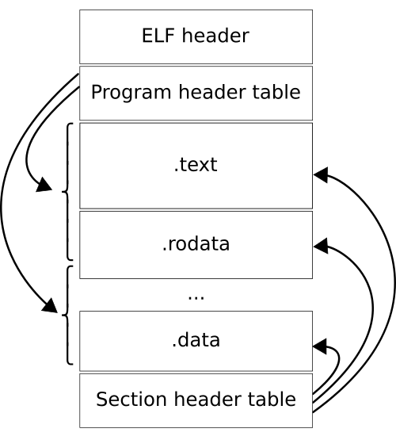

## 2、ELF结构

#### 2.1、ELFHeader

ELF头（ELF header）：记录了用来管理整个ELF的信息，使用 `readedf -h filename` 查看详细信息。

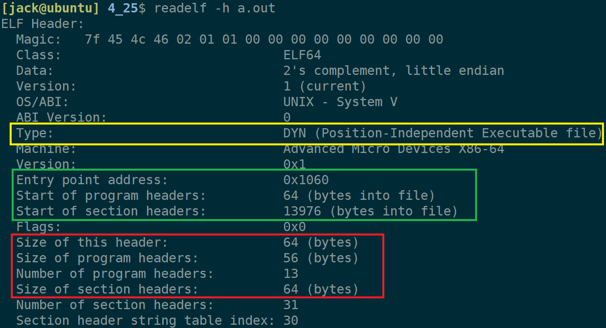

ELF header中记录了非常重要的信息，挑几个来说一说。

黄色部分是更具体的文件类型；

绿色部分是程序开始地址，以及program header和section header在这个ELF中的开始位置。

红色部分记录了各部分的大小。

#### 2.2、Section HeaderTable

节头表(section header table)：对中间各个section（节）的描述。使用 `readedf -S filename` 查看详细信息。

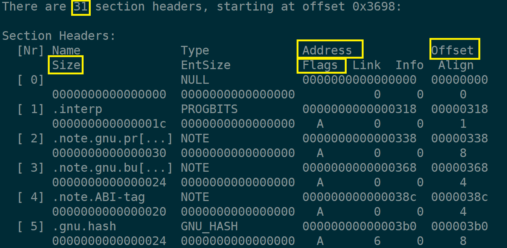

section header table中记录了各个section的详细信息。例如本图中，该elf文件共有31个section。

Size：该section的大小。
Address：被加载到虚拟地址空间的地址。
Offset：在elf文件中各section的位置.
Flags：对应section的权限包括如下图：

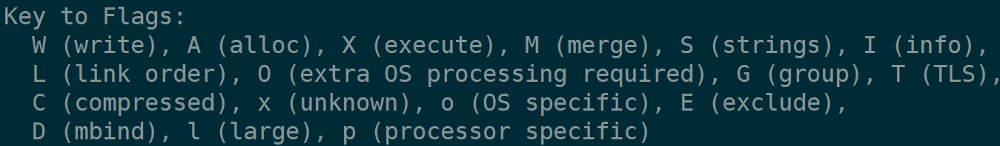

#### 2.3、Program Header Table

程序头表(program header table)：记录了如何加载到虚拟内存中。使用 `readedf -l filename` 查看详细信息。

数据从磁盘到内存，每次加载4kb大小的block。如果逐个加载section，那么至少要加载31次（假设每个section都小于等于4kb）。

操作系统将权限相同的一些section合并在一起成为称为segment（段），然后按段来加载。如图是section到segment的映射。

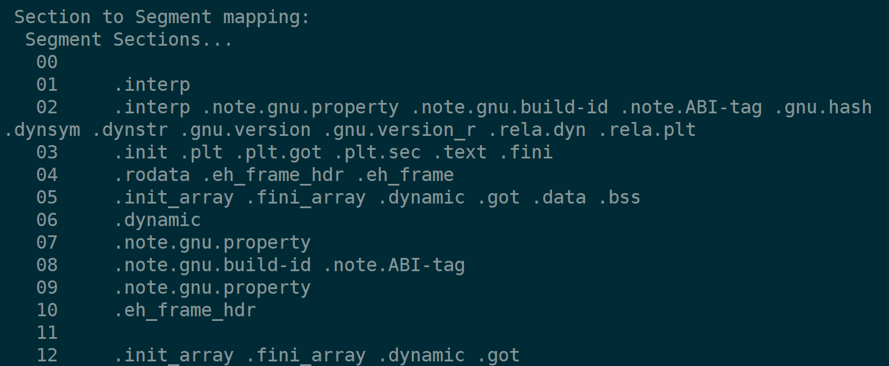

#### 2.4、Section

节(section)：需要运行的程序或者数据。最常见的section有.text、.data。

readelf读不了Section。使用反汇编可以看到相关段的汇编代码：

```bash
objdump -S a.out > hello.s
```

这是在objdump输出内容中截取的一段，可以看到代码段的第一句指令地址和elf中程序的入口地址相等。说明程序就是从这里开始的。

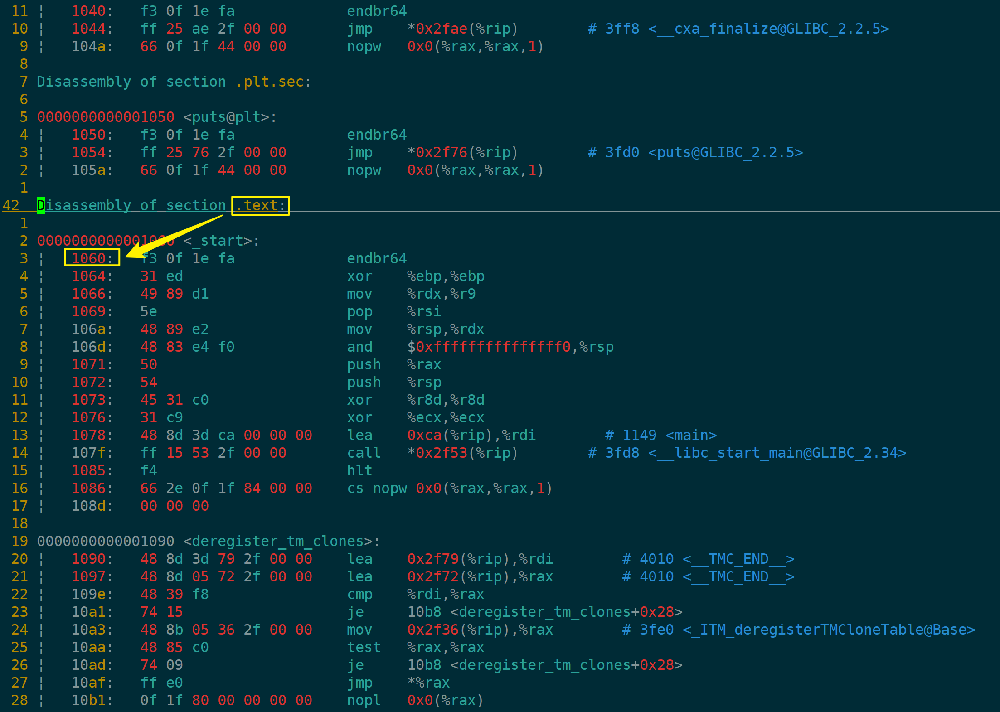

链接过程的一个重要步骤就是合并section。

## 3、再看虚拟地址空间

之前 [《程序眼中的世界：一个由虚拟地址空间构建的幻觉》](https://blog.csdn.net/2401_87889177/article/details/160088809?spm=1011.2415.3001.5331) 一文中简洁了虚拟地址空间，这一次将探究程序是如何加载到虚拟地址空间的。

#### 3.1、程序没有加载，代码数据是否有地址？

在上面谈section那幅图，汇编代码的左边那一排数字就是地址。程序在编译完成代码数据的地址就确定了，这个地址是叫逻辑地址（虚拟地址）。

逻辑地址：在平坦模式下地址的编号。

平坦模式是采用相对地址+偏移量来确定一个具体地址的。现在的电脑的相对地址为0。理论上是编号是从 `0x00000000` 到 `0xffffffff` 。这也就意味着在一个elf中，代码和数据都有唯一的地址。

#### 3.2、程序的加载过程

在加载程序之前会创建内核数据结构，其中，mm_struct是用于管理虚拟地址空间的结构体。其中一部分源代码是：

```c
stuct mm_struct {
	...
	unsigned long total_vm, locked_vm, shared_vm, exec_vm;
	unsigned long stack_vm, reserved_vm, def_flags, nr_ptes;
	unsigned long start_code, end_code, start_data, end_data;
	unsigned long start_brk, brk, start_stack;
	unsigned long arg_start, arg_end, env_start, env_end;
};
```

mm_struct记录的是各个区域开始、结束。该结构体中的变量初始化数据来源于section header table。mm_struct结构体初始化完成后，就认为虚拟地址空间构建好了。

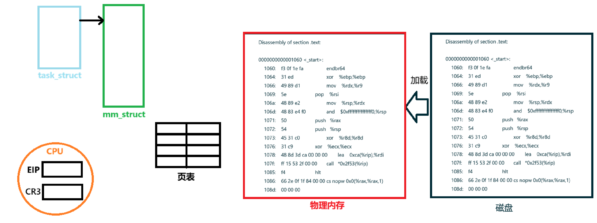

一个程序被加载到内存后，会通过页表在mm_struct和物理内存中建立映射关系，同时CPU中的CR3寄存器会指向页表，EIP（即PC指针）会开始读取程序入口地址的那条语句。

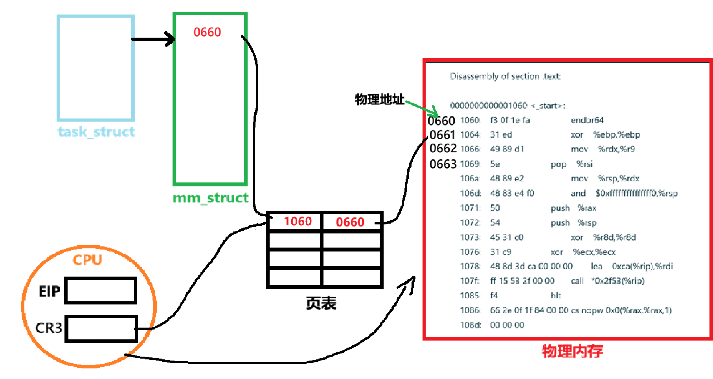

对于CPU，进入CPU的地址都是虚拟地址，CPU通过MMU（Memory Management Unit）将其转换为物理地址（实际就是通过页表得到物理地址的），然后操作物理地址。

**总结：虚拟地址空间是一个数据结构，由mm_struct管理，程序使用虚拟地址，虚拟地址经MMU得到物理地址，CPU实际操作的是物理地址** 。

## 4、静态链接

现有run.c与main.c文件：

```c
// run.c
#include <stdio.h>

void run()
{
    printf("running\n");
}

// main.c
void run();
int main()
{
    run();
    return 0;
}
```

#### 4.1、section合并

使用 `gcc -c *.c` 将两个文件编译成.o文件。

使用 `objdump -d main.o` 查看main.o中具体有哪些二进制指令

```asm
main.o:     file format elf64-x86-64
Disassembly of section .text:

0000000000000000 <main>:
   0:	f3 0f 1e fa          	endbr64
   4:	55                   	push   %rbp
   5:	48 89 e5             	mov    %rsp,%rbp
   8:	b8 00 00 00 00       	mov    $0x0,%eax
   d:	e8 00 00 00 00       	call   12 <main+0x12>
  12:	b8 00 00 00 00       	mov    $0x0,%eax
  17:	5d                   	pop    %rbp
  18:	c3                   	ret
```

使用 `objdump -d run.o` 查看run.o

```asm
run.o:     file format elf64-x86-64
Disassembly of section .text:

0000000000000000 <run>:
   0:	f3 0f 1e fa          	endbr64
   4:	55                   	push   %rbp
   5:	48 89 e5             	mov    %rsp,%rbp
   8:	48 8d 05 00 00 00 00 	lea    0x0(%rip),%rax        # f <run+0xf>
   f:	48 89 c7             	mov    %rax,%rdi
  12:	e8 00 00 00 00       	call   17 <run+0x17>
  17:	90                   	nop
  18:	5d                   	pop    %rbp
  19:	c3                   	ret
```

这显示的是两个文件的汇编，使用 `gcc *.o -o main` 编译链接在一起，然后查看汇编 `objdump -d main > main.s` ：

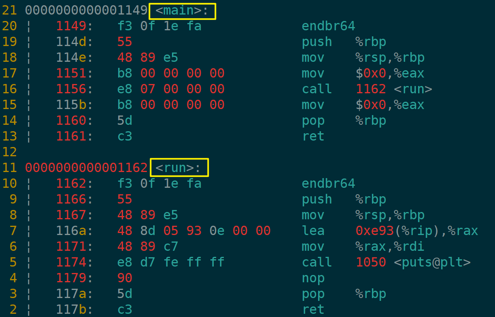

两个文件中内容都合并到一起了，并且都是.text节合并到.text。因此，得出结论，静态链接要做的一件事是合并section，然后调整 `ELF header` 、 `program header table` 、 `section table` 内容，因为这些都是管理或者记录了section信息的。

#### 4.2、地址重定位

CPU能够直接执行的都是二进制指令，通过将二进制指令组合能完成复杂的任务。这些二进制指令又叫指令集。如英特尔系列CPU的指令集中 `e8 xx xx xx xx` 表示调用xx xx xx xx地址处函数。

在main.o的反汇编中可以看到e8调用函数的地址为00 00 00 00，这里本来应该调用run函数。这是因为在编译阶段找不到run函数的符号，编译器会先填充0。（符号是用来标识变量名、程序名等的名字。这个符号的命名规则规定了函数怎么命名，不同变量类型怎么命名。）

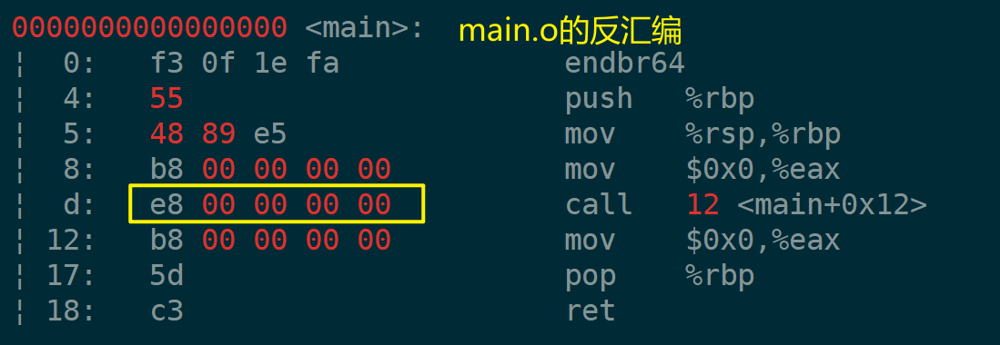

使用 `readelf -s filename` 可查看符号表，这是main.o的符号表：

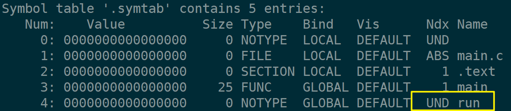

最后一个符号run显示的是UND（undefine未定义），说明run这个符号在该文件中只有声明。所以在反汇编中看见的是 `e8 00 00 00 00` 。在链接阶段section合并后，使用平坦模式对所有指令数据重写分配地址，然后由链接器在全局中寻址run是否有定义，若存在则修正e8后面的地址，否则报错符号未定义。

静态库本质就是多个.o的集合，静态链接静态库时，本质就是上面的过程。

## 5、动态链接

#### 5.1、什么是动态链接器

一个进程被创建一定要先创建内核数据结构，然后是先加载程序自己的代码和数据，还是加载动态库呢？

`_start` 是一个符号函数，是程序的入口函数，会在main函数调用之前一档会被调用。

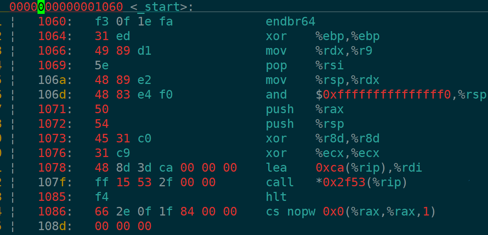

使用ldd查看一个可执行文件发现绝大多数都依赖于一个动态库 `/lib64/ld-linux-x86-64.so.2` ，这其实是一个动态链接器，在调用_start之前，需要动态链接器完成一些工作。

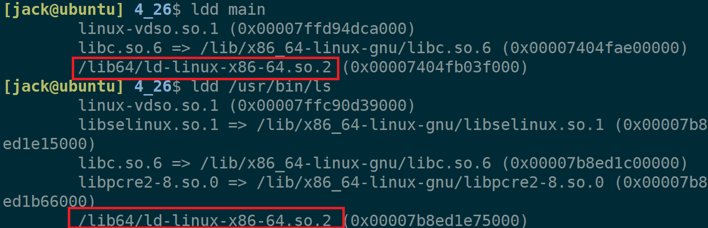

#### 5.2、程序加载过程

一个程序被加载，需要经过如下步骤：

1. 一定要先创建内核数据结构（PCB、虚拟地址空间等）。

2. 路径解析，通过inode在磁盘上找到elf文件。

3. elf解析（读取elf header、program header）。

4. 将.text、.data、.bss段从文件映射到虚拟地址空间（还在磁盘，惰性加载）。

5. 虚拟地址空间中映射动态库（还在磁盘，惰性加载）。

6. 对动态库重定位、符号解析。

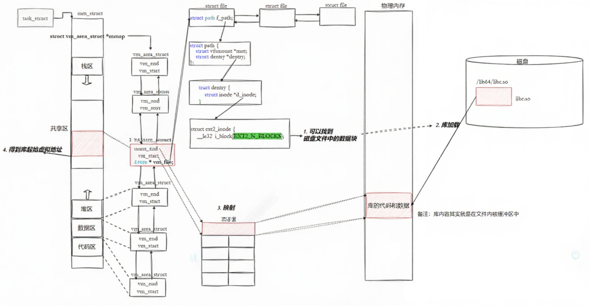

在第三个步骤就会确定动态库大小，并在虚拟地址空间中开辟好大小，动态库在虚拟地址空间中的地址就确定了，假设动态库开始地址位于虚拟地址空间0x00004f7d。

动态库是一个elf文件，因此它也是遵循平坦模式编址。动态库中每一个函数都有相对文件开始的地址。假设C标准库中puts函数的地址是0x0000005f。

平坦模式的相对地址就是 `0x00304f7d` ，偏移量就是 `0x0000005f` 。那么标准库中puts函数就可以确定在虚拟地址空间为 `0x00304f7d + 0x0000005f` 。

讲动态库加载到物理内存中一样，只要记住动态库开始的相对的物理地址，就能通过加上偏移量确定具体的物理地址了。


假设有A，B两个程序都需要用到一个动态库，A程序先运行，A就执行上面的6个步骤；然后B运行，发现物理内存中已经加载了动态库，那么它只需要通过页表将虚拟地址空间中的共享区与动态库做映射就行了。因此，动态库又叫共享库。

**动态链接的本质就是把链接阶段推迟到加载程序时！** 

#### 5.3、GOT表与PLT技术

程序加载到虚拟内存中，被放到.text区，根据常识——.text区为只读区域。无法在.text区中进行符号重定向！

调用动态库函数puts时，会调用 `puts@plt` ，会让plt去got表中查找puts的真实地址。如果不存在就让链接器填写真实地址（got表在链接时就确定了，在运行时填写），如果存在则直接跳转到只是地址。程序实现通过got访问动态库函数。

got表存在实现了动态库地址与程序代码的解耦，因此，动态库中的指令码又叫做位置无关码。

## 6、总结

1. ELF结构：ELF头（管理文件信息）、节头表（描述各节）、程序头表（直到段的加载），常见的节有.text、.data。

2. 虚拟地址空间：编译后程序分配的逻辑地址空间；使用mm_struct描述管理，通过页表映射到物理内存，CPU通过MMU得到物理地址。

3. 静态链接：合并相同节、重定位符号地址。

4. 动态链接：有动态链接器在程序加载时完成符号解析与重定位。采用GOT/PLT实现位置无关码。动态库可多进程共享物理内存。
