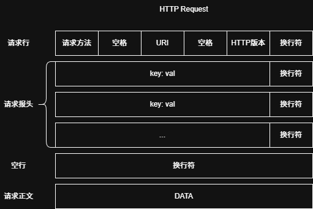
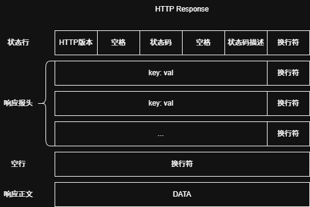
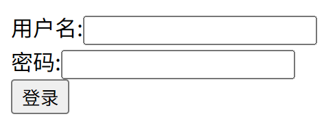
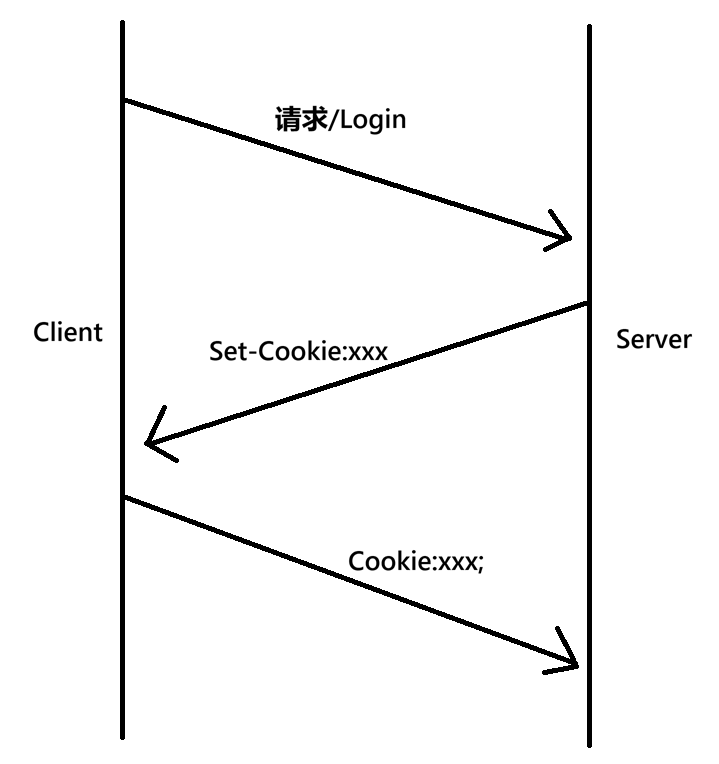

+++
date = 2026-07-21
title = "HTTP请求响应解析及C++实现静态与动态服务"
description = ""
slug = ""
authors = []
tags = ["HTTP", "C++", "Cookie", "Session"]
series = ["Linux网络编程"]
featuredImage = "assets/cover.png"
toc = true
+++


> 原创 于 2026-07-21 15:27:38 发布 · 公开 · 359 阅读 · 10 · 2 · 本内容遵循CC 4.0 BY-SA版权协议 版权声明：本文为博主原创文章，遵循 CC 4.0 BY-SA 版权协议，转载请附上原文出处链接和本声明。 GEO检测 · 编辑
> 文章链接：https://blog.csdn.net/2401_87889177/article/details/162814930

## 1HTTP原理

### 1.1 IP、域名、URL 与 URI

一个公网 IP 能在全球唯一地标识一台主机，域名的功能约等于 IP。域名更适合人类阅读。在访问网站时，计算机会先去 DNS服务器解析域名，得到目标服务器的 IP，然后使用 IP 访问网站。

URL（UniformResource Locator）俗称网址，用于表示某资源的链接。URI（Uniform Resource Identifier）用于标识某资源的唯一性。URL 是 URI 的一个子集。

```
http://example.com:80/a/b/c/index.html
```

包含：

- 协议 `http` 。

- 分隔符 `://` ，用于分隔协议与域名。

- 域名 `example.com` ，也可以写 IP 地址。

- 分隔符 `:` ，分隔域名与端口号，HTTP 默认端口号为 80，HTTPS 默认端口号为 443。

- 带层次的文件路径 `/a/b/c/index.html` 。第一个 `/` 为 Web 根路径。

### 1.2 HTTP本质

HTTP(HyperText Transfer Protocol)：超文本传输协议，不仅可以传输文本，图片、视频、音频等都可以传输。

现代网站网页都是用htlm、css、javascript写的。用户看到的都是前端页面，这些页面来源于服务器。HTTP的传输层协议是TCP，原理就是发送文件内容。域名加端口确定全球唯一一台主机中唯一一个进程。HTTP本质就是客户端和服务端两个进程间通信。

HTTP是一个非常成熟的协议。我们只需要写服务端。可以用telnet做测试，用浏览器做客户端。现在的浏览器已经非常强大了，即便我们的客户端优点瑕疵，浏览器也能处理。

---



HTTP 请求由图中所示组成，图中虽然是5行，但是是一个包含多个 `\r\n` 的字符串。请求本质上是一串字节（Byte Sequence），而不是字符串。字符串只是其中一种解释方式。

其浏览器默认为字符串，通过 `Content-Type` 解释请求正文的文件类型。

---



HTTP 响应参照请求。

## 2 静态HTTP网站

### 2.1 请求

```cpp
class Request
{
    bool ParseRequestLine(std::string& httpstr);
    bool ParseHeaderKV(std::string& httpstr);
    bool ParseText(std::string& httpstr) ;
public:
    bool Deserialize(std::string& httpstr)
    {
        // 1. 解析请求行
        bool n = ParseRequestLine(httpstr);
        if(!n) return false;
        
        // 2. 解析请求报头
        n = ParseHeaderKV(httpstr);
        if(!n) return false;

        // 3. 解析空行
        _blank = "";

        // 4. 解析正文
        n = ParseText(httpstr);
        if(!n) return false;
        return true;
    }
private:
    std::string _method;
    std::string _uri;
    std::string _version;
    std::unordered_map<std::string, std::string> _headers;
    std::string _blank;
    std::string _body;
};
```

该类能够反序列化一个请求。该类的主要实现方法都是字符串操作，需要注意 `find` 和 `substr` 的下标问题。

其中，uri是web根目录，需要手动拼接到本地服务器中的目录。

### 2.2 响应

```cpp
class Response
{
public:
    Response(const std::string& version = defaultversion)
        :_version(version)
        ,_code("0")
        ,_code_desc("")
        ,_blank("")
    {  }

    void SetCode(int code)
    {
        _code = std::to_string(code); 
        _code_desc = GetCodeDesc(code);
    }

    void AddHead(const std::string& key, const std::string& val)
    {
        _headers.emplace(key, val);
    }

    void SetBody(const std::string& content)
    {
        _body = content;
    }

    std::string Serialize()
    {
        std::string ret =_version + spacesep + _code + spacesep + _code_desc + linesep;
        for(auto& [k, v] : _headers)
        {
            ret += k + headersep + v + linesep;
        }
        ret += _blank + linesep;
        ret += _body;

#ifdef __DEBUG__
        std::cout << "=============================" << std::endl;
        std::cout << ret << std::endl;
#endif

        return ret;
    }

private:
    std::string _version;
    std::string _code;
    std::string _code_desc;
    std::unordered_map<std::string, std::string> _headers;
    std::string _blank;
    std::string _body;
};
```

#### 2.2.1 状态码

状态码是给计算机看的，相应的状态码描述是给人看的，按照数字开头可以分为：

| 状态码段 | 大类名称 | 核心说明 |
|:---:|:---:|:---:|
| 1xx | 信息响应 | 服务器已接收请求头，等待客户端继续发送请求体，极少出现 |
| 2xx | 请求成功 | 服务器成功接收并处理完本次请求，正常返回数据 |
| 3xx | 重定向 | 资源地址变更，需要浏览器跳转至新地址访问 |
| 4xx | 客户端错误 | 客户端请求存在问题（参数、权限、地址、请求方式等） |
| 5xx | 服务端错误 | 服务器/网关/后端服务故障，无法正常处理请求 |


常用的HTTP状态码、对应描述以及说明：

| 状态码 | 英文描述 | 含义说明 |
|:---:|:---:|:---:|
| 200 | OK | 请求成功，服务器正常返回数据 |
| 300 | Multiple Choices | 存在多个可选资源，需手动选择跳转目标 |
| 301 | Moved Permanently | 资源永久重定向，后续请求应使用新地址 |
| 302 | Found | 临时重定向，本次访问跳转到新地址，下次仍用原地址 |
| 400 | Bad Request | 客户端请求格式错误，参数、报文不合法 |
| 401 | Unauthorized | 未登录/无身份凭证，需要认证后访问 |
| 403 | Forbidden | 已登录，但权限不足，禁止访问该资源 |
| 404 | Not Found | 请求的资源不存在，URL地址错误 |
| 405 | Method Not Allowed | 请求方法不允许（如GET访问仅支持POST的接口） |
| 408 | Request Timeout | 请求超时，客户端长时间未发送完整报文 |
| 429 | Too Many Requests | 请求频率过高，触发限流，稍后再试 |
| 500 | Internal Server Error | 服务器内部代码异常，服务运行出错 |
| 502 | Bad Gateway | 网关/反向代理无法连接后端业务服务 |
| 503 | Service Unavailable | 服务不可用，服务器过载、停机或维护中 |
| 504 | Gateway Timeout | 网关超时，后端服务处理请求过久无响应 |


其中302是临时重定向， 不改变浏览器跳转规则，没有访问依旧是访问原地址。例如访问 `http://example.com/user/profile` ，返回302，跳转至 `http://example.com/login` 。也用于跳转404页面。

301是永久重定向，浏览器缓存新地址，下次直接跳转新地址。常用于域名迁移。例如 `https://twitter.com` 迁移到 `https://x.com` 后，一次访问twitter.com后，下次访问直接访问x.com。

#### 2.2.2 报头

请求常用报头：

| 报头名称 | 使用场景 | 示例值 |
|:---:|:---:|:---:|
| `Host` | HTTP/1.1 协议要求，指定目标服务器域名和端口 | `Host: www.example.com:8080` |
| `Content-Type` | 标明请求体的媒体类型 | `Content-Type: application/json` |
| `Content-Length` | 指明请求体的字节长度 | `Content-Length: 348` |
| `User-Agent` | 标识客户端类型（浏览器、操作系统、设备） | `User-Agent: Mozilla/5.0 (Windows NT 10.0; Win64; x64) AppleWebKit/537.36` |
| `Referer` | 记录上一个页面，常用于广告计费、拦截外部访问内部资源 | `Referer: google.com` |


响应常用报头：

| 报头名称 | 使用场景 | 示例值 |
|:---:|:---:|:---:|
| `Content-Type` | 告知客户端响应体的媒体类型及字符集 | `Content-Type: application/json; charset=utf-8` |
| `Content-Length` | 响应体字节长度（便于客户端判断传输完成） | `Content-Length: 1024` |
| `Location` | 配合 3xx 状态码，指定跳转目标 URL | `Location: https://www.example.com/dashboard` |
| `Connection` | 告诉客户端是否长连接 | `keep-alive` / `close` |


注意：HTTP/1.0中，Connection默认为close，HTTP/1.1中默认为keep-alive。

## 3 动态HTTP网站

### 3.1 认识GET和POST

html中表单示例：

```html
 <form action="/Login" method="post">
     用户名:<input type="text" name="username" required><br>
     密码:<input type="password" name="pwd" required><br>
     <input type="submit" value="登录">
 </form>
```

`ip:port/login.html` 效果如图：



当用户填写表单并提交时，浏览器根据表单内容向服务器发送带参请求。

根据参数位置不同，分为 `GET` 和 `POST` 方法。

- `GET` 传参：参数位置在URI，其URI格式为： `/service?key1=val1&key2=val2` .

- `POST` 传参：参数位置在Body，其URI格式为： `/service` ，其Body格式为： `key1=val1&key2=val2` 。

GET和POST方法都能传参，GET参数有字数限制，并且参数会回显到浏览器地址栏。POST的私密性更好，只会回显服务，不会显示参数。

**注意** ：私密性不等于安全性！HTTP为无加密传输，没有安全保证。

### 3.2 GET POST解析

```cpp
bool ParseText(std::string& httpstr) 
{
    if(strcasecmp(_method.c_str(), "GET") == 0)
    {
        size_t pos = _uri.find(argsep);
        if(pos == std::string::npos)
        {
            // GET请求资源
            _body = "";
            return true;
        }
        else
        {
            // GET请求服务
            _body = _uri.substr(pos + argsep.size());
            _uri = _uri.substr(0, pos);
            return true;
        }
    }
    else
    {
        // POST请求服务
        auto it = _headers.find("Content-Length");
        if(it == _headers.end())
        {
            _body = "";
            return true;
        }

        size_t size = std::stoi(_headers["Content-Length"]);
        _body = httpstr.substr(0, size);
        httpstr.erase(0, size);
        return true;
    }
}
```

解析正文就变成了这样，主要操作还是字符串分割。一般的GET/POST带参请求，都是请求服务相关。

在反序列化完成后，应判断是否请求为服务。若不是服务正常处理，否则回调服务处理。

参数传递的方式，使HTTP走出浏览器，可以给外部提供 `Rustful` 风格的服务。

### 3.3 会话保持

#### 3.3.1Cookie

HTTP是一个在应用层无连接的的协议，当客户端请求VIP资源时，服务端会检查用户登录状态。

为了让客户端长周期保持登录状态，客户端在用户端第一次登录时的响应中添加报头 `Set-Cookie: key1=val1; key2=val2` 。浏览器将Cookie信息自动保存在本地，下次访问自动带上Cookie报头。



很多盗号行为就是因为Cookie泄露导致的。

这种老式Cookie已经很少用了。

#### 3.3.2 Cookie +Session

现代服务器常用方式是Cookie+Session。

与上面不同的是，服务器将用户信息存在服务器上（常用Redis）。服务器返回报头中不是用户信息，而是一个session-id，下一次客户端访问服务器，带上这个Cookie内容为session-id，服务器根据session-id找到用户信息。然后提供资源或者服务。

这种方式解决了用户信息泄露问题，但是没有彻底解决冒充用户信息问题。这一点是HTTP的痛点，但是主动权是在服务端的，服务端随时可以让session-id失效。

安全性需要更高层服务解决。例如QQ中有200个好友，其中常聊的只有20个，某一天QQ检测到用户给所有人都发了一条信息，然后异常提示，强制身份认证。

## 4 总结

本文源码已上传至【gitee： [https://gitee.com/muyi-2580/learning-linux/tree/main/7_10](https://gitee.com/muyi-2580/learning-linux/tree/main/7_10) 】。

本文从 HTTP 基本原理出发，介绍了静态网站与动态网站的核心实现。静态网站通过解析请求行、报头与正文，构建请求与响应对象，并利用状态码和报头完成通信。动态网站则通过 GET/POST 方法传递参数，实现服务端业务逻辑，并借助 Cookie 与 Session 机制维持用户会话状态。理解这些底层机制，有助于更好地构建和调试现代 Web 应用。