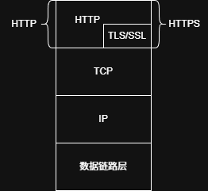
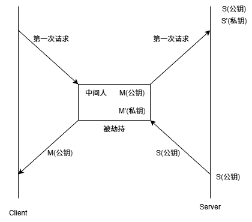
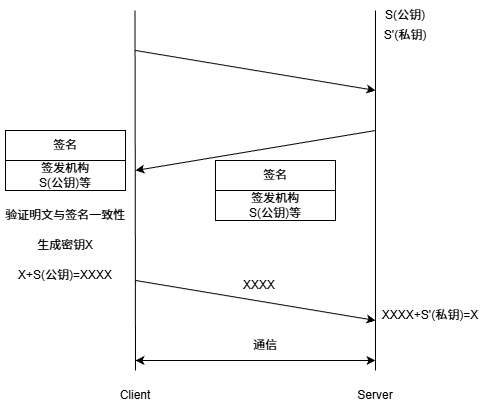

+++
date = 2026-07-21
title = "HTTPS凭什么可信？"
description = ""
slug = ""
authors = []
tags = ["HTTPS", "加密", "CA证书", "中间人攻击"]
series = ["Linux"]
featuredImage = "assets/cover.png"
toc = true
+++

# HTTPS凭什么可信？

> 原创 于 2026-07-21 15:30:40 发布 · 公开 · 308 阅读 · 10 · 5 · 本内容遵循CC 4.0 BY-SA版权协议 版权声明：本文为博主原创文章，遵循 CC 4.0 BY-SA 版权协议，转载请附上原文出处链接和本声明。 GEO检测 · 编辑
> 文章链接：https://blog.csdn.net/2401_87889177/article/details/162978059

**文章目录**

[TOC]

## 1 基础概念

Q：什么是加密、解密？
A：加密就是把明文进行一系列转化，生成密文；解密就是把密文进行一系列转化，生成明文 。

F：为什么要加密？
A：HTTP协议是明文传输，并不安全。

F：不加密有哪些安全问题？
A：1. 被抓包后信息泄露；2. 存在中间人，运营商劫持。

F：常见的加密方式有？
A：1. 对称加密：加密、解密用同一个密钥；2. 非对称加密：公钥和密钥（算法更复杂、速度更慢、更安全）。

F：什么是数据摘要（数据指纹）？
A：将文件内容按照一定哈希算法得出的一个固定长度的字符串。能够表示文件的唯一性。哈希碰撞概率极低，可以忽略。注：数据摘要严格不算加密（因为没有解密过程）。

F：数据摘要有啥用？
A：对比文件是否被修改（篡改）。云盘服务商常用。数据库存储敏感信息（如密码）。

F：HTTPS与 HTTP 有啥区别？
A：见下图：

## 2 四种加密方式

### 2.1 只使用对称加密

对称加密采用同一个密钥加密、解密，效率不错，但是密钥传输的过程不安全。这成了一个鸡生蛋、蛋生鸡的问题。

### 2.2 只使用非对称加密

这个方案貌似解决了 `Client => Server` 的单方向通信，但依旧存在问题。其特点是非对称加密速度慢。

### 2.3 双方都使用非对称加密

这个方案貌似也解决了双方的通信问题。但其效率底下。

### 2.4 非对称加密+对称加密

这个方案在密钥协商时使用非对称加密，后续通信使用对称加密。效率不错，貌似没有问题。

### 2.5 中间人攻击

方案二、三、四有一个共同点，都涉及到公钥传输。公钥在互联网中传输就可能被中间人劫持、篡改。

公钥一旦被中间人劫持，中间人生成自己的密钥对，并给客户端发送中间人的公钥。后续客户端用中间人公钥加密，只能由中间人解密（数据被劫持），中间人转发数据（可能被篡改）给服务器。

现在本质问题变成了，如何让公钥安全发送到对方，如何证明公钥没有被篡改过。

## 3 CA 证书与 HTTPS 原理

原始数据经过散列函数（数据摘要）得到字符串，字符串经过私钥加密（签名）得到证书。

证书得到签名后可以确保数据不会被修改，客户端只需要做一次明文信息通过（相同的）散列函数计算得到的散列值和证书中的散列值对比，就能验证是否合法。

CA证书是CA机构或者其授权的权威机构颁发的。CA证书包括签发机构、域名、申请该证书的服务器信息的公钥等明文信息和这些信息的摘要签名。

浏览器中内置了CA机构的公钥，而CA机构私钥只有一份，由CA机构保管，申请到的CA证书内容由CA私钥加密，只有CA公钥能够解密。中间人没有CA私钥，无法伪朝CA证书。

HTTPS的过程就变成了这样：

客户端通过证书获得服务端公钥，然后生成密钥。这个密钥用服务端的公钥加密，就只能由服务端解密，后续的数据通过这个密钥的对称加密通信。

## 4 总结

HTTPS 的核心在于用非对称加密安全地传递对称加密密钥，兼顾安全与效率。

关键链路：

- CA 证书解决了公钥可信问题——浏览器内置 CA 公钥，校验服务端证书签名，防止中间人伪造。

- 握手阶段使用非对称加密（RSA/ECDHE）协商会话密钥。

- 通信阶段改用对称加密（AES）加解密数据，速度快。

一句话：HTTPS = HTTP + TLS/SSL，在应用层与传输层之间加了一层安全协议，保证了数据的机密性、完整性和身份认证。