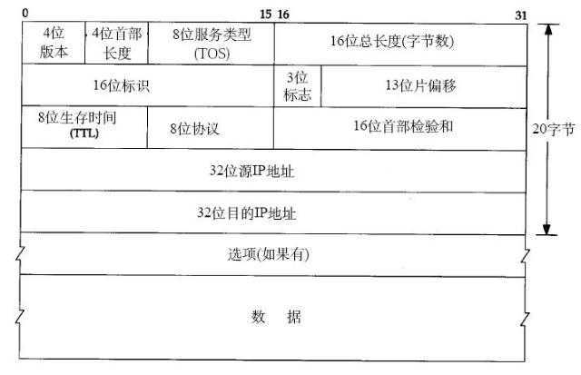
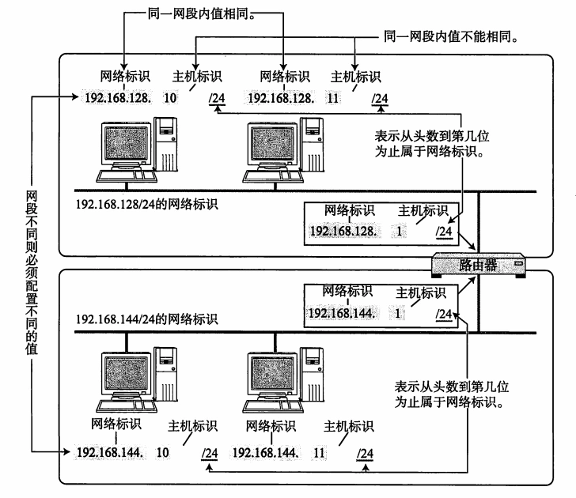
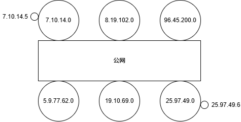
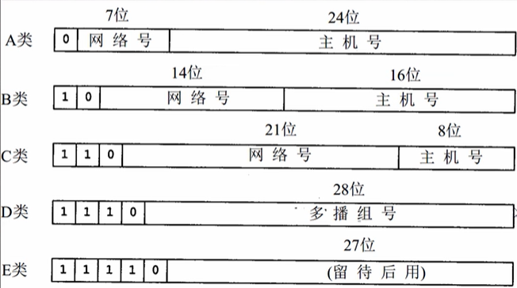
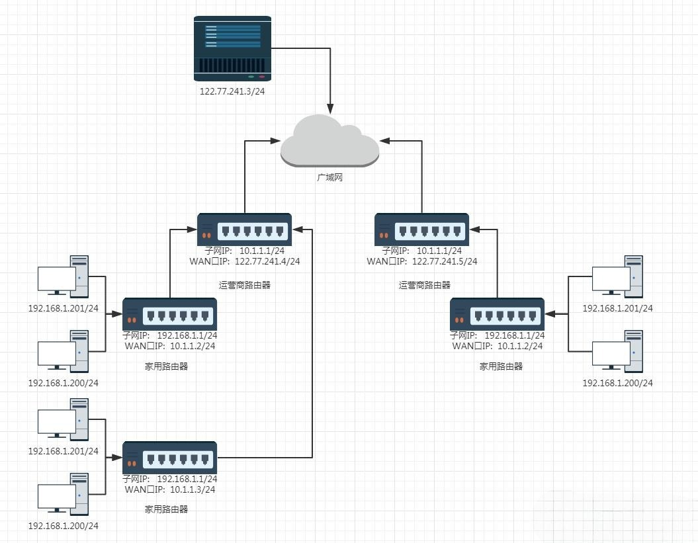
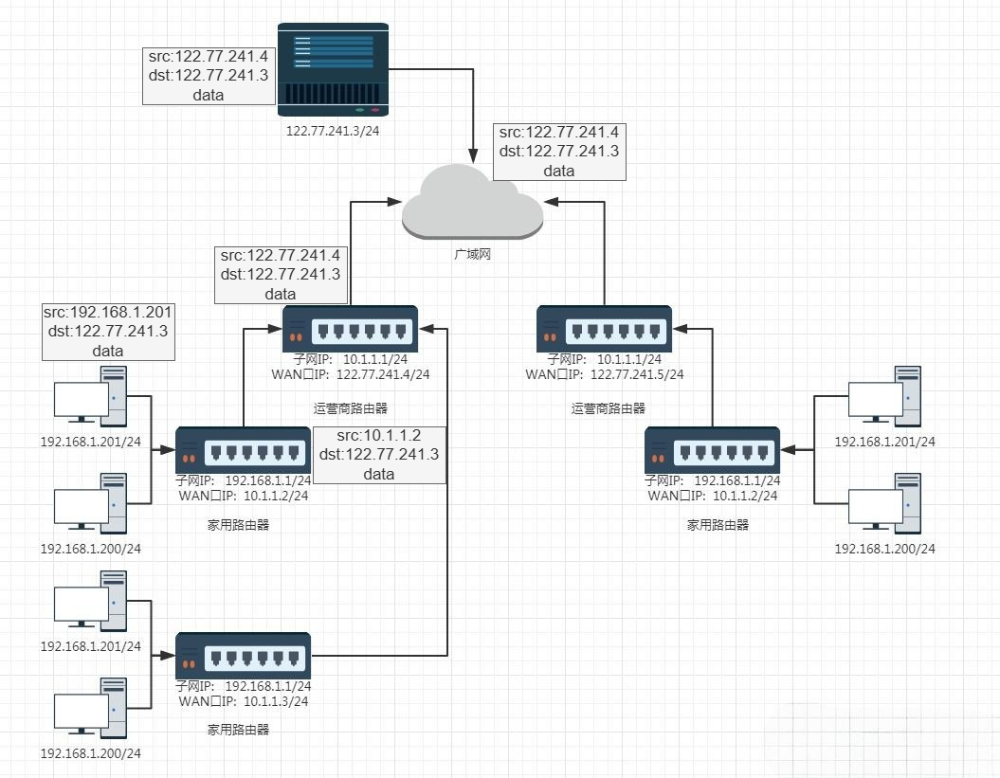
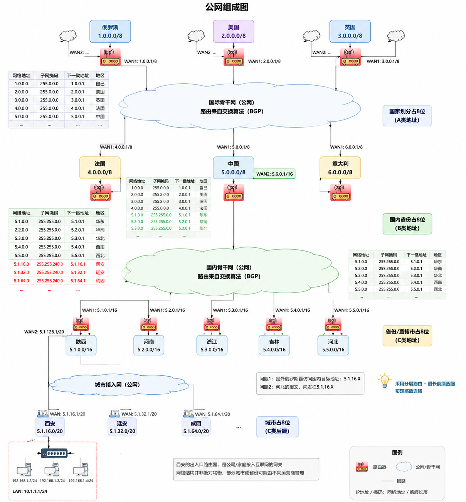
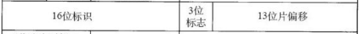
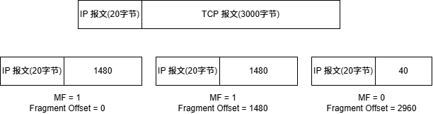

+++
date = 2026-08-23
title = "IP 协议是如何把数据包送达目的地的"
description = ""
slug = ""
authors = []
tags = ["IP分片", "路由", "子网掩码", "MTU"]
series = ["Linux"]
featuredImage = "assets/cover.png"
toc = true
+++

# IP 协议是如何把数据包送达目的地的

> 原创 于 2026-08-23 21:58:03 发布 · 公开 · 275 阅读 · 3 · 5 · 本内容遵循CC 4.0 BY-SA版权协议 版权声明：本文为博主原创文章，遵循 CC 4.0 BY-SA 版权协议，转载请附上原文出处链接和本声明。 GEO检测 · 编辑
> 文章链接：https://blog.csdn.net/2401_87889177/article/details/163332931

**文章目录**

[TOC]


## 1IP协议头格式



IPv4版本为4，总共32位长度。IPv6版本为6，总共128位长度。

4位首部长度与TCP首部长度一样，为IP报头长度，单位是4字节，IP报头长度为20~60字节。解决分离报头、有效载荷问题。

8位服务类型(TOS)：
以前的TOS，前3位为优先级；中间4位表示以什么样的方式传输，分别为希望低延迟、希望高速传输、希望可靠、希望低费用（四者冲突、只能选一个）；后1位保留。

现在的TOS，前6位表示DSCP，允许网络路由器根据流量类型（如语音、视频或普通数据）进行分类和优先级排序；后2位为ECN，用来通知发送方“网络拥塞了，但不用丢包”的一种机制。

8位生存时间(Time To Live，TTL)，是限制数据报在网络中经历的最多路由器数量，限制数据报在网络中无限循环。是为了防止下图所示的情况。



8位协议，被填写为上层协议号，解决分用，向上交付的问题。

16为首部校验和，校验数据报是否损坏。

数据为 TCP/UDP 报文。

IP与TCP的关系：TCP是控制传输策略的，什么时候传？丢包了怎么办？IP 的能力是尽可能的将报文传输到目标主机。

## 2 原理

### 2.1 网段概念



路由器工作在网络层（管理 Web 界面只是附加应用层功能）。路由器的一大功能是组建子网，由于路由器有多个网卡，所以可以同时存在多个子网当中。

IP 地址中可以划分为网络号与主机号。如上图中路由器同时存在于两个网段，其网络号分别是 `192.168.128.0` 和 `192.168.144.0` 。主机号就是用于同一子网中识别不同主机的主机标识。

IP 功能的本质是搜索目标到主机，搜索的本质是淘汰。

如果主机7.10.14.5需要将数据报跨网络传输到25.97.49.6。7.10.14.5主机能够判断目标主机一定不在本网段（淘汰了一个网段的主机），源主机将数据报交给本网段路由器，本网段路由器通过公网将数据报交给25.97.49.0网段的路由器（淘汰了其他网段的主机），由网段路由器通过主机识别号交给目标主机（淘汰了网段内其他主机）。

这是一个高效的搜索算法。



### 2.2 网段划分

#### 2.2.1 分类划分法



IP被分为网络号和主机号，分类划分法是早期提出的 IP 分类方法。

分类划分法根据开头的不同比特位将 IP 划分为5类，每类中的网络号与主机号数量不同。

A 类 IP 中网络号只有 $\text{2}^\text{7}$ 个，但是主机号有 $\text{2}^\text{24}$ 个。这就意味着可以组建126个子网，子网中可以有约1600万台主机。如果某一机构申请到了该类IP，其主机号可能被大量浪费。

#### 2.2.2子网掩码划分

在 IPv4 中，子网掩码是一个32位的数字，前面要求全是连续的1，后面全是连续的0。

例如， `11111111 11111111 11111111 00000000` ，也可以简写为 `/24` ，表示前面有24个1的子网掩码。

子网掩码与 IP 按位与操作得出网络号，剩下的位就是主机号。

例如：
现有 IP 为 `10.24.67.241` ，子网掩码为 `255.255.224.0` 的机器。
换算成二进制，IP： `00001010 00011000 01000011 11110001` ，Subnet Mask： `11111111 11111111 11111111 11100000` 。
两者按位与得出网络号 `00001010 00011000 01000011 11100000` 即 `10.24.67.224` ；IP与取反子网掩码按位与得出主机号为 `00000000 00000000 00000000 00010001` 即 `17` 。

该网段中 IP 主机号范围为 `00000` 到 `11111` ，共有 32 个IP地址，但是全0被用于网络号，全1被用于广播地址。所以，该网段最多有30台主机。

### 2.3 小结

**特殊 IP** 
将IP地址中的主机地址全部设为0, 就成为了网络号, 代表这个局域网；
将IP地址中的主机地址全部设为1, 就成为了广播地址, 用于给同一个链路中相互连接的所有主机发送数据包。
127.*的IP地址用于本机环回(loop back)测试,通常是127.0.0.1​。

**网段划分** 
网段划分（即子网划分）则是实现高效路由的关键——通过将 IP 地址拆分为网络号和主机号，路由器可以依据网络号快速“淘汰”不可能的目标网段，从而将搜索范围逐步缩小，最终精确交付到目标主机。

早期的分类划分法（A/B/C/D/E类）结构清晰、实现简单，但存在明显的地址浪费问题，尤其是A类网络主机数过多，而C类网络数量又受限；子网掩码划分法通过灵活的掩码长度（如 /24、/16 等）打破了固定分类的限制，允许网络管理员根据实际需求任意切割地址空间，大大提高了 IPv4 地址的利用率。

**IP 数量限制** 
IP 数量有限，而且有用，它就是资源。为了缓解 IP 的不够用问题，采取了这些措施：

- 动态分配IP地址：接入网络的设备会获取 IP 地址，同一 MAC 设备连上网 IP 不同。

- NAT技术。

- IPv6：与 IPv4不兼容，用128位表示一个 IP 地址。

## 3 路由器与运营商

### 3.1 路由器

路由器是工作在网络层的核心设备，它的本质是一台专门用于路径选择和数据转发的专用计算机，即 **路由** 。它在 IP 网络中扮演以下关键角色：

1. 跨网络通信

路由器最基础的功能是连接不同的子网。当一台主机发现目标 IP 不属于本网段时，会将数据报交给默认网关（即路由器）。路由器负责将数据报从一个子网“搬运”到另一个子网，因此可以说，没有路由器，子网之间就是信息孤岛。

2. 数据报的“导航员”

路由器内部维护着一张路由表（Routing Table），表中记录了到达各个目标网络的“下一跳”地址。

### 3.2 运营商

每个国家地区内部的网络物理线路，路由器等基础设施都是运营商建立的。国内三大运营商：电信、移动、联通。负责管理、维护网络线路。

1. 基础设施的“建设者”

运营商负责铺设光纤、建设基站、部署机房，构建了从接入网（“最后一公里”）到城域网，再到骨干网的物理链路。IP 数据报本质上是电磁信号在光纤和无线频谱中的传播，而运营商提供了这些物理介质。

2. 自治系统的“运营者”
互联网并非铁板一块，而是由成千上万个自治系统（AS，AutonomousSystem） 组成的。每个运营商都是一个独立的自治系统（如中国电信、中国联通）。运营商负责管理自己 AS 内部的所有路由器、链路和 IP 地址资源，并制定内部的路由策略。

3. 跨网路由的“外交官”
不同运营商的网络之间需要通过 BGP（边界网关协议） 来交换路由信息。

之所以有 IP 方式定位主机的传输方式，是因为运营商按照这样的结构建设网络基础设施，这一点很容易搞反因果关系。

## 4 局域网和广域网

### 4.1 局域网组成

以下 IP 只能用于局域网，根据网络号长度不同，主机识别号数量不同：

- 10.*,前8位是网络号,共16,777,216个地址 ​。

- 172.16.*到172.31.*,前12位是网络号,共1,048,576个地址。 ​

- 192.168.*,前16位是网络号,共65,536个地址 。

局域网组成如下（简化后）：



局域网路由器一般有一个 WAN 口，多个 LAN；公网路由器有多个 WAN 口，多个 LAN 口。

假如右边的 `192.168.1.201` 要先向 `122.77.241.3` 发送数据，会经历下面几个阶段：



当 IP 数据报到达一个局域网路由器，该局域网路由器会判断数据报是否 路由器网段，如果是则转发；否则，向上交付。直到 `122.77.241.4` (公网入网路由器)。然后在公网骨干网络中转发，直到目标服务器。

### 4.2 广域网组成

广域网就是常说的公网。公网非常负责，这里简化成以地域划分。

国际骨干网是由卫星、海底光缆等组成的。这些网络基础设施是顶级运营商、标准化组织搭建的。国内的线路是国内运营商搭建的，它们都遵守相同的协议，因此能够相互通信。



无论是局域网路由器还是公网路由器都有一张路由表，使用 `route -v` 查看：

```bash
Kernel IP routing table
Destination     Gateway         Genmask         Flags Metric Ref    Use Iface
default         _gateway        0.0.0.0         UG    100    0        0 eth0
100.100.2.136   _gateway        255.255.255.255 UGH   100    0        0 eth0
100.100.2.138   _gateway        255.255.255.255 UGH   100    0        0 eth0
172.23.144.0    0.0.0.0         255.255.240.0   U     100    0        0 eth0
_gateway        0.0.0.0         255.255.255.255 UH    100    0        0 eth0
```

包含内容：

- Destination：目标地址 / 网段。

- Gateway：下一跳网关，0.0.0.0 = 直连网段（无需转发）。

- Genmask：子网掩码。

- Flags：路由标记。

- Metric：度量值，越小优先级越高。

- Iface：数据包从这块网卡发出（eth0）。

路由器的转发逻辑是数据报中目的 IP 与每一个 Genmask 按位与（检查是否该路由器局域网内的主机）。如果是该网段的，则发往 Gateway 的主机。

如果都不是则发往默认目标地址。

---

现在手动模拟 `1.0.0.5` 向 `5.1.16.x` 发送数据报过程。

`1.0.0.5` 是俄罗斯国内公网 IP 地址，向上交付到俄罗斯出国际公网路由器 `1.0.0.1` （称A路由器)。A逐条比对A中路由表，发现 `5.1.16.x` 是 `5.0.0.0` 网段的地址，下一跳是 `5.0.0.1` ，地区是中国。

该数据报通过国际骨干网，被发送到中国出国际公网路由器 `5.0.0.1` ，接入国内骨干网络。

然后逐条比对路由表条目，查到是 `5.1.0.0` 网段的。通过国内骨干网络发送到陕西。接入城市公网。

然后再查路由表条目，接入城市局域网。

---

IP 地址具有很强的地域性（但不完全是根据地域划分），所以会出现北京移动、西安移动等，各自维护地域内的网络基础设施。

## 5 分片与组装

IP 报头中有三个字段是用于分片与组装的：16位标识、3位标志、13位偏移。



TCP 层中滑动窗口中数据不会直接打包成一个报文，而是根据一定大小（MSS，Maximum Transmission Unit）划分成多个报文，向下交付给 IP 层。

IP 数据报的大小也是有限的，假设 TCP 层传了一个较大的报文，就会根据一定大小（MTU，Maximum Transmission Unit）。

IP 数据报之所以有大小限制是因为数据链路层一次数据不能超过1500字节。

物理硬件、差错恢复、网络共享、缓存资源、路由转发，全都扛不住无限大的数据包。大包一旦出错，全部重传。所以必须切分成固定上限大小的块，这个上限就是 MTU。

无选项标准报头中：

$$
\text{MSS} = \text{MTU} - \text{IP 报头长度} - \text{TCP 报头长度}
$$

对于一个分片丢失，接收方 IP 层没有收到完整分片，不向上提交，TCP 超时重传一整个TCP报文。

---

一个 TCP 报文被分层多片，其中每一片都有一个报头，报头中16位标识相同。

3位标识中，第一位R标识保留，永远为0，第二位DF标识禁止分片是0标识允许分片，第三位MF，标识有更多的分片（最后一个分片中的MF为0。

13位片偏移(Fragment Offset)标识当前报文数据在原始 IP 报文中的偏移量。偏移的单位为 $\text{2}^3$ 字节，所以能用13为偏移表示16位长度中的偏移。

---

**组装** 
先要判断该数据报是否分片：

- 是分片：(MF = 1) || (Fragment Offset != 0)

- 不是分片：(MF = 0) && (Fragment Offset == 0)

判断分片是否完整：

- 第一个分片：(MF == 1) && (Fragment Offset == 0)

- 最后一个分片：(MF == 0) && (Fragment Offset != 0)

- 中间分片：(MF == 1) && (Fragment Offset != 0)

如果是分片，就先不交付给 TCP 层，等到集齐分片再组装按片偏移升序排序（组装）得到完整的TCP报文，交给TCP层。

**分片** 
现有一个3000字节的 TCP 报文（正常情况下不会出现这么大的），IP 层会尝试加上 IP 报头，发现总长度大于MTU。


该报文会被分片为：



这里有一个 **误解** ：分片只会出现在两端通信主机。其实中间经过路由器也有可能被分片。1500 字节只是以太网 II 标准的 MTU，≠全世界所有链路的数据链路层 MTU！

## 6 总结

IP 协议是 TCP/IP 体系中的核心网际层协议，负责将数据报“尽力而为”地从源主机交付到目标主机。其报头关键字段包括 TTL（限制跳数，防止循环）、协议号（用于分用）和分片相关字段（标识、标志、片偏移），其中分片是为了适配数据链路层的 MTU 限制。

网段划分通过子网掩码灵活地将 IP 拆分为网络号和主机号，路由器依靠路由表逐跳转发，每一步都在“淘汰”不可能的目标网段，从而实现高效寻址。局域网使用私有 IP 并通过 NAT 访问公网，而公网则由各级运营商通过 BGP 协议互联构成全球互联网骨架。

整体而言，IP 负责“找路”，TCP 负责“控流”，两者分层协作，构成了互联网通信的基石。尽管 IPv4 地址资源紧张，但借助 CIDR、NAT 等技术得以缓解，而 IPv6 的演进则是未来的必然趋势。