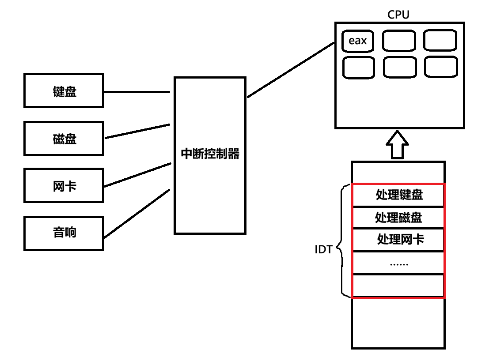
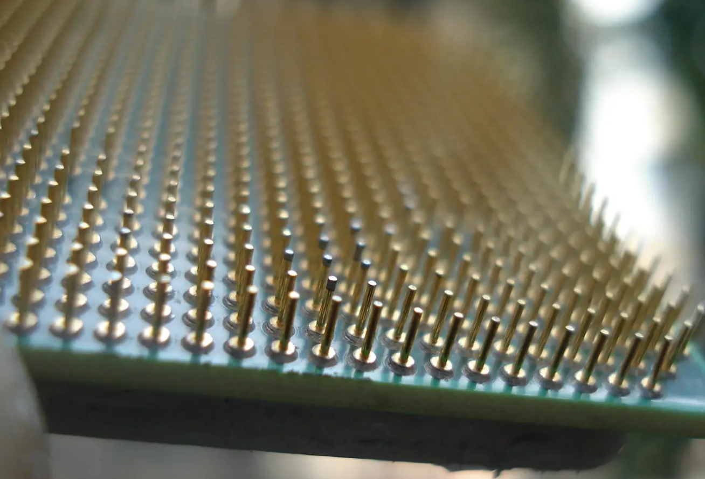
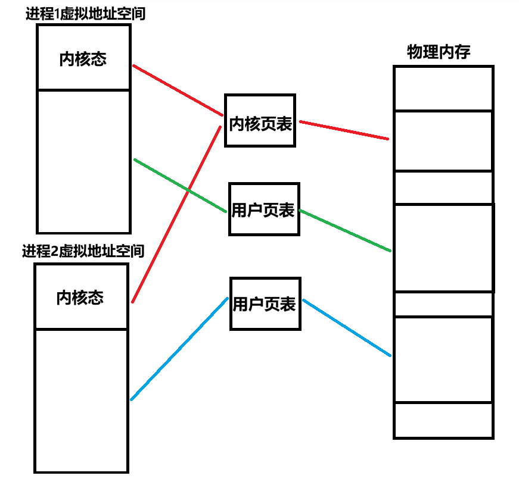

+++
date = 2026-05-13
title = "Linux 0.11 中断机制——操作系统的脉搏"
description = ""
slug = ""
authors = []
tags = ["中断", "内核", "异常"]
series = ["Linux系统编程"]
featuredImage = "assets/cover.png"
toc = true
+++


> 原创 于 2026-05-13 15:33:59 发布 · 公开 · 439 阅读 · 16 · 13 · 本内容遵循CC 4.0 BY-SA版权协议 版权声明：本文为博主原创文章，遵循 CC 4.0 BY-SA 版权协议，转载请附上原文出处链接和本声明。 GEO检测 · 编辑
> 文章链接：https://blog.csdn.net/2401_87889177/article/details/161013536

本文源码基于linux0.11。

## 1. 硬件中断：外设如何“唤醒”CPU

### 1.1、硬件中断原理

当CPU正在执行一个任务，也就是执行进程代码时，按下键盘。可以通过轮询方式来检查键盘行为。即：

```pseudo
while(1)
{
	检查键盘;
	检查磁盘；
	...
}
```

这种方式资源浪费严重，因此，操作系统采用“硬件通知操作系统”来实现。

中断控制器用于管理硬件发送的高电平和记录外设中断号。中断号是由系统分配的。



中断的本质就是硬件电信号！

中断控制器通过CPU针脚将通知CPU。



Q：为什么外设不直接通过针脚与CPU连接？
A：CPU针脚有限。

CPU收到中断后，保存当前进程的上下文（保护现场），就能去中断控制器中查看中断号。

操作系统中有一张表 **中断向量表** (IDT)，其中记录了处理各种中断的函数地址、内核代码段、权限等级等。

```c
void trap_init(void)
{
	int i;

	set_trap_gate(0,&divide_error);
	set_trap_gate(1,&debug);
	set_trap_gate(2,&nmi);
	...
	// 17~47对应硬件中断处理函数
	for (i=17;i<48;i++)
		set_trap_gate(i,&reserved);
}
	...
```

处理完后恢复上下文叫做恢复现场。

### 2.1、时钟中断

时钟晶振是一种可以固定频率发送震荡的硬件，这个频率叫做CPU的主频。

我的笔记本CPU主频为2.5GHz，也就是时钟源每秒震荡2.5G次。


假设现在有一个主频为1000Hz的的CPU，规定震荡10次为一个时间单位出发一次时钟中断，操作系统规定每10个时间中断进行1次进程调度，那么这个时间单位就叫做时间片。时间片的本质就是一个计数器，时钟中断一次时间片减一，减到零就进程一次进程调度。

对应内核代码：

```asm
_timer_interrupt:   ; 时钟中断处理函数
	...
	call _do_timer		;调用_do_timer 
```

```c
void do_timer(long cpl)
{
	...
	if ((--current->counter)>0) return;
	current->counter=0;
	if (!cpl) return;
	schedule(); // 调度下一个进程
}
```

### 2.2、操作系统的本质

操作系统也是软件，操作系统之所以能运行，是因为时钟中断不断的“唤醒”操作系统。

```c
void main(void)
{
	...
/*
 *   NOTE!!   For any other task 'pause()' would mean we have to get a
 * signal to awaken, but task0 is the sole exception (see 'schedule()')
 * as task 0 gets activated at every idle moment (when no other tasks
 * can run). For task0 'pause()' just means we go check if some other
 * task can run, and if not we return here.
 */
	for(;;) pause();
}
```

操作系统就是一个死循环，pause函数用于只有收到中断才会被唤醒。

## 2、软中断

### 2.1、什么是软中断

硬件中断是外设通过电信号同时CPU。
而软中断是软件主动执行特殊指令，人为触发中断。

软中断的需求场景：1、访问磁盘。2、操作文件系统。3
、创建进程。4、操作内存……这些涉及到内核权限操作。

用户程序必须通过合法的入口 `int 0x80` (现代系统为 `syscall` )进入内核。 `int 0x80` 本质是中断号。

全过程为：


系统调用的本质就是通过软中断陷入内核态，通过系统调用号索引系统调用表，然后执行对应内核态代码。

系统调用表：

```c
fn_ptr sys_call_table[] = { sys_setup, sys_exit, sys_fork, sys_read,
sys_write, sys_open, sys_close, sys_waitpid, sys_creat, sys_link,
sys_unlink, sys_execve, sys_chdir, sys_time, sys_mknod, sys_chmod,
sys_chown, sys_break, sys_stat, sys_lseek, sys_getpid, sys_mount,
sys_umount, sys_setuid, sys_getuid, sys_stime, sys_ptrace, sys_alarm,
sys_fstat, sys_pause, sys_utime, sys_stty, sys_gtty, sys_access,
sys_nice, sys_ftime, sys_sync, sys_kill, sys_rename, sys_mkdir,
sys_rmdir, sys_dup, sys_pipe, sys_times, sys_prof, sys_brk, sys_setgid,
sys_getgid, sys_signal, sys_geteuid, sys_getegid, sys_acct, sys_phys,
sys_lock, sys_ioctl, sys_fcntl, sys_mpx, sys_setpgid, sys_ulimit,
sys_uname, sys_umask, sys_chroot, sys_ustat, sys_dup2, sys_getppid,
sys_getpgrp, sys_setsid, sys_sigaction, sys_sgetmask, sys_ssetmask,
sys_setreuid,sys_setregid };
```

### 2.2、用户态与内核态

CPU执行权限分为 **内核态** 与 **用户态** ，CPU使用CS寄存器低两位存储当前特权等级CPL(Current Privilege Level)，当CPL为 `0b00` (0)时处于内核态，当CPL为 `0b11` (3)时处于用户态。

每个进程的虚拟地址空间的0～3GB为进程独有的用户态空间，而3GB~4GB为所有进程共享的内核态空间(通过使用同一张内核页表实现)。这样做后每个进程看到的都是同一个操作系统，操作系统的虚拟地址都是同一个。



CPL的存在是为了防止用户态指针指向内核态地址处，然后做非法修改。除了CPL的权限限制，操作系统内部还有多处权限控制的机制。

## 3、异常

CPU异常也会产生中断，相关的中断有：

```c
set_trap_gate(0,&divide_error); //除零错误
	set_trap_gate(1,&debug);
	set_trap_gate(2,&nmi);
	set_system_gate(3,&int3);	/* int3-5 can be called from all */
	set_system_gate(4,&overflow);
	set_system_gate(5,&bounds);
	set_trap_gate(6,&invalid_op);
	set_trap_gate(7,&device_not_available);
	set_trap_gate(8,&double_fault);
	set_trap_gate(9,&coprocessor_segment_overrun);
	set_trap_gate(10,&invalid_TSS);
	set_trap_gate(11,&segment_not_present); //段不存在
	set_trap_gate(12,&stack_segment);	//段错误
	set_trap_gate(13,&general_protection);
	set_trap_gate(14,&page_fault); //缺页异常
	set_trap_gate(15,&reserved);
	set_trap_gate(16,&coprocessor_error);
```

常见的有除零错误、段错误、缺页异常等。

c/cpp中malloc/new都是惰性开辟空间，当需要使用堆空间时访问页表，若页表的物理地址位填写，就触发缺页异常中断。

三种中断来源：

| 硬件中断 | 软中断 | 异常 |
|:---:|:---:|:---:|
| 外设 | 软件指令 | CPU |


## 4、中断的调用流程

### 4.1、三种中断流程统一

**处理流程** ：

1. 事件发生

2. 得到中断号

3. 查IDT

4. 保存现场

5. 进入处理函数(不属于任何进程)

6. 恢复现场

7. 继续执行

---

**目的** ：进入内核态，推动操作系统执行。

### 4.2、中断嵌套

中断嵌套：当正在处理一个中断时又来了一个中断信号。

是否允许嵌套取决于嵌套标志位(寄存器的一个比特位)是否允许。



## 5、总结

1. 硬件中断

   - 外设通过电信号与中断控制器通知CPU，取代低效轮询。

   - 时钟中断递减计数器，归零触发进程调度，是驱动操作系统的脉搏。

2. 软中断

   - 通过 `int 0x80` 指令主动陷入内核，获取内核权限。

   - 本质是系统调用的入口，通过调用号对应内核函数。

3. 异常

   - CPU执行时出错(除零、缺页等)，类似中断处理。

4. 三种中断

   - 来源不同，但都是统一通过IDT分发处理。

   - 核心流程：中断->查IDT->保护现场->处理->恢复现场。

   - 是否允许嵌套取决于嵌套标志位。
