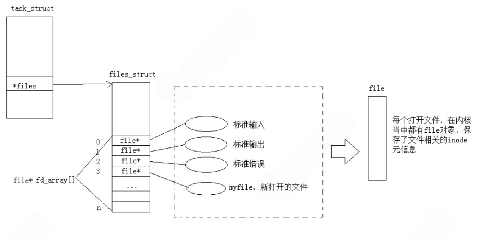
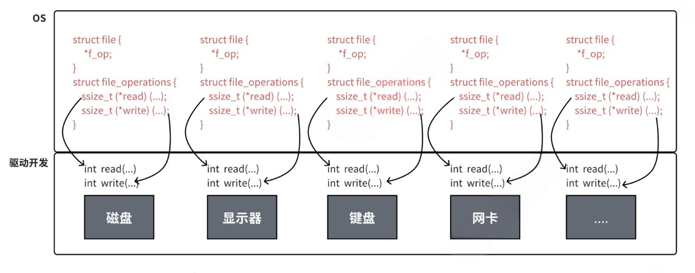

+++
date = 2026-04-20
title = "彻底理解 Linux 文件描述符：从 open/close 到重定向与缓冲区"
description = ""
slug = ""
authors = []
tags = ["文件描述符", "fd", "缓冲区", "重定向"]
series = ["Linux"]
featuredImage = "assets/cover.png"
toc = true
+++

# 彻底理解 Linux 文件描述符：从 open/close 到重定向与缓冲区

> 原创 于 2026-04-20 20:00:00 发布 · 公开 · 135 阅读 · 5 · 2 · 本内容遵循CC 4.0 BY-SA版权协议 版权声明：本文为博主原创文章，遵循 CC 4.0 BY-SA 版权协议，转载请附上原文出处链接和本声明。 GEO检测 · 编辑
> 文章链接：https://blog.csdn.net/2401_87889177/article/details/160307870

**文章目录**

[TOC]


本文详解 Linux 文件描述符、重定向、dup2、一切皆文件及语言级缓冲区等概念。

## 1. 什么是文件描述符？底层结构彻底讲透

### 1.1 open 和 close 到底做了什么

open 不加载文件内容，仅在内核建立进程与文件的关联（创建structfile）；close 释放文件描述符。

所有语言打开文件后必须关闭，语言级关闭操作（如C语言 fclose）均封装系统调用 close；C++等 无需手动关闭，是因为关闭操作在文件对象析构函数中。

### 1.2 open 返回值：文件描述符的分配规则

文件描述符（fd）是 int 类型，进程默认打开3个标准文件：

- 标准输入（stdin） ： fd = 0

- 标准输出（stdout）：fd = 1

- 标准错误（stderr）： fd = 2

新文件的 fd 分配规则：当前未被占用的最小非负整数。
代码验证：

```c
int main()
{
    close(0); 
    int fd = open("log.txt", O_CREAT | O_RDONLY, 0666);
    int fd1 = open("log.txt.1", O_CREAT | O_RDONLY, 0666);
    
    printf("fd is : %d\n", fd);
    printf("fd1 is : %d\n", fd1);
    
    close(fd);
    close(fd1);
    return 0;
}
```

输出结果：

```shell
fd is : 0
fd1 is : 3
```

### 1.3 内核结构：task_struct → files_struct → fd_array

task_struct（PCB）中的 files 指针，指向管理进程打开文件的 files_struct，其核心是 fd_array 指针数组。

```c
struct task_struct {
	...
	struct files_struct *files;
	...
};
```

```c
struct files_struct {
	...
	struct file * fd_array[NR_OPEN_DEFAULT];
	...
};
```

总结：文件描述符本质是 fd_array 数组的下标，通过下标访问文件属性和操作方法。



### 1.4 C 语言FILE结构体对 fd 的封装

Linux内核只识别 fd，C 语言 FILE 结构体封装 fd，其中 _fileno 成员存储对应 fd。

```c
int main()
{
    FILE* fp = fopen("log.txt", "w");
    const char* s = "hello world\n";
    write(fp->_fileno, s, strlen(s));
    fclose(fp);
    return 0;
}
```

log.txt 内容： `hello world` 

## 2. 重定向原理：为什么 close(1) 就能改变输出？

### 2.1 什么是重定向

核心：修改 fd 对应的文件关联，让指向标准设备的 fd 指向指定文件。

```c
int main()
{
    close(1);
    int fd = open("log.txt", O_CREAT | O_WRONLY, 0666);
    printf("printf -> fd[%d]\n", fd);
    fflush(stdout);
    close(fd);
    return 0;
}
```

log.txt 内容：

```text
printf -> fd[1]
printf -> fd[1]
printf -> fd[1]
```

### 2.2 dup2 系统调用

函数原型： `int dup2(int oldfd, int newfd);` 

参数：oldfd（目标 fd）、newfd（被覆盖 fd）；成功返回新 fd，失败返回 -1。

原理：用 oldfd 覆盖 newfd，newfd 已打开则自动关闭。

三种常用示例：

```c
// 输入重定向
const char* InReDir  = "In.txt";
int infd  = open(InReDir, O_RDONLY);
dup2(infd, 0);
close(infd);
```

```c
// 输出重定向
const char* OutReDir = "Out.txt";
int outfd = open(OutReDir, O_CREAT | O_WRONLY | O_TRUNC, 0666);  
dup2(outfd, 1);
close(outfd);
```

```c
// 追加重定向
const char* AppReDir = "App.txt";
int appfd = open(AppReDir, O_CREAT | O_WRONLY | O_APPEND, 0666);  
dup2(appfd, 1);
close(appfd);
```

## 3. Linux 设计思想：一切皆文件

### 3.1 驱动与 file_operations

Linux 中所有设备均抽象为文件，统一用 read/write 接口访问，底层依赖 file_operations 结构体（存储操作函数指针，指向硬件驱动）。

```c
struct file_operations {
	struct module *owner;
	loff_t (*llseek) (struct file *, loff_t, int);
	ssize_t (*read) (struct file *, char __user *, size_t, loff_t *);
	ssize_t (*write) (struct file *, const char __user *, size_t, loff_t *);
	...
};
```

### 3.2 统一接口的底层逻辑

应用层无需关心驱动细节，通过统一接口访问不同设备，体现接口抽象与多态思想。



## 4. 语言级缓冲区与经典面试题

### 4.1 语言级缓冲区存在的意义

减少系统调用开销，暂存数据，满缓冲、手动刷新或进程结束时写入内核。

```c
int main()
{
    FILE* fp = fopen("log.txt", "w");
    fprintf(fp, "hello world");
    char* start = fp->_IO_write_base;
    int len = fp->_IO_write_ptr - start;
    printf("buffer: %.*s\n", len, start);
    fclose(fp);
    return 0;
}
```

输出： `buffer: hello world` 

### 4.2 三种缓冲区类型与刷新规则

1. 行缓冲：遇 \n 刷新（stdout 默认）；

2. 全缓冲：满缓冲刷新（文件操作默认）；

3. 无缓冲：直接写入（stderr 默认）。

默认刷新场景：缓冲满、fflush 调用、进程结束。

### 4.3 经典面试题：fork为什么会导致 printf 输出两次？

核心：语言级缓冲区写时拷贝。

```c
int main()
{
    printf("hello printf    ");
    fork();
    return 0;
}
```

输出： `hello printf hello printf ` 

解析：printf无 \n 不刷新，fork 时子进程复制父进程缓冲区，进程结束时两者均刷新，故输出两次。

补充：fork 前加 `fflush(stdout);` 仅输出一次。

## 5. 总结

1. fd 是 fd_array 下标，默认 0/1/2，分配规则为“最小未占用”；

2. open 建立关联，close 释放 fd，均不直接操作文件内容；

3. 重定向本质修改 fd 关联，dup2 是常用工具；

4. “一切皆文件”靠 file_operations 统一接口；

5. 缓冲区减少系统调用，fork 输出两次源于缓冲写时拷贝；

6. FILE 结构体封装 fd，_fileno 为对应 fd。
