+++
date = 2026-04-24
title = "从inode到block：一文搞懂Linux文件系统的本质"
description = ""
slug = ""
authors = []
tags = ["文件系统", "inode", "block", "磁盘存储"]
series = ["Linux系统编程"]
featuredImage = "assets/cover.png"
toc = true
+++


> 原创 已于 2026-04-24 08:35:11 修改 · 公开 · 463 阅读 · 15 · 12 · 本内容遵循CC 4.0 BY-SA版权协议 版权声明：本文为博主原创文章，遵循 CC 4.0 BY-SA 版权协议，转载请附上原文出处链接和本声明。 GEO检测 · 编辑
> 文章链接：https://blog.csdn.net/2401_87889177/article/details/160383296

本文基于ext2文件系统。

## 1、磁盘结构

#### 1.1、物理结构


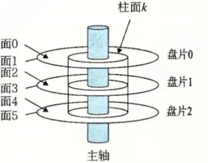

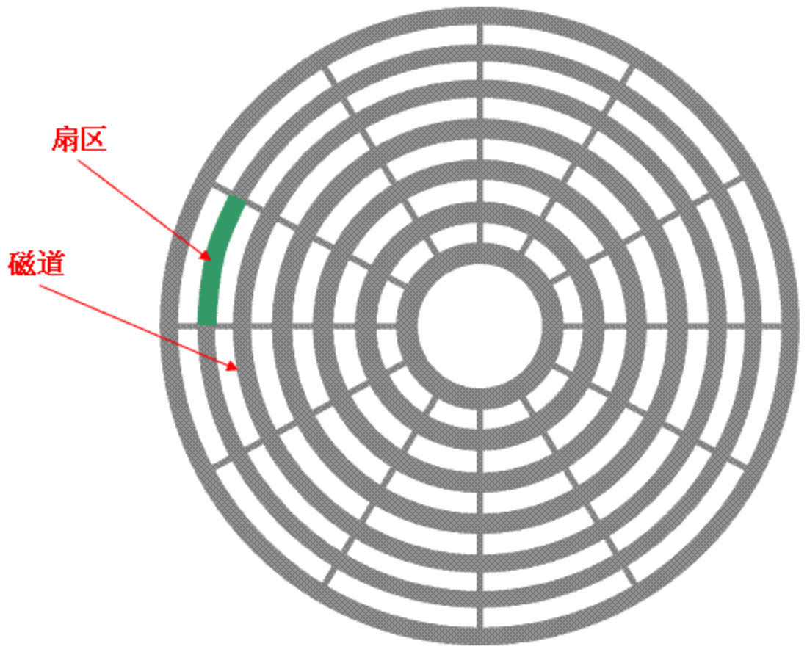

#### 1.2、基础概念

1. 磁头：每一个盘片有两面，一个盘面对应一个磁头数。

2. 磁道：从盘片从外圈向内圈编号，0磁道、1磁道……

3. 柱面：同一磁道同心圆所有的磁道。

4. 扇区：磁道被分成的扇形区域，每个磁道扇区数量相同。磁盘读写最小单位，通常为512字节（ext4为4kb）。

**传动臂上的磁头是共进退的** 

#### 1.3、磁盘寻址方式

##### 1.3.1、CHS寻址

对于一个扇区，通过柱面（cylinder）、磁头（header）可确定一个磁道。在该磁道中，通过扇区数（section）来确定该扇区是第几个扇区。

##### 1.3.2、LBA寻址

把多个柱面展开可视为一个三维数组：

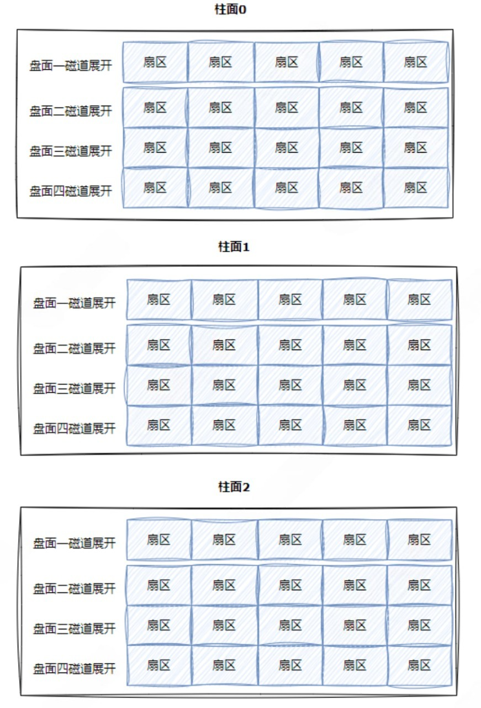

三维数组可用一位数组表示（类比于C语言中的数组）：

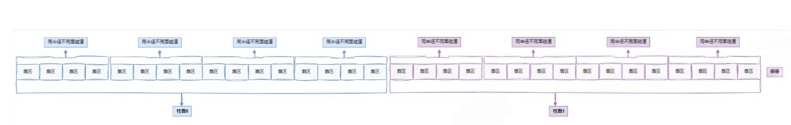

在一个一维数组中，如果知道数组的大小，就能够通过下标访问相应扇区了。现代系统都是使用的LBA寻址方式，磁盘负责将其转换成CHS，以便确认物理磁盘位置。

## 2、从磁盘到文件系统

#### 2.1、块的概念

块（block）是文件系统读写的最小单位（4kb）。
**块的作用:** 

1. 每次读写一个块，能够提高IO速度。

2. 块大小不一定等于磁盘扇区大小，体现了硬件与软件的解耦。

#### 2.2、分组分区管理机制

分区：将整个磁盘分成几个大的区域。
分组：在每一个区块中继续细分。

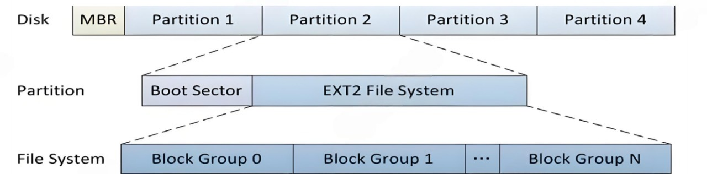

每一个组由 `GDT` , `Block Bitmap` , `inode Bitmap` , `inode Table` , `Data Blocks` 组成。其中 `Super Block` 只有几个分区有。

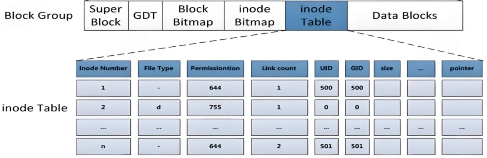

DataBlocks:
存储文件内容的地方，一个块为4kb大小。

inode Table：
用于inode的地方，inode结构体用于存文件属性（不包括文件名），一个inode为128字节（ext4为256字节）。

inodeBitmap:
位图，用于标识inode Table中的位有没有被占用，快速找到需要的块，一个块可以标识的大小为：4kb * 1024 B/kb * 8 = 32768个inode。

Block Bitmap：
类似于inode Bitmap，标识Data blocks占用情况。

GDT：
用于管理当前Group，记录了Block Bitmap、inode Bitmap、inode Table的位置、统计信息。

Super Block：一个分区只有几个组有，用于记录当前整个分区的情况。之所以有几个，是为了防备Super Block数据丢失，备份作用。

## 3、inode的认识

inode用于存储文件属性（除文件名）。在文件系统中，inode的数量和data block的数量是固定的。其中inode和块编号是整个分区唯一的。

#### 3.1、已知inode文件增删查改

创建文件，会在inode bitmap中找一个没有使用的位，然后标识为1并初始化一个inode对象。

删除文件，根据inode在inode bitmap中找到inode，修改block bitmap、inode bitmap并释放inode和block。

查找文件内容，在inode table中找到data blocks对应的block。

修改文件内容，找到文件内容，并修改内容。可能会更新 inode 和 block 分配。

#### 3.2、目录与inode

在Linux，目录也是文件。目录的文件内容是文件与inode之间的映射关系。用 `ls -i` 就能看见目录中每一个文件的inode值。

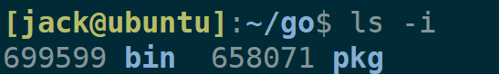

结论：已知文件名，找一个文件都要访问上级目录，因为上级目录保存了inode与文件名的映射关系。

这是一个递归问题，例如有 `/home/zh/li/wu/data.txt` ，要访问data.txt就要先访问wu目录，要访问wu就要先访问li目录……直到根目录。根目录在开机时就加载到内存中了，为已知状态。

## 4、dentry、路径解析与路径缓存

#### 4.1、dentry与路径缓存

每一个文件都有dentry， `dentry` 结构体记录 了当前文件的inode、上级目录的inode等。dentry将这些信息缓存在内存中，当打开一个路径或文件即使不存在，将这个文件创建一个dentry结构体，然后挂到父结点的下面。因此整个路径就像一棵树：

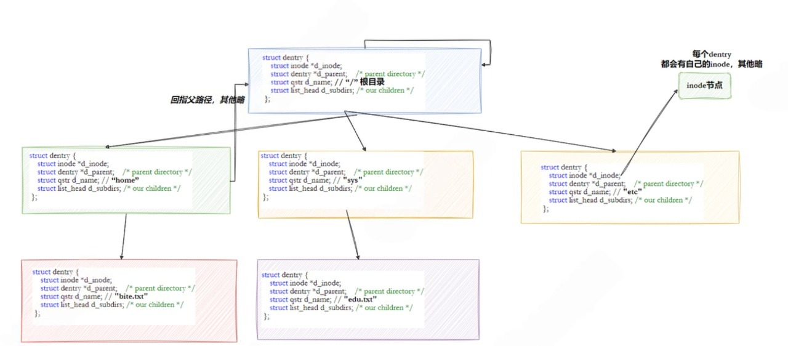

直接通过inode访问文件需要多次访问上级目录的inode，这个过程都涉及磁盘IO。而dentry是缓存在内存中的，所以第一次访问慢，后续极快。

#### 4.2、 再看open打开文件

使用open打开一个已存在的文件操作系统会做这些是操作

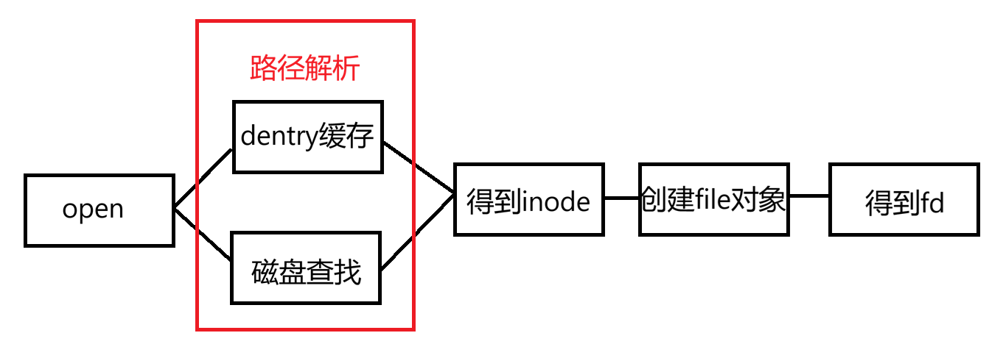

打开不存在文件时多了两个步骤，其中写目录项是在上级目录中增加一条inode文件名映射。

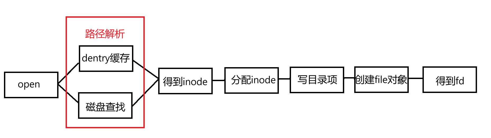

**总结打开文件的流程** ：

1. 根据路径查目录 -> 找到inode号

2. 根据inode -> 找block地址

3. 读取block -> 得到数据

## 5、大文件存储与寻区问题

#### 5.1、inode能映射多少block

`struct ext2_inode` 结构体中有一个数组（ `__le32 i_block[EXT2_N_BLOCKS];` ），用来记录与block相关的映射。其大小定义为15：

```c
#define	EXT2_NDIR_BLOCKS		12
#define	EXT2_IND_BLOCK			EXT2_NDIR_BLOCKS
#define	EXT2_DIND_BLOCK			(EXT2_IND_BLOCK + 1)
#define	EXT2_TIND_BLOCK			(EXT2_DIND_BLOCK + 1)
#define	EXT2_N_BLOCKS			(EXT2_TIND_BLOCK + 1)
```

由12个直接指针和一级间接指针、二级间接指针、三级间接指针组成。

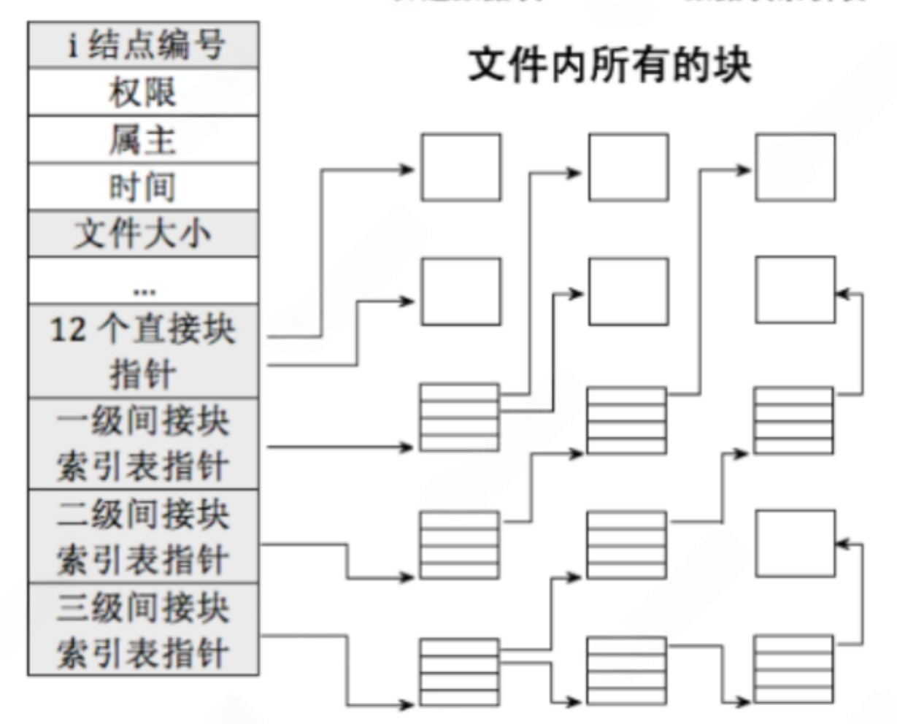

直接指针：每个指针指向一个确定的block。直接指向共12个block。
一级间接指针：指向一个4kb的block，该block全部用于存储直接指针。间接指向共4096 / 4 = 1024个block。
二级间接指针：指向一个4kb的block，该block全部用于存储一级指针。间接指向共1024 * 1024 = 1024 * 1024个block。
三级间接指针：指向一个4kb的block，该block全部用于存储二级指针。间接指向共1024 * 1024 * 1024 = 1024 * 1024 * 1024个block。

总共可以指向12 + 1024 + 1024 * 1024 + 1024 * 1024 * 1024 = 1,074,791,436个block。总共可以存储大约4TB文件（ext4可存16TB大小文件）。如果还不够用的话可以选择XFS（EB级别）。

前面说过，块号和inode都是整个区内有效。如果一个区有200GB，划分成10个组，每个group10GB，那么就会涉及多个group存储。inode可以找到同区内得block。

#### 5.2、寻区问题。

一块硬盘需要先格式化，再挂载才能使用。

格式化本质是在磁盘上建立文件系统的数据结构，包括写入superblock、GDT信息，初始化inode bitmap、block bitmap等，建立root目录，划分block。使操作系统能够对磁盘空间进行管理。

格式化后硬盘还不能使用，需要挂载到一个目录下。

下面是一个简单的实验：

```bash
dd if=/dev/zero of=./disk.img bs=1M count=5 #制作一个大的磁盘块，就当做一个分区
mkfs.ext4 disk.img 

mkdir /mnt/mydisk # 建立空目录
df -h # 查看可以使用的分区
Filesystem      Size  Used Avail Use% Mounted on
tmpfs           162M  1.1M  161M   1% /run
efivarfs        256K  6.9K  245K   3% /sys/firmware/efi/efivars
/dev/vda3        40G   13G   26G  33% /
tmpfs           807M   16K  807M   1% /dev/shm
tmpfs           5.0M     0  5.0M   0% /run/lock
/dev/vda2       197M  6.2M  191M   4% /boot/efi
tmpfs           162M   84K  162M   1% /run/user/0
tmpfs           162M   12K  162M   1% /run/user/1001

sudo mount -t ext4 ./disk.img /mnt/mydisk/ # 将分区挂载到指定的目录

df -h
Filesystem      Size  Used Avail Use% Mounted on
tmpfs           162M  1.1M  161M   1% /run
efivarfs        256K  6.9K  245K   3% /sys/firmware/efi/efivars
/dev/vda3        40G   13G   26G  33% /
tmpfs           807M   16K  807M   1% /dev/shm
tmpfs           5.0M     0  5.0M   0% /run/lock
/dev/vda2       197M  6.2M  191M   4% /boot/efi
tmpfs           162M   84K  162M   1% /run/user/0
tmpfs           162M   12K  162M   1% /run/user/1001
/dev/loop0      4.7M   24K  4.4M   1% /mnt/mydisk		# 这是新加的分区
```

可以看到新加的分区被挂载到了/mnt/mydisk下。
得出一个结论：打开文件路径分析时就能够找到分区。

## 6、软硬链接

#### 6.1、硬链接

如图，使用 `ln log.txt log_hard` 创建一个硬链接：

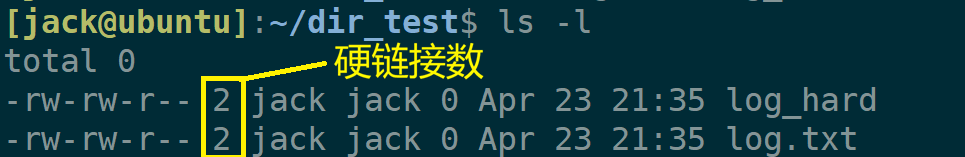

数字2就是硬连接数。使用 `ls -li` 

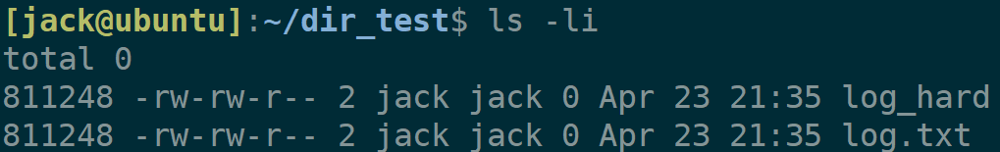

硬链接就是多个文件名指向同一个 inode！

log_hard就是log.txt的别名。底层维护一个计数器，当计数器为0才真的删除文件。

目录也有硬链接，空目录硬链接数为2，因为有一个隐藏文件点指向当前目录。两个点和子目录都是上一级目录的硬链接。目录的硬链接不允许用户建立，是为了防止出现环形路径。

**硬链接作用** ：

1. 备份文件

2. 维护Linux文件目录结构

#### 6.2、软链接

使用 `ln -s log.txt log_soft` 创建一个软链接
 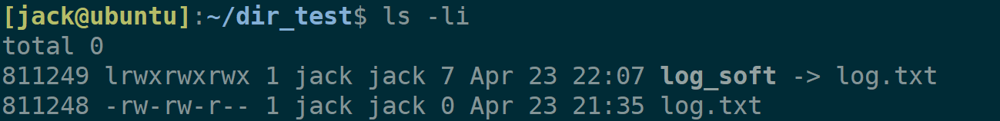

软链接的属性是链接属性。类似于Windows中的快捷方式。向log_soft中写入内容相当于向log.txt中写入内容。
 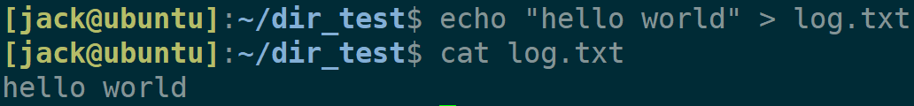

**软链接作用** ：

1. 简化超长路径

2. 使文件管理更加灵活。

## 7、总结

文件系统核心并不是“文件”，而是对数据的组织方式：

`inode` 负责描述文件并定位数据， `block` 负责存储数据，目录负责建立文件名与inode的映射关系。
所有文件操作，本质都是围绕这三者展开的依次“查找” -> “定位” -> “读写”的过程。