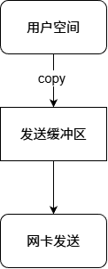
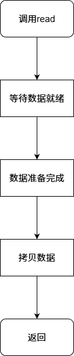
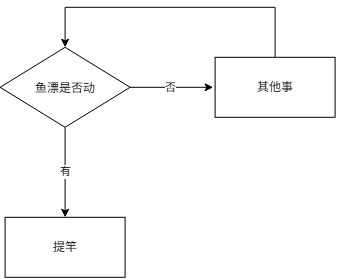
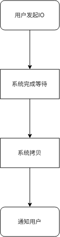

+++
date = 2026-09-18
title = "重新认识Linux五种IO模型"
description = ""
slug = ""
authors = []
tags = ["IO模型", "阻塞IO", "异步IO", "多路复用"]
series = ["Linux"]
featuredImage = "assets/cover.png"
toc = true
+++

# 重新认识Linux五种IO模型

> 原创 豆包力荐 于 2026-09-18 22:24:46 发布 · 公开 · 290 阅读 · 0 · 5 · 本内容遵循CC 4.0 BY-SA版权协议 版权声明：本文为博主原创文章，遵循 CC 4.0 BY-SA 版权协议，转载请附上原文出处链接和本声明。 · 编辑
> 文章链接：https://blog.csdn.net/2401_87889177/article/details/163604556

**文章目录**

[TOC]


## 1 从钓鱼理解Linux五种 IO 模型

### 1.1 IO 的本质：等待与拷贝

IO（Input Output）的本质可以概括为：

> IO = 等待 + 拷贝

以网络读取数据为例：

```cpp
read(sockfd, buffer, size);
```

实际上经历两个阶段：

1. 等待数据就绪

2. 数据从内核空间拷贝到用户空间

因此：

```
read = 等待数据 + 数据拷贝
```

写数据也是类似：



因此：

```
write = 等待发送条件 + 数据拷贝
```

---

### 1.2 IO 效率的关键：减少等待

很多人认为 IO 慢是因为数据拷贝慢。

实际上，真正消耗大量时间的是等待。

例如：

```
等待数据：99ms

拷贝数据：1ms
```

那么大部分时间都浪费在等待。

所以高效 IO 的核心：

> 减少等待时间占整体 IO 的比例。

---

## 2 钓鱼模型理解 IO

钓鱼包含两个过程：

```
等待鱼上钩

+

把鱼钓起来
```

对应 IO：

```
等待数据就绪

+

拷贝数据
```

不同的人采用不同的钓鱼方式，对应五种 IO 模型。

---

### 2.1 一直盯鱼漂 —— 阻塞 IO

张三来到河边，把鱼竿放下，然后一直盯着鱼漂。

鱼漂不动：

> 什么也不做，一直等待。

鱼漂动：

```
提竿
|
钓鱼完成
```

对应阻塞 IO：

```cpp
read(fd, buffer, size);
```

流程：



等待期间：

- 当前线程被阻塞

- 无法执行其他任务

---

### 2.2 不断查看鱼漂 —— 非阻塞 IO

李四不会一直盯鱼漂。

他的方式：



这就是轮询。

设置非阻塞后：

```cpp
read(fd, buffer, size);
```

如果没有数据，会立即返回。

例如：

```cpp
while(true)
{
    ret = read(fd, buf, size);

    if(ret > 0)
    {
        //处理数据
    }

    //执行其他任务
}
```

---

### 2.3 鱼漂响铃通知 —— 信号驱动 IO

王五给鱼竿安装铃铛。

流程：


这就是信号驱动 IO。

传统方式：

```
程序主动检查有没有数据
```

信号驱动：

```
数据准备好了

↓

系统发送通知
```

Linux 中可以通过 SIGIO 实现。

缺点：

大量 IO 时，信号处理成本较高。

信号的本质是PCB中的位图，大量信号时，未被处理的信号被覆盖，造成信号丢失问题。

---

### 2.4 同时管理多根鱼竿 —— IO 多路复用

赵六拥有很多鱼竿。

他不可能同时盯着所有鱼漂。

于是：


这就是 IO 多路复用。

Linux 中常见接口：

- select

- poll

- epoll

服务器可以使用一个线程管理多个 socket：

```
客户端1 socket
客户端2 socket
客户端3 socket

        |

     epoll

        |

处理准备好的连接
```

高性能服务器常用：

```
非阻塞 IO + epoll
```

---

### 2.5 让别人帮忙钓鱼 —— 异步 IO

田七不想自己钓鱼。

于是找小王：

```
鱼竿给你

水桶给你

钓完通知我
```

小王负责：

- 等鱼

- 钓鱼

- 装桶

田七只负责：

```
发起请求
```

这就是异步 IO。

流程：



用户不参与 IO 具体过程。

---

## 3 五种 IO 模型总结

| 模型 | 人物 | 特点 |
|:---:|:---:|:---:|
| 阻塞 IO | 张三 | 一直等待 |
| 非阻塞 IO | 李四 | 不断轮询 |
| 信号驱动 IO | 王五 | 系统通知 |
| 多路复用 IO | 赵六 | 同时监听多个 IO |
| 异步 IO | 田七 | 完全交给系统处理 |


---

## 4 阻塞 IO 和非阻塞 IO 的区别

两者都包含：

```
等待 + 拷贝
```

区别：

- 阻塞 IO：一直等待

- 非阻塞 IO：不断询问

非阻塞 IO 提升的是程序整体利用率，而不是单次 IO 速度。

---

**手动实现非阻塞IO** ：
linux中，打开文件、创建套接字等都可以设置文件描述符。万变不离其宗，可以使用 `fcntl` 达到相同效果。

`fcntl` 用于专门控制文件：

```c
int fcntl(int fd, int op, ... /* arg */ );
```

- fd：要操作的文件描述符

- cmd：操作命令，决定做什么，后面可变参数arg是否需要由cmd 决定

- 返回值：成功依 cmd 返回对应值；失败返回 -1，置errno

```cpp
#include <cerrno>
#include <csignal>
#include <iostream>
#include <unistd.h>
#include <cstring>
#include <fcntl.h>
#include <signal.h>

/*
 * 将标准输入设置为非阻塞
 * 测试非阻塞IO
 */

bool SetNonBlock(int fd)
{
    int fl = fcntl(fd, F_GETFL);
    if(fl == -1)
        return false;
    int n = fcntl(fd, F_SETFL, fl | O_NONBLOCK);
    if(n == -1)
        return false;
    return true;
}


int main()
{
    signal(SIGIO, SIG_IGN);
    char buf[1024] = { 0 };
    SetNonBlock(0);
    while(true)
    {
        int n = read(0, buf, sizeof(buf));
        if(n > 0)
        {
            // 数据就绪
            buf[n - 1] = 0;
            std::cout << "echo # " << buf << std::endl;
        }
        else if(n == 0)
        {
            // end of file
            exit(EXIT_SUCCESS);
        }
        else 
        {
            if(errno == EWOULDBLOCK /* || errno == EAGAIN */)
            {
                std::cout << "data is not ready" << std::endl;
                sleep(1);
                continue;
            }
            else if(errno == EINTR)
            {
                // 被信号唤醒
                errno = 0;
                sleep(1);
                continue;
            }
            else
            {
                // read errno
                std::cerr << "code : " << errno << " # " << strerror(errno) << std::endl;
                errno = 0;
            }
        }
        sleep(1);
    }
    return 0;
}
```

注意点：

1. 非阻塞 IO，没有读到数据，也是读取失败。

2. 信号的优先级大于 IO 阻塞，即信号会唤醒 IO。

因此，使用 `errno` 判断失败情况。 `EWOULDBLOCK` 等价于 `EAGAIN` ，为非阻塞IO失败情况； `EINTR` 为接收到信号的情况。

## 5 同步 IO 与异步 IO

判断同步还是异步：

关键看：

> 用户是否参与 IO 过程。

同步 IO：

用户参与等待和拷贝。

包括：

- 阻塞 IO

- 非阻塞 IO

- 信号驱动 IO

- 多路复用 IO

异步 IO：

用户只负责发起请求。

系统完成：

- 等待

- 拷贝

- 通知

---

## 6 总结

Linux 五种 IO 模型，本质都是解决：

> 如何减少 IO 中等待时间的比例。

IO 的本质：

```
等待 + 拷贝
```

五种模型：

- 阻塞 IO：自己一直等

- 非阻塞 IO：自己不断问

- 信号驱动 IO：系统通知

- 多路复用 IO：同时管理多个等待

- 异步 IO：完全交给系统完成
