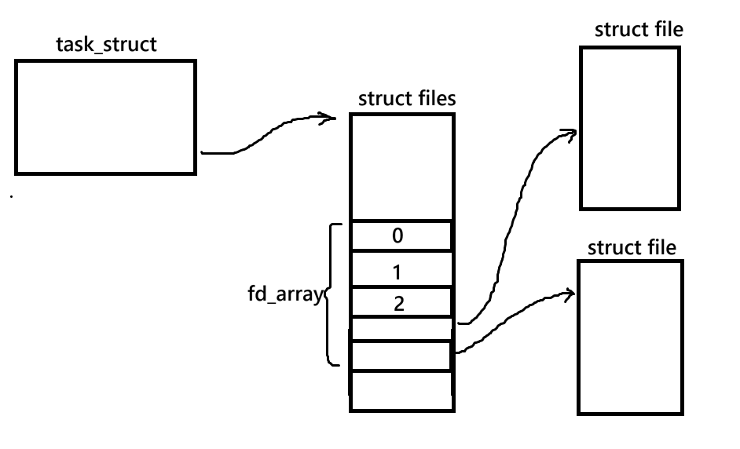
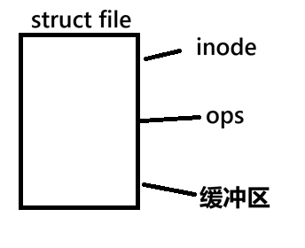
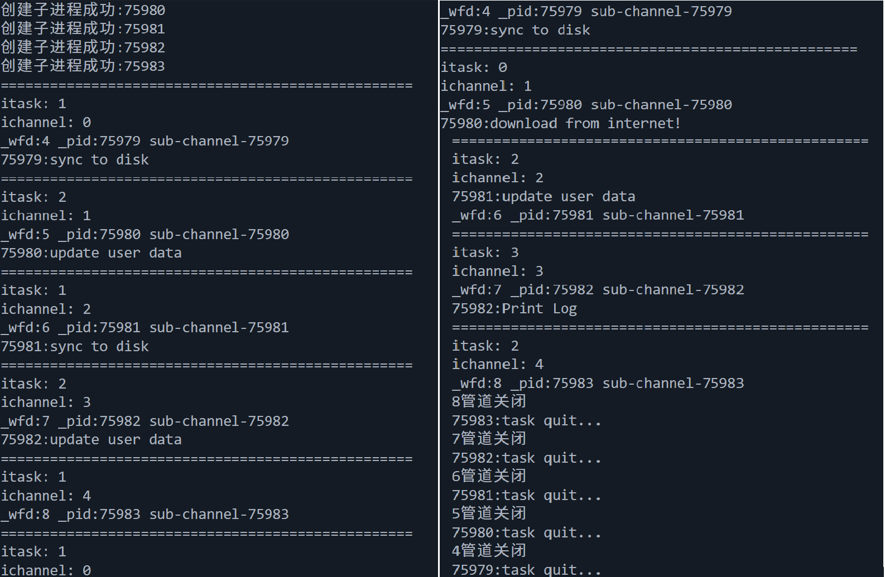
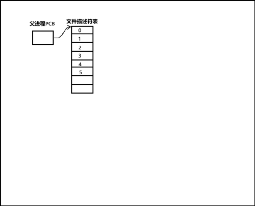
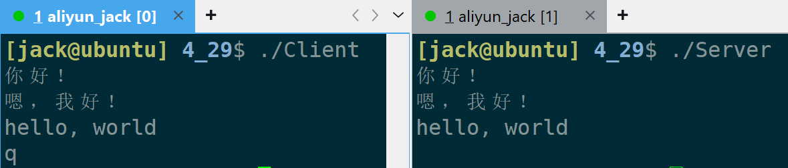

+++
date = 2026-05-08
title = "管道通信深度剖析：从匿名管道到命名管道，手写进程池"
description = ""
slug = ""
authors = []
tags = ["管道", "进程间通信", "进程池"]
series = ["Linux"]
featuredImage = "assets/cover.png"
toc = true
+++

# 管道通信深度剖析：从匿名管道到命名管道，手写进程池

> 原创 已于 2026-05-08 23:07:36 修改 · 公开 · 498 阅读 · 17 · 11 · 本内容遵循CC 4.0 BY-SA版权协议 版权声明：本文为博主原创文章，遵循 CC 4.0 BY-SA 版权协议，转载请附上原文出处链接和本声明。 GEO检测 · 编辑
> 文章链接：https://blog.csdn.net/2401_87889177/article/details/160566224

**文章目录**

[TOC]


## 1、前言

Q：为什么需要进程间通信？
A：开发中常常会遇到这样的情况，前端进程返回数据，后端进程负责处理数据。

Q：怎么进行进程间通信？
A：进程间通信的本质是就是让不同的进程看到同一份资源，因为每个进程都有自己的虚拟地址空间，所以只能通过内核来完成进程间通信。

Q：进程间通信有哪些方式？
A：

1. 管道：匿名管道、命名管道

2. System V IPC：System V 消息队列、System V 共享内存、System V 信号量

3. POSIX IPC：消息队列、共享内存、信号量、互斥锁、条件变量、读写锁

Q：POSIX和SystemV是什么？
A：它们都是进程间通信的一种标准。System V较老项目还在使用，只能本地进程间通信。POSIX很多新项目使用的标准，可以跨网络进程间通信。

Q：本文涉及到哪些进程间通信？
A：本文会涉及匿名管道和有名管道，后续会发其他通信方式的文章。

**建议** ：如果对文件系统有较深理解，那么读本文就会秒懂。

## 2、匿名管道

匿名管道的思路来源于文件系统。匿名管道的本质两个进程同时打开一个文件，A进程可以往里面写内容，B进程可以从里面读取内容。

### 2.1、原理

如图是一个进程管理文件的数据结构：



在每一个文件对象中，都有一个指向缓冲区的对象。



当父进程fork出子进程，task_struct，structfiles、struct file都会拷贝给子进程。但是inode、ops、缓冲区等是不会拷贝的，相当于这些都是共享的。

开发者基于这样的文件内核缓冲区通信进行特殊设计，就形成了匿名管道。由于这个文件缓冲区不需要被刷新到磁盘，是内存级文件，因此，不需要文件名和路径，所以较匿名管道。

注意事项：匿名管道相当于使用读和写分别打开文件，所以两个进程都有两个文件描述符。理论上两个进程能同时写、同时读，但不安全，所以规范的操作是一端读，一端写。

这种一端读一端写的通信方式又叫做单工通信。

- 单工：只允许一方发送，一方接收。

- 半双工：只允许一方发送，两方都能接收。

- 全双工：双方都能发送和接收。

匿名管道大小一般是4kb、8kb、16kb（取决于操作系统）。

### 2.2、使用

pipe：创建匿名管道。

```c
int pipe(int pipefd[2]);
```

> pipefd：一个输出型参数，pipefd[0]将被设置为读取端文件描述符，pipfd[1]将被设置为写入端文件描述符。
> return value：成功0；失败-1，并设置errno。

下面一段demo演示子进程向匿名管道每隔一秒写一条数据，总共十条。父进程每隔一秒去匿名管道中尝试读取数据。

```c
#include <fcntl.h>
#include <unistd.h>
#include <sys/wait.h>
#include <stdio.h>
#include <stdlib.h>
#include <string.h>

int main()
{
    int pipefd[2] = { 0 };
    if(pipe(pipefd) == -1) // 1.创建管道
        exit(1);

    pid_t id = fork(); // 2.fork子进程
    if(id < 0)
        exit(1);

    if(id == 0)
    {
        // child
        close(pipefd[0]); // 3.子进程关闭读
        
        char msg[] = "hello world";
        char outbuffer[1024] = { 0 };
        for(int i = 0; i < 10; ++i)
        {
            snprintf(outbuffer, sizeof(outbuffer),               \
                    "c->f[%d]: %s child->pid:%d father->pid:%d\n",  \
                    i, msg, getpid(), getppid());
            write(pipefd[1], outbuffer, strlen(outbuffer)); // 4.子进程write写内容
            sleep(1);
        }
        exit(0);
    }
    // father
    close(pipefd[1]); // 3.父进程关闭写

    char inbuffer[1024] = { 0 };
    while(1)
    {
        ssize_t n = read(pipefd[0], inbuffer, sizeof(inbuffer) - 1); // 4.父进程read读内容
        if(n < 0)
        {
            perror("read");
            break;
        }
        else if(n == 0)
        {
            printf("read end of file!\n");
            break;
        }
        inbuffer[n] = '\0';
        printf(inbuffer, NULL);
        sleep(1);
    }

    int status = 0;
    pid_t rid = waitpid(id, &status, 0);
    if(!WIFEXITED(status))
    {
        printf("last_code:%d\n", WEXITSTATUS(status));
    }
    return 0;
}

```

### 2.3、特征和常见情况

没有明确说明匿名管道时，命名管道也符合。

5种特征：

1. 管道时只能单工通信。

2. 匿名管道只能用于具有亲缘关系进程之间，常用于父子进程之间（继承内核资源）。

3. 管道是面向字节流的。

4. 管道的生命周期随进程。

5. 管道通信，对多进程而言，自带互斥与同步机制。

4种情况：

1. 写端写得慢，读端阻塞等待数据写入。

2. 读端读得慢，写端阻塞等待输入读走。

3. 读端在读，写端关闭，read返回0，表示读到文件结尾。

4. 写端在写，读端关闭，操作系统将杀死写端进程（操作系统不会做无用功）。

### 2.4、应用——手写进程池

本节源码已上传至 [【https://gitee.com/muyi-2580/learning-linux/tree/main/4_28】](https://gitee.com/muyi-2580/learning-linux/tree/main/4_28) 。

思路：父进程创建一个进程池管理子进程，在父进程与子进程之间创建匿名管道。父进程向管道写入消息，唤醒子进程，子进程执行某项任务。

部分声明如下：

```cpp
#include <unistd.h>
#include <sys/wait.h>

#include <vector>
#include <string>
#include <functional>
#include <cstdlib>
#include <ctime>
#include <iostream>
#include <cstdio>

// 常量定义
const int process_num = 5;	// 创建5个进程
using cb_t = std::function<void(int)>;

// 枚举错误码
enum
{
    OK = 0,
    PIPEERR,
    FORKERR,
};

// 任务函数
void Dowload()
{
    std::cout << getpid() << ":download from internet!" << std::endl;
    sleep(1);
}
void SyncDisk()
{
    std::cout << getpid() << ":sync to disk" << std::endl;
    sleep(1);
}
void UpdateUserData()
{
    std::cout << getpid() << ":update user data" << std::endl;
    sleep(1);
}

// 任务数组，方便管理
std::vector<std::function<void()>> task_vec {
    Dowload,
    SyncDisk,
    UpdateUserData,
    PrintLog
};
```

子进程执行任务入口函数实现：

```cpp
void DoTask(int fd)
{
    while (1)
    {
        int task_code = 0;
        ssize_t n = read(fd, &task_code, sizeof(task_code));
        if (n == sizeof(task_code))
        {
            task_vec[task_code]();
        }
        else if (n == 0)
        {
            // 写端关闭
            std::cout << getpid() << ":task quit..." << std::endl;
            break;
        }
        else
        {
            std::cerr << "read";
            break;
        }
    }
    sleep(1);
}
```

进程池类与管道类的声明：

```cpp
class ProcessPool
{
public:
    // 内部管道通信类声明
    class Channel
    {
    public:
        Channel(int wfd, pid_t pid);
        void Write(int index);
        void ClosePipe();
        void Wait();
        void PrintInfo();

    private:
        int _wfd;
        pid_t _pid;
        std::string _subname;
    };
public:
    ProcessPool();
    ~ProcessPool();
    void Init(cb_t cb);
    void Debug();
    void Run();
    void Quit();
private:
    void SendTask2Salver(int itask, int ichannel);
    void CreateChannel(cb_t cb);
    int SelectTask();
    int SelectChannel();

    std::vector<Channel> channels;
};
```

进程池必要函数：

```cpp
ProcessPool()
{
    srand(time(nullptr));
}
void Init(cb_t cb)
{
    CreateChannel(cb);
}
~ProcessPool() { }
void Debug()		// 调试信息
{
    for (auto &channel : channels)
    {
        channel.PrintInfo();
    }
}
```

创建管道实现：

```cpp
void CreateChannel(cb_t cb)
{
    // 创建管道
    for (int i = 0; i < process_num; ++i)
    {
        int pipefd[2] = {0};
        int n = pipe(pipefd);
        if (n < 0)
        {
            std::cerr << "pipe create fail!";
            exit(PIPEERR);
        }
        pid_t id = fork();
        if (id < 0)
        {
            std::cerr << "creat subprocess fail!";
            exit(FORKERR);
        }
        else if (id == 0)
        {
            // child
            close(pipefd[1]);
            cb(pipefd[0]);
            exit(OK);
        }
        // fatherid
        channels.emplace_back(pipefd[1], id); // 创建管道对象
        close(pipefd[0]);

        std::cout << "创建子进程成功:" << id << std::endl;
    }
}
```

随机选择一个任务函数，轮询方式选择管道函数：

```cpp
int SelectTask()
{
    int i = rand() % task_vec.size();
    return i;
}
int SelectChannel()
{
    // 轮询方式
    static int i = -1;
    i = ++i % channels.size();
    return i;
}
```

父进程发消息给子进程：

```cpp
void SendTask2Salver(int itask, int ichannel)
{
    if (itask < 0 || itask >= 4)
    {
        return;
    }
    if (ichannel < 0 || ichannel >= 4)
    {
        return;
    }
    channels[ichannel].Write(itask);
}
```

对外主要接口，给子进程发布任务：

```cpp
void Run()
    {
        // 随机10个任务，给子进程
        int cnt = 10;
        while (cnt--)
        {
            std::cout << "==================================================" << std::endl;

            // 需要执行的任务
            int itask = SelectTask();
            std::cout << "itask: " << itask << std::endl;

            // 选择一个管道/进程
            int ichannel = SelectChannel();
            std::cout << "ichannel: " << ichannel << std::endl;

            // 发送消息，给ichannel发送消息
            SendTask2Salver(itask, ichannel);
            channels[ichannel].PrintInfo();

            // 一秒一个任务
            sleep(1);
        }
    }
```

退出函数，version 2有bug：

```cpp
void Quit()
    {
        // version 1
        // for(auto& channel : channels)
        // {
        //     channel.ClosePipe();
        // }
        // for(auto& channel : channels)
        // {
        //     channel.Wait();
        // }

        // version 2  // bug演示
        // for(auto& channel : channels)
        // {
        //     channel.ClosePipe();
        //     channel.Wait();
        // }

        // version 3
        for (auto it = channels.rbegin(); it != channels.rend(); ++it)
        {
            it->ClosePipe();
            it->Wait();
        }
    }
```

管道类主要函数：

```cpp
Channel(int wfd, pid_t pid)
    : _wfd(wfd), _pid(pid)
{
    _subname = "sub-channel-" + std::to_string(_pid);
}

void Write(int index)
{
    // 约定发送4字节消息，内容是消息数组的下标
    ssize_t n = write(_wfd, &index, sizeof(index));
    (void)n;  // 防编译器告警
}
void ClosePipe()
{
    close(_wfd);
    std::cout << _wfd << "管道关闭" << std::endl;
}
void Wait()
{
    pid_t rid = waitpid(_pid, NULL, 0);
    (void)rid; 
}
void PrintInfo()
{
    printf("_wfd:%d _pid:%d %s\n", _wfd, _pid, _subname.c_str());
}
```

执行结果如下图



---

Quit函数版本2bug解析：

下图中3号文件描述符为空是因为省略了父进程关闭读端、子进程关闭写端的过程。



bug发生的原因时在第二个子进程创建时，拷贝了父进程的文件描述符，此时父进程的文件描述符中的4号文件描述符还指向管道1。而Quit函数的原理是利用写端关闭，读端进程会被操作系统杀掉，但写端并没有关完。

解决方法，可以倒序遍历channels。也可以在创建子进程和管道是关闭子进程无用管道（这里未实现）。

## 3、命名管道

### 3.1、原理

在使用上命名管道与匿名管道唯一的区别在于，匿名管道用于亲缘关系进程间通信，命名管道不受亲缘关系限制。

为了达到这一点，命名管道就要在系统中有一个唯一的标识符，而管道都是基于文件的，这个标识符就是文件路径+文件名。为了存储文件路径和文件名就必须在磁盘上有一个文件。

这个文件的大小永远为0，内核缓冲区中的内容是不会刷新到里面的。

其他方面，匿名管道与命名管道一样。

管道文件还有个特点：使用open打开管道文件如果另一端没有打开，则进程会阻塞。

### 3.2、使用

以下是几个会用到的系统调用函数：

mkfifo：创建命名管道。

```c
int mkfifo(const char *pathname, mode_t mode);
```

> pathname：管道文件名（相对路径/绝对路径）。
> mode：创建时的权限。
> return value：成功0；失败-1，并设置errno。

unlink：解除文件名与inode的映射，相当于删除文件。

```c
int unlink(const char *pathname);
```

> pathname：需要删除的文件名。
> return value：成功0；失败-1，并设置errno。

stat：用于获取文件属性，或检查文件是否存在。

```c
int stat(const char *restrict pathname, struct stat *restrict statbuf);
```

> pathname：文件名，不存在会失败。
> statbuf：一个stat结构体（用于描述文件属性），输出型参数。
> return value：成功0；失败-1，并设置errno。

---

本节源码已上传至 [【https://gitee.com/muyi-2580/learning-linux/tree/main/4_29】](https://gitee.com/muyi-2580/learning-linux/tree/main/4_29) 。

写两个程序（一个Server，一个Clinet），Client通过命名管道给Server发送数据（字符串），Server接收数据并打印出来。

Server.cpp:

```cpp
#include "Fifo.hpp"

int main()
{
    Fifo named_pipe;
    // 创建命名管道
    named_pipe.Build();
    // 打开命名管道
    named_pipe.Open('r');
    while(1)
    {
        // 接收消息
        int n = named_pipe.Recv();
        if(n == 0)
            break;
    }
    // 关闭命名管道
    named_pipe.Close();
    // 销毁命名管道
    named_pipe.Destory();
    return 0;
}
```

Client.cpp

```cpp
#include "Fifo.hpp"

int main()
{
    Fifo named_pipe;
    // 创建命名管道
    named_pipe.Build();
    // 打开命名管道
    named_pipe.Open('w');
    while(1)
    {
        // 发送消息
        int n = named_pipe.Send();
        if(n == -1)
            break;
    }
    // 关闭命名管道
    named_pipe.Close();
    // 销毁命名管道
    named_pipe.Destory();
    return 0;
}
```

Fifo.hpp：

```cpp
#include <cstdlib>
#include <cstring>
#include <fcntl.h>
#include <iostream>
#include <string>
#include <unistd.h>
#include <sys/stat.h>

#define CHECK_ERROR(n)                                                      \
    do                                                                      \
    {                                                                       \
        if(n < 0)                                                           \
        {                                                                   \
            std::cerr << errno << ": " << std::strerror(errno) << std::endl;\
            std::cerr << __LINE__;                                          \
            exit(EXIT_FAILURE);                                             \
        }                                                                   \
    }                                                                       \
    while(0)                                                                \

class Fifo
{
public:
    Fifo(std::string pathname = "./named_pipe")
        :_pathname(pathname)
    {}
    ~Fifo() {}

    // 创建管道
    void Build()
    {
        if(isExist()) // 存在！不需要创建
            return;
        // umask(0);
        // 不存在！需要创建
        int n = mkfifo(_pathname.c_str(), 0666);
        CHECK_ERROR(n);
    }

    // 销毁管道
    void Destory()
    {
        if(!isExist())
            return;
        int n = unlink(_pathname.c_str()); 
        CHECK_ERROR(n);
    }

    void Open(char mode)
    {
        switch(mode)
        {
            case 'r':
                fd = open(_pathname.c_str(), O_RDONLY);
                break;
            case 'w':
                fd = open(_pathname.c_str(), O_WRONLY);
                break;
        }
    }

    void Close()
    {
        close(fd);
    }

    int Send()
    {
        std::string msg;
        std::getline(std::cin, msg);
        if(msg == "q") // 退出
            return -1;
        int n = write(fd, msg.c_str(), msg.size());
        CHECK_ERROR(n);
        return n;
    }

    int Recv()
    {
        char buffer[1024] = { 0 };
        int n = read(fd, buffer, sizeof(buffer) - 1);
        CHECK_ERROR(n);
        std::cout << buffer << std::endl;
        return n;
    }

private:
    bool isExist()
    {
        struct stat un;
        int n = stat(_pathname.c_str(), &un);
        if(n < 0) // 文件不存在
        {
            errno = 0;
            return false;
        }
        // 文件存在
        return true;
    }

private:
    std::string _pathname;
    int fd = -1;
};
```

makefile：

```makefile
ALL:Client Server

Client:Client.cpp
	g++ -o Client -g Client.cpp

Server:Server.cpp
	g++ -o Server -g Server.cpp

.PHONY:clean
clean:
	rm Server Client
```

构建出来有两个可执行程序，效果如下：



## 4、总结

1. 通信的本质是让两个进程共享同一份资源。

2. 管道通信是基于文件系统的，本质是文件系统代码复用。

3. 匿名管道依靠的是两个文件使用一个文件缓冲区。

4. 命名管道不同于匿名管道的是，它会在磁盘上创建一个空文件，记录路径和文件名，使得所有进程都能找到这个文件的文件缓冲区。
