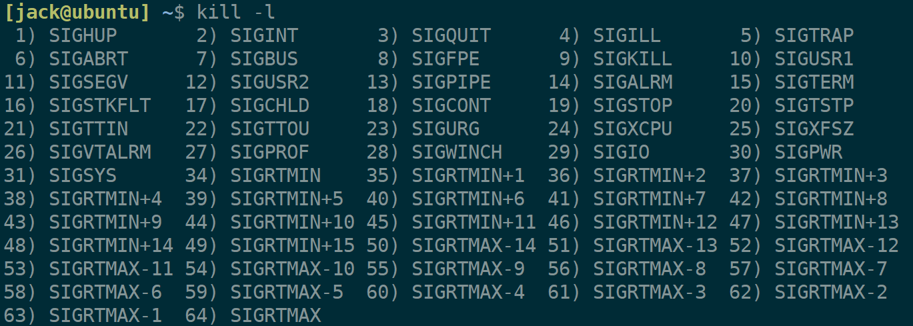
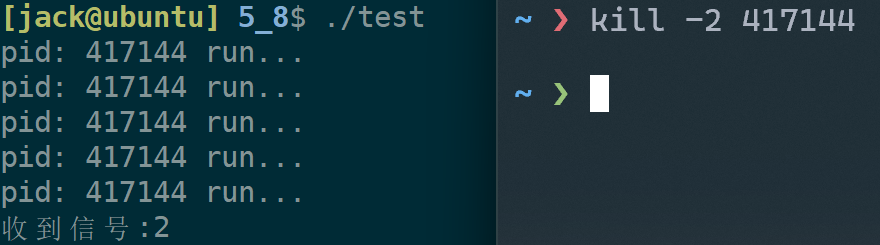
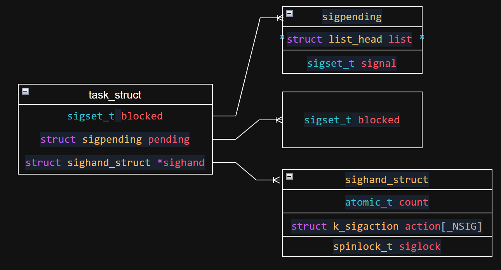

+++
date = 2026-05-11
title = "Linux信号深度解剖：5种产生、3张表、4次切换"
description = ""
slug = ""
authors = []
tags = ["信号", "信号处理", "阻塞", "未决信号"]
series = ["Linux"]
featuredImage = "assets/cover.png"
toc = true
+++

# Linux信号深度解剖：5种产生、3张表、4次切换

> 原创 于 2026-05-11 17:04:45 发布 · 公开 · 535 阅读 · 22 · 19 · 本内容遵循CC 4.0 BY-SA版权协议 版权声明：本文为博主原创文章，遵循 CC 4.0 BY-SA 版权协议，转载请附上原文出处链接和本声明。 GEO检测 · 编辑
> 文章链接：https://blog.csdn.net/2401_87889177/article/details/160900996

**文章目录**

[TOC]


## 1、信号的认识

**信号** 是一种由外部、其他人或硬件发送给进程的异步事件通知机制。严格来说也算进程间通信方式，但与IPC有很大不同，信号只负责通知进程。

linux下有32个普通信号，本文不探究34到64的实时信号。



信号的生命周期有三个阶段，1、信号产生；2、信号保持；3、信号处理。

信号的处理有三种方式，1、忽略；2、默认处理（退出进程）；3、自定义（捕捉）处理。

其中，9号信号（管理员信号）和19号信号不可被捕捉。

`signal` 系统调用用于自定义信号处理行为：

```cpp
typedef void (*sighandler_t)(int);
sighandler_t signal(int signum, sighandler_t handler);
```

参数：

- signaum：需要捕捉的信号。

- handler：函数指针类型，指向用于处理的函数，其参数为信号。
  返回值：

- 成功：返回指向上一个处理信号函数的函数指针。

- 失败：返回SIG_ERR，并设置errno。

信号的处理是由进程自己处理的。

更详细的信号内容使用 `man 7 signal` 查看。

## 2、信号产生

信号的本质：PCB中的一个位图。信号产生的本质：操作系统向位图写数字。无论那种产生方式，都是由操作系统完成的。

### 2.1、shell命令产生

`kill -signal PID` 用于向目标进程发送信号，一段demo测试。

```cpp
#include <signal.h>
#include <iostream>
#include <unistd.h>

void hander(int sig)
{
    std::cout << "收到信号:" << sig << std::endl;
    exit(1);
}

int main()
{
    signal(2, hander);
    while(1)
    {
        std::cout << "pid: " << getpid() << " run..." << std::endl;
        sleep(1);
    }
    return 0;
}
```

发送2号信号后就进行自定义处理方式。



kill命令最灵活，可以发送任意号信号给任意进程。

### 2.2、键盘产生

| 快捷键 | 信号 | 行为 |
|:---:|:---:|:---:|
| <kbd>Ctrl</kbd> + <kbd>c</kbd> | SIGINT(2) | Term(退出进程) |
| <kbd>Ctrl</kbd> + <kbd>\</kbd> | SIGQUIT(3) | Core(退出并产生core dump) |
| <kbd>Ctrl</kbd> + <kbd>z</kbd> | SIGSTOP(19) | Stop(暂停进程) |


细节1：coredump，会生成一个 `core` 文件，包含了调试信息，使用 `gdb program core` 可直接跳到程序崩溃位置，免去了打断点的过程。在云服务器中被云服务厂商禁用了，避免过多占用磁盘。

细节2：Core是异常退出，Term是用户发送信号退出。

细节3：19号信号暂停的进程变成后后台进程，不能读取键盘信息，只能用 `kill` 命令发送18号信号（SIGCONT）恢复。

### 2.3、硬件异常产生

常见的硬件异常有：除零异常和段错误。

CPU中的ALU 算术逻辑单元负责计算，当遇到除零异常时，ALU异常，操作系统一定要知道，因为操作系统是硬件的管理者。

CPU中CR3负责存储指向页表的地址，当访问空指针时，CR3和MMU异常（段错误），操作系统也能够知道。

使用signal捕捉后，证明除零异常和访问空指针会收到信号：

```cpp
#include <signal.h>
#include <iostream>
#include <unistd.h>

void hander(int sig)
{
    std::cout << "收到信号:" << sig << std::endl;
    exit(sig);
}

int main()
{
    signal(8 , hander);
    signal(11, hander);

    // 除零异常
    int a = 3;
    a /= 0;

    // 访问空指针
    // *(int*)nullptr = 1;
    return 0;
}
```

### 2.4、系统调用

kill：指定进程发送指定信号。

```cpp
int kill(pid_t pid, int sig);
```

参数：

- pid：目标进程。

- sig：发送的信号。

手写kill命令：

```cpp
#include <signal.h>
#include <iostream>

int main(int argc, char *argv[])
{
    if(argc != 3)
    {
        std::cout << "Usage:" << argv[0] << "sig who" << std::endl;
        exit(1);
    }
    int sig   = atoi(argv[1]);
    pid_t pid = atoi(argv[2]);
    int n = kill(pid, sig);
    if(n == 0)
        std::cout << "Sucess!" << std::endl;
    return 0;
}
```

---

raise(C标准库函数)：特定进程（调用的进程）发送指定信号。

```cpp
int raise(int sig);
```

参数：

- sig：发送的信号。

该函数相当于 `kill(getpid(), sig)` 。

---

abort：特定进程（调用的进程）发送特定信号（6号SIGABRT）。

```cpp
[[noreturn]] void abort(void);
```

相当于 `kill(getpid(), 6)` 。会参数core dump，常用于工程中主动留下调试信息。6号信号即使捕捉后不退出，也会再捕捉后自动退出。

### 2.5、软件条件产生

管道通信时，读端关闭，操作系统会发送信号杀死写端进程。详细见 [【管道通信深度剖析：从匿名管道到命名管道，手写进程池】](https://blog.csdn.net/2401_87889177/article/details/160566224?spm=1001.2014.3001.5501) 。

alarm闹钟：

```cpp
unsigned int alarm(unsigned int seconds);
```

参数：

- seconds：非0表示seconds秒后发送14号信号(SIGALRM)。为0则取消还没有发送的信号。

返回值：

- 上一个闹钟超时剩余的时间。若没有上一个闹钟则返回0。

常见误区：在循环中设置闹钟，可能反复重置超时时间，永远不出发闹钟。

### 2.6、常用信号汇总

| 信号名 | 编号 | 默认动作 | 说明 |
|:---:|:---:|:---:|:---:|
| SIGINT | 2 | Term | <kbd>Ctrl </kbd> + <kbd>c</kbd> |
| SIGQUIT | 3 | Core | <kbd>Ctrl </kbd> + <kbd>\</kbd> |
| SIGABRT | 6 | Core | abort() |
| SIGFPE | 8 | Core | 除零/浮点异常 |
| SIGKILL | 9 | Term | 强制终止 |
| SIGSEGV | 11 | Core | 段错误 |
| SIGPIPE | 13 | Term | 无读端的管道写 |
| SIGALRM | 14 | Term | alrm闹钟 |
| SIGCONT | 18 | Cont | 唤醒进程 |
| SIGSTOP | 19 | Stop | 暂停进程 |


## 3、信号保存

### 3.1、信号相关概念

1. 信号递达(Delivery)：内核处理信号的动作。

2. 信号未决(Pending)：从信号产生到信号递达之间的状态。

3. 阻塞(Block)：被阻塞的信号将保持在未决状态，解除阻塞才能被递达。

阻塞不等于忽略，忽略是信号递达的具体一种处理方式，而被阻塞的信号将不会递达。

### 3.2、内核结构

内核对于阻塞、未决、递达维护了三张表（对应pending、blocked(block)、sighand(handler)）。



sigset_t是一个位图，又叫信号集，可以表示信号是否有效。 对信号的操作变成了对三张表的增删查改。pending和block表都是用sigset_t类型实现的。

handler表中存储函数指针类型，记录处理信号方法，默认为 `SIG_DFL` （清理进程资源并退出进程，由0强转），忽略信号为 `SIG_IGN` （由1强转）。

三张表关系：

| block | pending | handler |
|:---:|:---:|:---:|
| 0 | 0 | 不执行 |
| 0 | 1 | 执行 |
| 1 | 任何 | 不执行 |


block（阻塞信号集）又叫屏蔽字信号集，类比于umask。

### 3.3、信号集操作函数

```cpp
#include <signal.h>
int sigemptyset(sigset_t *set);
int sigfillset(sigset_t *set);
int sigaddset(sigset_t *set, int signo);
int sigdelset(sigset_t *set, int signo);
int sigismember(const sigset_t *set, int signo);
```

1. sigemptyset：初始化set指向的信号集，使位图中的每一个数位清0。

2. sigfillset：初始化set指向的信号集，使位图中每一位数位置1。

3. sigaddset：set指向的信号集中，使signo信号对应数位置1。

4. sigdelset：set指向的信号集中，使signo信号对应数位置0。

5. sigmember：判断set指向的信号集中signo是否为1。

---

读取或更改屏蔽字信号集：

```cpp
int sigprocmask(int how, const sigset_t *_Nullable restrict set,sigset_t *_Nullable restrict oldset);
```

参数：

- how：通常传递宏 `SIG_BLOCK` (新增屏蔽字，block |= set)、 `SIG_UNBLOCK` (删除屏蔽字，block &= ~set)、 `SIG_SETMASK` (覆盖屏蔽字信号集，block = set)。

- set：输入型参数。

- oldset：输出型参数，被设置为修改前的屏蔽字信号集。

sigpending用于获取当前进程的pending表位图：

```cpp
int sigpending(sigset_t *set);
```

参数：

- set：输出型参数，将内核中pending位图复制到set指向的信号集中。

### 3.4、查看屏蔽与未决

按照一下流程可看到信号集变化的过程。


具体实现如下：

```cpp
#include <iostream>
#include <unistd.h>

void PrintSig(sigset_t& set)
{
    for(int i = 31; i > 0; --i)
    {
        if(sigismember(&set, i))
            std::cout << 1;
        else
            std::cout << 0;
    }
    std::cout << std::endl;
}

// 全局变量方便handler函数使用。
sigset_t pendding, block, oldblock;
void hander(int sig)
{
    std::cout << "收到信号:" << sig << std::endl;
    PrintSig(pendding);
}

int main()
{
    signal(2, hander);
    
    sigpending(&pendding);
    PrintSig(pendding);

    sigemptyset(&block);
    sigaddset(&block, 2);
    sigprocmask(SIG_BLOCK, &block, &oldblock); 
    
    kill(getpid(), 2);

    sigpending(&pendding);
    PrintSig(pendding);

    sigprocmask(SIG_SETMASK, &oldblock, nullptr);

    sigpending(&pendding);
    PrintSig(pendding);
    return 0;
}
```

结果：

```bash
0000000000000000000000000000000
0000000000000000000000000000010
收到信号:2
0000000000000000000000000000010
0000000000000000000000000000000
```

得出结论：解除信号后，信号立即被处理；先处理信号，后将pending相关位置0。

## 4、信号处理

### 4.1、信号处理时机

虚拟地址空间（32位）中，0～3GB称为用户态空间；3GB～4GB被称为内核态空间。

信号处理都是内核做的，因此无论怎么处理都是在内核态空间完成的。

典型场景：

1. 系统调用完成后。

2. 中断处理完成后。

3. 进程被调度再次获得CPU时。

内核在返回用户态之前调用do_signal()函数，检查当前进程的pending和block表。

- 若无信号可递达，则直接返回。

- 若有信号且未被阻塞，则递达信号。

### 4.2、信号处理流程

默认处理：清理task_struct，并退出进程。

忽略：清理pending表后直接返回用户态。

---

自定义处理流程：


自定义处理需要4次状态切换：

1. 进入内核态处理某种事件，用户态->内核态；

2. 处理完后，判断是否执行信号处理，保存上下文，返回用户态执行处理逻辑，内核态->用户态；

3. 处理完后，进入内核态加载上下文，用户态->内核态；

4. 加载完后，返回用户态继续执行主流程，内核态->用户态；

## 5、总结

1. 信号定义：异步时间通知机制，不传数据，与信号量无关。

2. 生命周期：产生->未决->递达。

3. 产生方式：键盘、命令、硬件异常、系统调用、软件条件。

4. 内核三张表：block(屏蔽字)、pending(未决)、handler(处理函数)。

5. 阻塞 不等于 忽略：阻塞阻止信号递达，忽略时递达后的一种处理方式。9、19号信号不可忽略/捕捉/阻塞。

6. 处理时机：内核态->用户态时检查。自定义捕捉4次状态切换。
