+++
date = 2026-07-08
title = "Linux Socket 编程从入门到实战：UDP群聊与TCP远程连接"
description = ""
slug = ""
authors = []
tags = ["Socket", "UDP", "TCP", "套接字"]
series = ["Linux"]
featuredImage = "assets/cover.png"
toc = true
+++

# Linux Socket 编程从入门到实战：UDP群聊与TCP远程连接

> 原创 于 2026-07-08 09:51:15 发布 · 公开 · 225 阅读 · 7 · 5 · 本内容遵循CC 4.0 BY-SA版权协议 版权声明：本文为博主原创文章，遵循 CC 4.0 BY-SA 版权协议，转载请附上原文出处链接和本声明。 GEO检测 · 编辑
> 文章链接：https://blog.csdn.net/2401_87889177/article/details/161737781

**文章目录**

[TOC]


## 1、网络协议

### 1.1、为什么有四层协议

ISO制定出7层OSI协议标准。实际使用4层协议，物理层为网卡等硬件需要遵守的，这里不做解释。

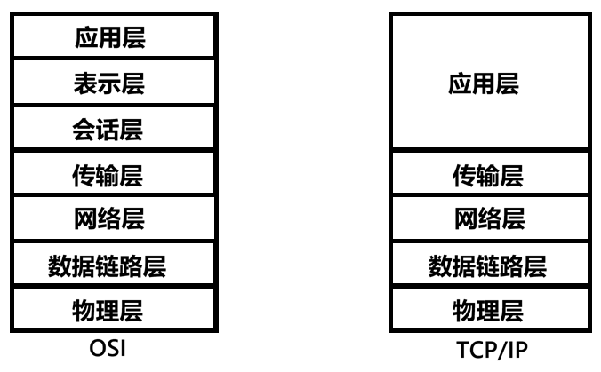

OSI标准非常好，但是协议栈要嵌入操作系统。就不能把 **应用层** 、 **表示层** 、 **会话层** 放入操作系统，这三层是用户软件需要遵守的。所以TCP/IP就将其统一应用层。

数据在一台电脑中传输，可以把主板看作一个网络结构，因其传输距离近，所以极少发生丢包、错误等概率。

网络传输距离变长，四层协议分别解决的问题：

- 数据链路层：相邻硬件之间数据传输。

- 网络层：地址管理和路由选择，路由器工作在这一层。

- 传输层：两台主机的数据传输。

- 应用层：具体如何使用，如：电子邮件、文件传输等。

### 1.2、封装、解包与分用

发送数据不是目的，使用数据才是。数据的产生于用户，发送的对象也是用户。因此，A电脑向B电脑发送数据，必须从A的应用层到A的物理层，通过硬件到B的物理层，再到B的应用层。

***协议的本质就是一个结构体！*** 

A向B发送“你好”，在每层协议中都会加上报头，增加报头的过程就是封装。

B的网卡接收到数据，逐渐剥离报头的过程是解包，传递给上一层协议教分用。

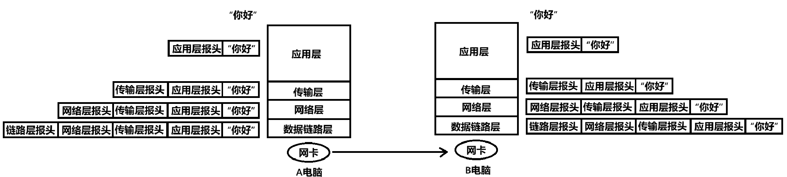

F：解包怎么做到的？
A：每个报头结构体的大小固定或者报头固定位置记录了大小。通过类型强转，指针解引用解包。

F：分用怎么知道向上传递给哪个协议？
A：报头中也有记录。

## 2、MAC、IP与端口

### 2.1、MAC地址与局域网通信

网络需求最开始出现在某实验室，人们通过几根网线连接几台电脑，实现通信。出现了第一个局域网。后来企业、高校、军事等方面也陆续模仿、有了多个局域网。但是，局域网通信的标准统一不了。

两种常见的局域网哪个通信标准：

- 以太网：如果发生数据碰撞，延时重发。

- 令牌环网：令牌是一个小数据帧，谁拿到这个令牌谁就能发送数据。令牌在局域网哪个中的各个主机中轮流传递。

MAC地址是一个48位数字，理论上全球唯一，用于标识表示数据源主机，目的主机。主机发送数据，局域网哪个中所有主机都会收到数据。数据会被发送到局域网中的每台主机，如果本机MAC与目的主机MAC不一样，否则丢弃数据。

### 2.2、IP与跨网络通信

IP地址是32位整数（ipv4），用于定位全球范围内唯一一台主机（公网IP）。

如图两主机位于不同局域网，不同直接通信，必须借助路由器。路由器必须至少有两个IP地址和MAC地址。

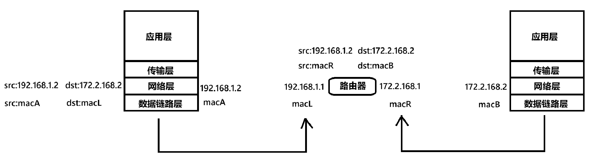

如果是上面局域网通信，可以通过IP判断目标主机是否当局域网内。如果不是，就发给路由器。在网络层判断是否发给路由器自己的，如果不是就重新封装（last src ip和last src mac发生变化），通过路由器其他端口转发。直到目标主机局域网路由器接收到数据。

### 2.3、端口

端口用于表示决定数据往目标主机哪个进程发送，接收的电脑进程通过监听指定端口，获得数据。

端口用于标识目需要数据的唯一进程，PID也能标识唯一的进程。从技术上是一定能实现的，但是没人这么做。不用PID的原因：网络与系统解耦，不是所有进程都需要网络数据，进程重启PID就变了。

IP用于标识唯一一台主机，端口用于标识唯一一个进程。IP+端口的组合可以标识全球网络范围内唯一一个进程。因此， ***网络通信的本质是进程间通信*** 。

## 3、socket编程

### 3.1、socket编程简介

把IP地址加端口号的通信编程方式叫做socket编程。在传输层有两个特别常用的协议：

1. TCP：

   - 有连接。

   - 可靠传输。

   - 面向字节流。

2. UDP：

   - 无连接。

   - 不可靠传输。

   - 面向数据报。

TCP/IP规定：网络传输中必须使用大端序数据，且先发低地址数据后发高地址数据。

为了使用户学习成本更低，开发者设计的不同通信方式的接口都一样。

统一的网络标准接口是通过C语言实现多态实现的， `sockaddr_in` 、 `sockaddr_un` 是具体的类型，通过开头16位的地址类型可以确定是什么类型。

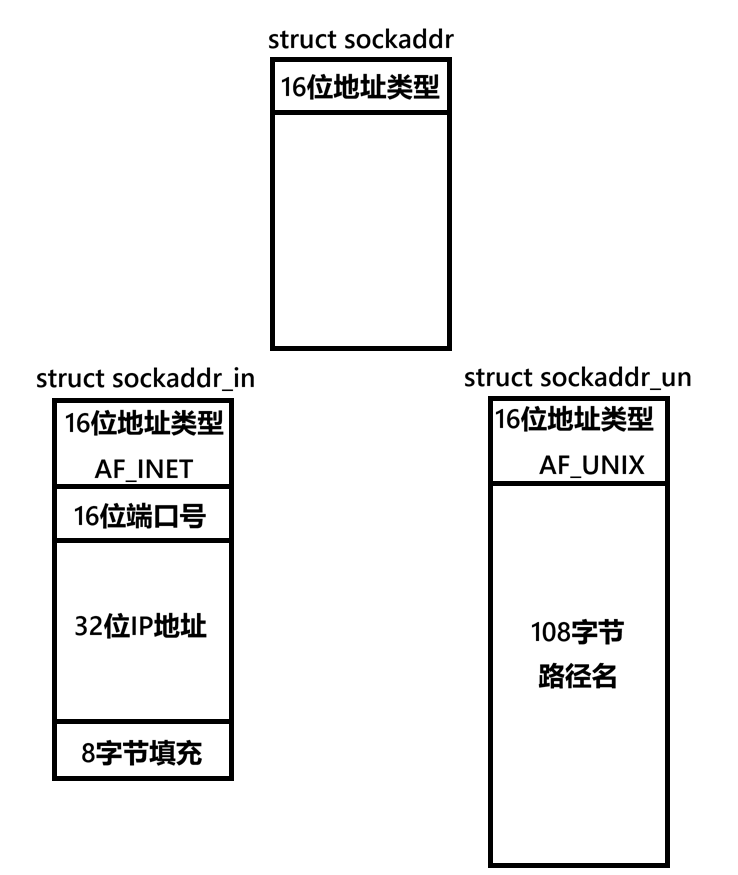

`sockarddr` 是父类用于函数参数，通常实现 `sockaddr_in` 子类，在子类填写ip地址、端口号。

使用时，传参需要将 `sockaddr_in` 强转成 `sockaddr` 类型。

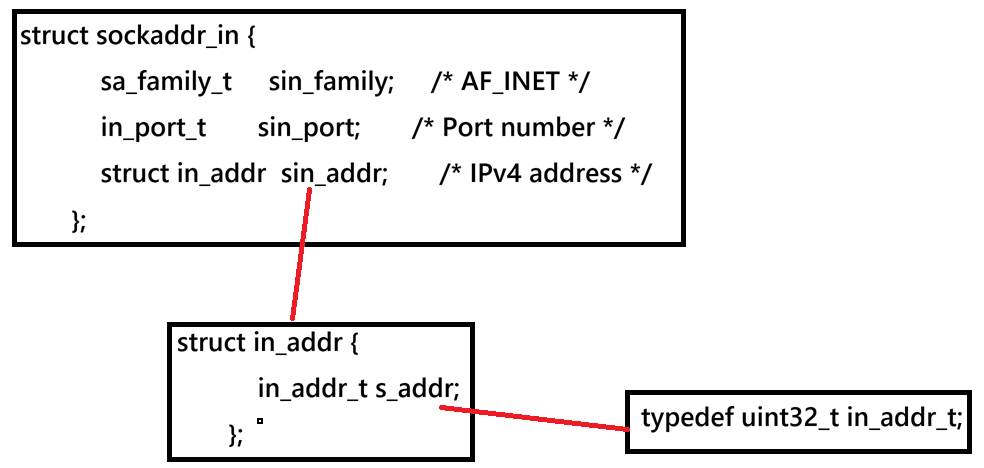

### 3.2socket编程常用接口

#### 3.2.1、TCP、UDP共用接口

可以使用下面一组函数在主机字节序和网络字节序之间转换：

```c
uint32_t htonl(uint32_t hostlong);   // host to net long
uint16_t htons(uint16_t hostshort);  // host to net short
uint32_t ntohl(uint32_t netlong);    // net to host long
uint16_t ntohs(uint16_t netshort);   // net to host short
```

---

创建套本地接字文件描述符：

```c
int socket(int domain, int type, int protocol);
```

参数：

- domain：地址族，填写宏。常见有：AF_UNIX（域间通信）、AF_INET（ipv4）、AF_INET6（ipv6）。

- type：套接字类型，填写宏。常见有：SOCK_STREAM（面向字节流、有序、可靠、有链接）、SOCK_DGRAM（面向数据报、不可靠、无连接）。

- protocol：常填0，系统自动选择。

返回值：

- 成功：linux下一切皆文件，返回文件描述符。

- 失败：返回-1，设置errno。

---

在填写ip是可以使用 `inet_pton` ，可以直接将点分十进制字符串IP地址转换成二进网络字节序的ip。

```c
in_addr_t inet_addr(const char *cp);
```

> 若不使用这个函数，可以使用结构体位段实现转换：
> struct ipv4_addr_bitfield {
> unsigned int part1 : 8; // 第1段
> unsigned int part2 : 8; // 第2段
> unsigned int part3 : 8; // 第3段
> unsigned int part4 : 8; // 第4段
> };
> struct ipv4_addr_bitfield ip;
> ip.part1 = 192; // 0xC0
> ip.part2 = 168; // 0xA8
> ip.part3 = 1; // 0x01
> ip.part4 = 1; // 0x01
> unsigned int *p = (unsigned int* )&ip;
> 与大小端机器有紧密关系，必须用htonl转换。

将IP转位点分十进制字符串：

```c
[[deprecated]] char *inet_ntoa(struct in_addr in);
```

---

将 `sockaddr_in` 对象绑定到文件描述符：

```c
int bind(int sockfd, const struct sockaddr *addr, socklen_t addrlen);
```

参数：

- sockfd：需要绑定的文件描述符。

- addr：填写具体的类型然后强转，例如： `(sockaddr*)sockaddr_in` 。

- addrlen：第二个参数的大小。

#### 3.2.2、UDP独有接口

UDP接收网络数据：

```c
ssize_t recvfrom(int sockfd, void buf[restrict .len], size_t len, int flags, struct sockaddr *_Nullable restrict src_addr, socklen_t *_Nullable restrict addrlen);
```

参数：

- sockfd：从sockfd文件描述符绑定的调节字接收。

- buf：接收数据的缓冲区，任意数据类型。

- len：缓冲区大小，本次最多读取len个字节。

- flags：填0，正常读取。填MSG_PEEK，读取后不会删除，下次可再读。

- src_addr：用于接收发送方的sockaddr的指针（方便后续给发送方回复数据）。

- addrlen：src_addr指向对象的大小。

返回值：

- 成功：返回接收到的数据字节数。

- 失败：返回-1，并设置errno。

---

UDP发送数据：

```c
ssize_t sendto(int sockfd, const void buf[.len], size_t len, int flags, const struct sockaddr *dest_addr, socklen_t addrlen);
```

参数：

- sockfd：使用sockfd绑定的套接字发送数据。

- buf：发送数据的缓冲区。

- len：buf缓冲区的大小。

- flags：填0，默认发送行为。填MSG_NOSIGNAL，对方断开连接也不触发异常，避免程序崩溃，UDP用不到。

- dest_addr：向dest_addr指向的套接字发送数据。

- addrlen：dest_addr对象的长度。

返回值：

- 成功：返回实际发送的字节数。

- 失败：返回-1，并设置errno。

#### 3.2.3、TCP独有接口

UDP是面向数据报的协议，所以不能使用文件接口，而TCP是面向字节流的，所以能够使用文件接口。

下面两个接口不做解释：

```c
ssize_t read(int fd, void buf[.count], size_t count);
ssize_t write(int fd, const void buf[.count], size_t count);
```

---

TCP发送数据：

```c
ssize_t send(int sockfd, const void buf[.len], size_t len, int flags);
```

参数：

- sockfd：这是目标服务器绑定的文件描述符。

- buf：发送的数据。

- len：发送数据的字节数。

- flags：掩码，一般填0。

---

TCP接收数据：

```c
ssize_t recv(int sockfd, void buf[.len], size_t len, int flags);
```

参数：

- sockfd：服务器文件描述符。

- buf：接收数据的缓冲区。

- len：buf的大小，最多能接收len个字节。

- flags：填写0，表示阻塞等待。

---

TCP进入 `Listen` 状态，TCP是基于连接的协议，这就要求服务端监听客户端发来的请求：

```c
int listen(int sockfd, int backlog);
```

参数：

- sockfd：有socket函数创建的文件描述符。

- backlog：底层挂起连接队列（待完成连接队列）的最大长度。若满了后收到连接请求，客户端会收到错误拒绝 `ECONNREFUSED` ，若是底层协议支持重传，客户端会延迟重新发送连接请求。

---

提取挂起连接队列中第一条 TCP 连接，返回专门和客户端通信的新套接字。

```c
int accept(int sockfd, struct sockaddr *_Nullable restrict addr, socklen_t *_Nullable restrict addrlen);
```

参数：

- sockfd：由socket创建的基于连接的文件描述符。

- addr：输出型参数，被设置成客户端的sockaddr。

- addrlen：输入输出型参数，被设置成实际sockaddr的字节数。

返回值：

- 成功：返回一个新的文件描述符，用于专门与该连接的客户端通信。

---

TCP建立三次握手连接：（该函数UDP也可用，但作用完全不一样）

```c
int connect(int sockfd, const struct sockaddr *addr, socklen_t addrlen);
```

参数：

- sockfd：由socket创建的本地文件描述符。

- addr：向addr的服务器建立连接，通常是客户端做。

- addrlen：输入型参数，addr的字节数。

## 4、UDP群聊服务器

### 4.1、基础版echo server

源码上传至【 [https://gitee.com/muyi-2580/learning-linux/tree/main/6_7](https://gitee.com/muyi-2580/learning-linux/tree/main/6_7) 】。

云服务器不能显示绑定公网IP，因为它存在多个IP地址（公网IP、本地环回、内网IP），一般的服务都要监听这几个IP。可以绑定 `0.0.0.0` 监听所有IP。
 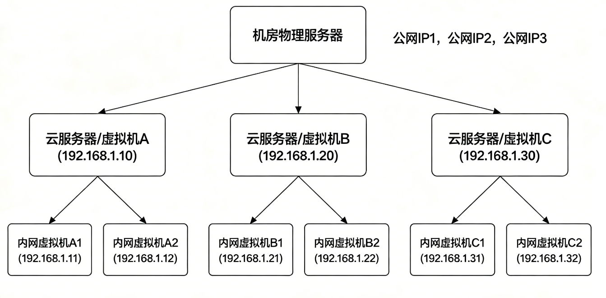

UdpServer.hpp：

```cpp
#ifndef __UDP__SERVER__HPP
#define __UDP__SERVER__HPP
#include "Logger.hpp"
#include <cstdint>
#include <cstring>
#include <strings.h>
#include <unistd.h>
#include <sys/socket.h>
#include <netinet/in.h>
#include <arpa/inet.h>
#include <string>
#include <functional>
#include "Logger.hpp"
using namespace NS_LOGGER_MUDULE;
#define BUF_SIZE 1024
using callback_t = std::function<void(void*,void*,ssize_t*)>;

enum 
{
    SUCCES = 0,
    BIND,
    RECVFROM,
    SENDTO
};

class UdpServer
{
public:
    UdpServer(callback_t cb, std::string ip = "0.0.0.0", uint16_t port = 5678)
        :_ip(ip)
        ,_port(port)
        ,_cb(cb)
    {  }

    void Init()
    {
        // 1.创建文件描述符
        ssize_t n = sockfd = socket(AF_INET, SOCK_DGRAM, 0);
        if(n < 0)
        {
            LOG(LogLevel::FATAL) << "sockfd create error... ";
            exit(BIND);
        }

        // 2.创建结构体并填写ip、port信息
        struct sockaddr_in addr;
        bzero(&addr, sizeof(sockaddr));

        addr.sin_family = AF_INET;
        addr.sin_port = htons(_port);
        addr.sin_addr.s_addr = inet_addr(_ip.c_str());
       
        // 3.绑定信息到文件描述符 
        n = bind(sockfd, (sockaddr*)&addr, sizeof(sockaddr));
        if(n < 0)
        {
            LOG(LogLevel::FATAL) << "bind error... ";
            exit(BIND);
        }

        LOG(LogLevel::DEBUG) << "init succes... ";
    }

    void Start()
    {
        LOG(LogLevel::DEBUG) << "start succes... ";
        while(true)
        {
            // 存储发送方信息
            struct sockaddr_in peer;
            socklen_t len = sizeof(peer);

            char inbuf[BUF_SIZE];
            ssize_t n = recvfrom(sockfd, inbuf, sizeof(inbuf) - 1,
                    0, (struct sockaddr*)&peer, &len);
            if(n < 0)
            {
                LOG(LogLevel::WARNING) << "recvfrom error... ";
                exit(RECVFROM);
            }
            else
            {
                LOG(LogLevel::INFO) << "[" << inet_ntoa(peer.sin_addr)
                    << ":" << ntohs(peer.sin_port) << "]" << "read " << n << " bytes";

                char outbuf[BUF_SIZE];
                _cb((void*)inbuf, (void*)outbuf, &n);

                n = sendto(sockfd, outbuf, n, 0,
                        (struct sockaddr*)&peer, len);
                if(n < 0)
                {
                    LOG(LogLevel::WARNING) << "sendto error... ";
                    exit(SENDTO);
                }
            }
        }
    }

    ~UdpServer()
    {
        close(sockfd);
    }
private:
    std::string _ip;
    uint16_t _port;
    int sockfd;
    callback_t _cb;
};

#endif
```

server_udp.cc：

```cpp
#include "Logger.hpp"
#include "UdpServer.hpp"
#include <cstdint>
#include <memory>
#include <unistd.h>

void Usage(char argv[])
{
    std::cout << "Usage:\n\t" << argv << " port" << std::endl; 
}

// ./udp_server port
int main(int argc, char* argv[])
{
    if(argc != 2)
    {
        Usage(argv[0]);
        exit(1);
    }
    ENABLE_CONSOLE_STRATEGY();

    std::string ip = "0.0.0.0";
    uint16_t port = std::atoi(argv[1]);
    std::unique_ptr<UdpServer> upd_server = std::make_unique<UdpServer>([](void* inbuf, void* outbuf, ssize_t* n){
                char* in = (char*)inbuf;
                in[*n] = 0;
                std::cout << in << std::endl;
                char* out = (char*)outbuf;
                sprintf(out, "echo: %s", in);
                *n = strlen(out);
            }, ip, port);
    
    upd_server->Init();
    upd_server->Start();

    return 0;
}
```

客户端不要显示本地绑定ip和本地端口，这是为了避免端口号冲突，由系统自动分配。
client_udp.cc：

```cpp
#include <sys/socket.h>
#include <netinet/in.h>
#include <arpa/inet.h>
#include <stdlib.h>
#include <iostream>
#include <string>
#include <strings.h>
#include <sys/types.h>
#define BUF_SIZE 1024

void Usage(char argv[])
{
    std::cout << "Usage:\n\t" << argv << " ip port" << std::endl;
}

// ./client ip port
int main(int argc, char *argv[])
{
    if(argc != 3)
    {
        Usage(argv[0]);
        exit(1);
    }

    int sockfd = socket(AF_INET, SOCK_DGRAM, 0);
    if(sockfd < 0)
    {
        std::cerr << "sockfd create error...";
        exit(1);
    }
    
    struct sockaddr_in server;
    bzero(&server, sizeof(server));
    server.sin_family = AF_INET;
    server.sin_addr.s_addr = inet_addr(argv[1]);
    server.sin_port = htons(atoi(argv[2]));

    std::string mesg;
    while(std::getline(std::cin, mesg))
    {
        ssize_t n = sendto(sockfd, mesg.c_str(), mesg.size(), 
                0, (struct sockaddr*)&server, sizeof(server));
        if(n < 0)
        {
            std::cerr << "sendto error...";
        }
        else
        {
            struct sockaddr_in tmp;
            socklen_t len = sizeof(tmp);
            char buf[BUF_SIZE];
            n = recvfrom(sockfd, buf, sizeof(buf) - 1,
                    0, (struct sockaddr*)&tmp, &len);
            if(n < 0)
            {
                std::cerr << "recvfrom error...";
            }
            else
            {
                buf[n] = 0;
                std::cout << buf << std::endl;
            }
        }
    }

    return 0;
}
```

服务端效果（Ubuntu）：

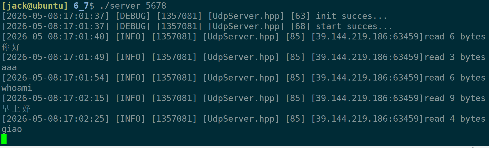

客户端效果（Android+Termux）：

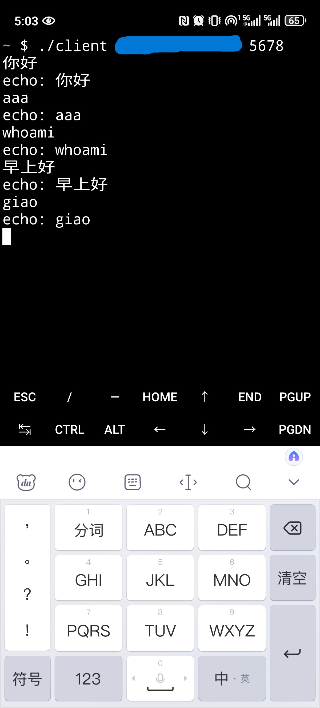

### 4.2、改进版群聊服务器

源码上传至【 [https://gitee.com/muyi-2580/learning-linux/tree/main/6_8](https://gitee.com/muyi-2580/learning-linux/tree/main/6_8) 】。
架构图：


效果:

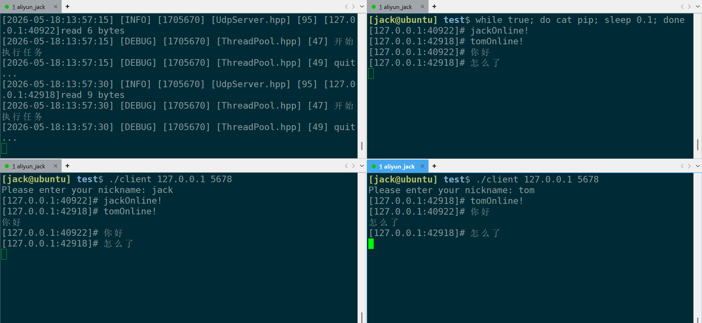

## 5、TCP实现简单远程连接

### 5.1、TCP版本echo server

源码已上传至：【gitee： [https://gitee.com/muyi-2580/learning-linux/tree/main/6_29/versoin1](https://gitee.com/muyi-2580/learning-linux/tree/main/6_29) 】。

TCP服务器流程与UDP大同小异，流程如下：


#### 5.1.1、version1 单进程单线程版本

该版本只能至多同时连接一个客户端，实现简单，但没有工程意义。

主要实现逻辑（伪代码）：

```
while(true)
{
	accept();
	...
	Service();
)
```

#### 5.1.2、version2 多进程版本

该版本实现异步处理服务。

多线程版本最大的问题在于等待子进程退出。

解决方法1：

```
while(true)
{
    // 5. 接收连接
    struct sockaddr_in peer;
    socklen_t len;
    int sockfd = accept(_listensockfd, (struct sockaddr*)&peer, &len);
    ...
    // 6 .处理连接服务
    InetAddr addr(peer);

    // version 2: 多进程版本
    pid_t pid = fork();
    if(pid < 0)
    {
        LOG(LogLevel::FATAL) << "fork err...";
    }
    else if(pid == 0)
    {
        // child
        // 关闭无用文件描述符
        close(_listensockfd);

        // 子进程直接退出
        if(fork() > 0) exit(SUCCES);

        // 只有孙子进程会执行到这里
        ServiceIO(sockfd, addr);
        close(sockfd);
        exit(SUCCES);
    }
    else 
    {
        // parent 
        // 关闭无用文件描述符
        close(sockfd);
        wait(nullptr);
    }
}
```

该方法利用系统特性，创建子进程后，创建孙子进程。当子进程退出，孙子进程称为孤儿进程，托管到1号进程进程回收。

解决方法2（伪代码）:

```
signal(SIGCHLD, SIG_IGN);
while(true)
{
	accept();
	...
	pid = fork();
	if(id < 0)
		...
	else if(id == 0)
		// child
	else
	{
		// parent
		ServiceIO();
	}
)
```

该方法是最佳实践，捕捉信号处理，然后忽略掉处理子进程退出信息。

#### 5.1.3、version3 多线程版本

多线程主要是解决创建多进程时的效率问题，多进程的创建页表、虚拟空间写实拷贝会有严重拖慢效率。

写法1（原生线程库）（伪代码）：

```
while(true)
{
	accept();
	ThreadData* td = new ThreadData(this, sockfd, addr);
    pthread_t tid;
    pthread_create(&tid, nullptr, thread_routine, (void*)td);
}

static void* thread_routine(void* args)
{
    ThreadData* data = static_cast<ThreadData*>(args);
    pthread_detach(pthread_self());
    data->_this->ServiceIO(data->_sockfd, data->_addr);

    delete data;
    pthread_exit(nullptr);
}

struct ThreadData
{
    ThreadData(TcpServer* ts, int sockfd, const InetAddr& addr)
        :_this(ts)
        ,_sockfd(sockfd)
        ,_addr(addr)
    {  }
    TcpServer* _this;
    int _sockfd;
    InetAddr _addr;
};
```

实现思路，使用线程库的 `pthread_detach` 进行分离线程。这里的 `thread_routine` 需要一个_this参数，是因为thread_routine静态函数，没有this指针，通过 `_this` 可以调用TcpServer的函数。

写法2（线程库）（伪代码）：

```
// 接入线程库
ThreadPool<task_t>::Instance()->Enqueue([this,sockfd, &addr](){
    this->ServiceIO(sockfd, addr); 
        });
```

该方法效率更高，提前创建线程，连接到客户端直接把任务交给线程库中线程。

### 5.2、简易版Remote SSH

源码已上传至：【gitee： [https://gitee.com/muyi-2580/learning-linux/tree/main/6_30](https://gitee.com/muyi-2580/learning-linux/tree/main/6_30) 】。

说明：没有任何安全验证，不可用于生产环境。

先看整体架构图：

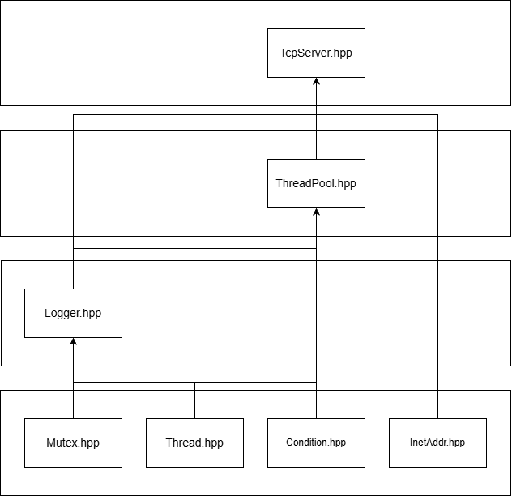

再看主要的流程：

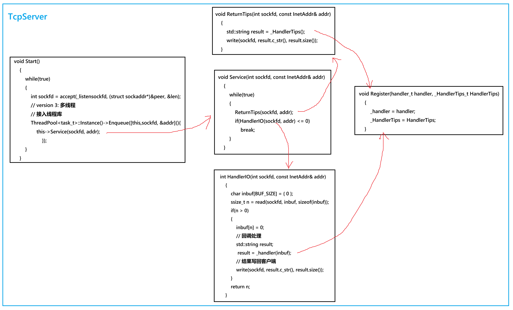

**注意：当读端退出，写端进程会自动退出。服务器应该一直工作才对！！！** 

TCP是基于连接的协议，客户端和服务端是平等关系，因此，服务端可以先像客户端发送命令行信息。

## 6、补充与总结

### 6.1、补充

**一、函数缩写** 

| 函数 | 缩写来源 | 含义 |
|:---:|:---:|:---:|
| `inet_addr()` | internet address | 字符串 IP → 二进制（已弃用） |
| `inet_aton()` | internet address to network | 字符串 IP → 二进制（可移植） |
| `inet_ntoa()` | internet network to address | 二进制 IP → 字符串（已弃用） |
| `inet_pton()` | internet presentation to network | 字符串 IP → 二进制（推荐） |
| `inet_ntop()` | internet network to presentation | 二进制 IP → 字符串（推荐） |
| `htonl()` | host to network long | 32位主机序 → 网络序 |
| `htons()` | host to network short | 16位主机序 → 网络序 |
| `ntohl()` | network to host long | 32位网络序 → 主机序 |
| `ntohs()` | network to host short | 16位网络序 → 主机序 |


注意： `inet_addr和inet_ntoa` 是不可重入函数，线程不安全的，推荐使用线程安全的 `inet_pton` 和 `inet_ntop` 。

**二、地址族/协议域（domain）** 

| 宏 | 缩写来源 | 含义 |
|:---:|:---:|:---:|
| `AF_INET` | Address Family Internet | IPv4 地址族 |
| `AF_INET6` | Address Family Internet version 6 | IPv6 地址族 |
| `AF_UNIX` | Address Family UNIX | Unix 域套接字（本地通信） |
| `AF_LOCAL` | Address Family Local | 本地通信（同 AF_UNIX） |
| `AF_PACKET` | Address Family Packet | 数据链路层直接访问 |
| `PF_INET` | Protocol Family Internet | 协议族（通常等于 AF_INET） |


> **注意** ： `AF_*` 和 `PF_*` 在 Linux 中通常值相同，现在统一使用 `AF_*` 

**三、套接字类型（type）** 

| 宏 | 缩写来源 | 含义 |
|:---:|:---:|:---:|
| `SOCK_STREAM` | Socket Stream | 流式套接字（TCP，可靠有序） |
| `SOCK_DGRAM` | Socket Datagram | 数据报套接字（UDP，不可靠） |


**四、协议（protocol）** 

| 宏 | 缩写来源 | 数值 | 含义 |
|:---:|:---:|:---:|:---:|
| `IPPROTO_TCP` | IP Protocol TCP | 6 | TCP 协议 |
| `IPPROTO_UDP` | IP Protocol UDP | 17 | UDP 协议 |
| `IPPROTO_SCTP` | IP Protocol SCTP | 132 | SCTP 协议 |
| `IPPROTO_ICMP` | IP Protocol ICMP | 1 | ICMP 协议（ping） |
| `IPPROTO_RAW` | IP Protocol RAW | 255 | 原始 IP 协议 |
| `IPPROTO_IP` | IP Protocol IP | 0 | IP 协议（默认） |


### 6.2、总结

sockaddr 作为基类，具体使用时强转 sockaddr_in（IPv4）或 sockaddr_un（Unix域）。核心接口如下：

| 协议 | 服务端 | 客户端 |
|:---:|:---:|:---:|
| UDP | socket → bind → recvfrom/sendto | socket → sendto/recvfrom |
| TCP | socket → bind → listen → accept → recv/send | socket → connect → recv/send |


区别：UDP 无连接、不可靠、面向数据报；TCP 面向连接、可靠、面向字节流。

是否基于连接不能说是优缺点，只能说是特征，每一种协议都有自己的作用。