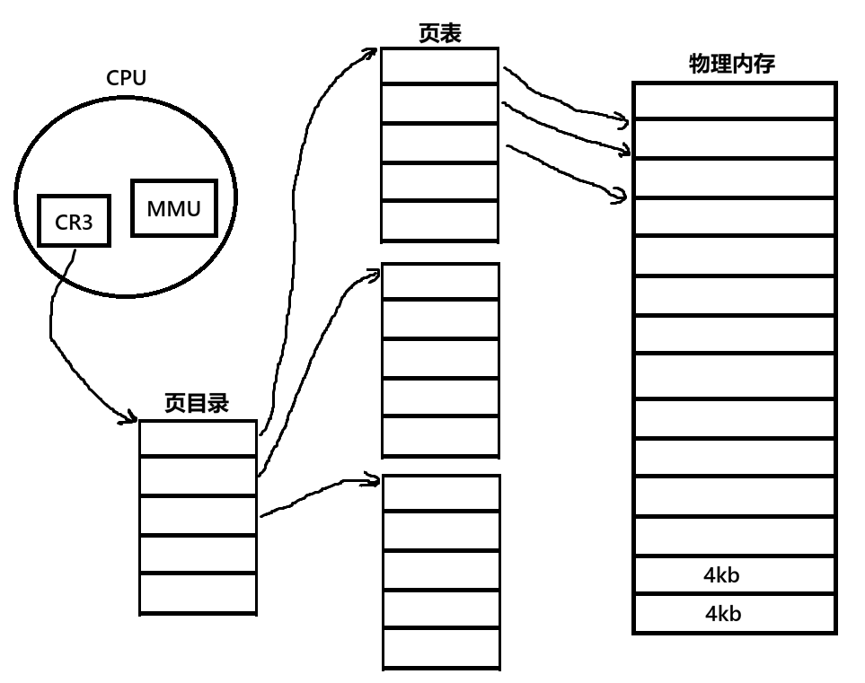
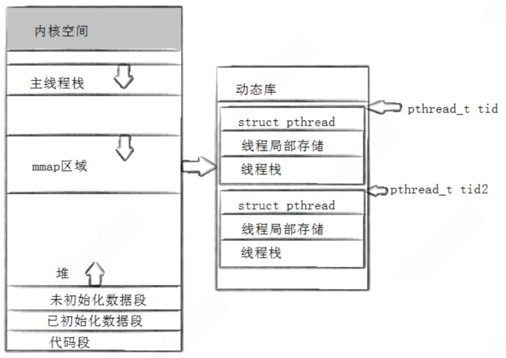
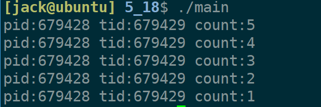
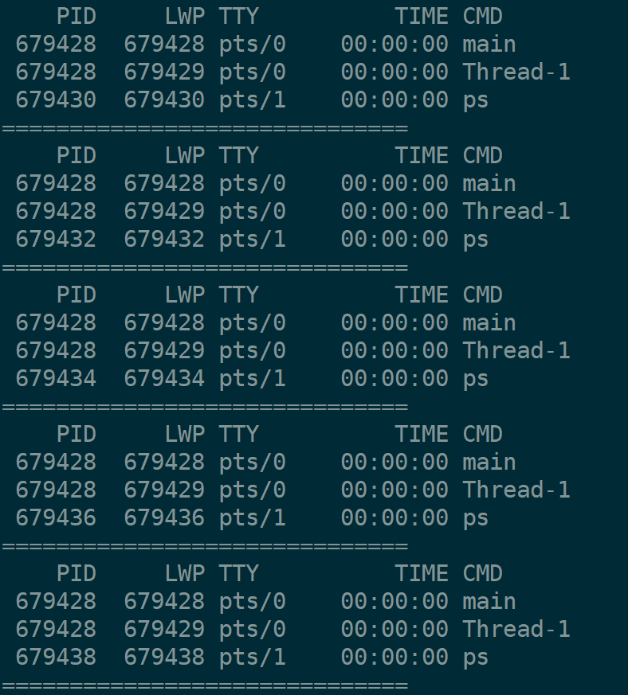

+++
date = 2026-05-25
title = "Linux多线程编程(一)：pthread库从入门到封装"
description = ""
slug = ""
authors = []
tags = ["线程", "pthread", "页表", "虚拟地址"]
series = ["Linux"]
featuredImage = "assets/cover.png"
toc = true
+++

# Linux多线程编程(一)：pthread库从入门到封装

> 原创 已于 2026-05-25 20:33:18 修改 · 公开 · 438 阅读 · 20 · 15 · 本内容遵循CC 4.0 BY-SA版权协议 版权声明：本文为博主原创文章，遵循 CC 4.0 BY-SA 版权协议，转载请附上原文出处链接和本声明。 GEO检测 · 编辑
> 文章链接：https://blog.csdn.net/2401_87889177/article/details/161115848

**文章目录**

[TOC]


## 1、页表

### 1.1、内存管理

操作系统有五大功能：进程管理、磁盘管理、文件管理、驱动管理、内存管理。其中内存管理最简单了。

假设有一块4GB的物理内存，将其按照4KB（具体操作系统具体分析）划分，可以分为 `1,048,576` 部分，每一个4KB为一个页框（页帧）。


局部性原理：从统计学角度看，如果某地址的数据被访问，下一次有较大概率访问其附近的数据。因此操作系统读、写、访问物理内存的最小单位是页框，因此即便只写一个字节也要加载4KB。

4KB等于2^12字节，第n个页框的物理地址等于 `n * (2 << 12)` ，记录物理地址只需要20个比特位，低12位都为0。

页框用结构体 `struct page` 来描述，结构体中剩下的12位比特位也充分利用起来了做为标志位，是否被共享，是否禁止换出到磁盘等。

操作系统通过一个数组来管理页框，数组内容为每个页框的起始地址。也就是需要 `1048576 * 4 / 1024 / 1024 = 4MB` 空间来管理这个物理内存。数组下标为页框地址右移12位。

### 1.2、页表结构

CPU读入的是虚拟地址，操作的是物理地址中的数据。是通过 `CR3` 寄存器、 `MMU` （Memory Management Unit）、页表实现的。

32位虚拟地址被分为三部分：


CR3寄存器中存储页表物理地址。MMU负责通过查页表找到物理地址。

页目录和页表都是1024个元素的数组，高10位用于索引页目录，找到对应页表。中间10位用于索引页表，找到具体是哪个页框。低12位为页内偏移。



页目录与页表每一个元素叫页项，页项大小都位4字节大小。页表总大小为4KB，1024个页表总计4MB。

页表和页目录刚好占用一个页框。因此20比特位存储的是页框起始物理地址，后12个比特位存储的是标志位，记录是否被访问，是否脏页等。

MMU硬件通过查页表完成虚拟地址到物理地址的转换的。

Q：内存懒加载什么意思？
A：像ls这样的进程不需要很多物理内存，因此页表只也很少，都是根据需要加载的。

Q：缺页中断怎么触发的？
A：当虚拟地址到物理地址的转换过程中，MMU发现页表、页框不存在或者页表页框标志位权限不足时，CPU触发异常机制。

Q：写实拷贝什么原理？
A：父子页表指向同一物理地址，且页表标志位权限为只读，当其中一进程写操作时，CPU触发异常机制。

## 2、线程的概念

### 2.1、认识线程

线程是进程当中的一个执行分支，线程存在的意义是为了完成某个任务，即执行某段代码。每个进程都有一个入口地址，线程是在进程中创建的，对于某个函数，如果将代码段中的函数作为入口地址，那么就可以从这个函数开始执行了。线程的原理就是划分代码段。

线程也需要ID标识，需要被调度，需要被管理。windows系统对线程使用TCB(Thread Control Block)进程管理。而Linux开发者认为线程与进程高度相识，因此复用PCB，linux下没有真的线程，是用进程模拟的，又叫 **轻量级进程** 。

这点又体现在无论是 `pthread_create` 还是 `fork` 系统调用都是对 `clone` 进行的封装。

通进程下线程共用虚拟地址空间，实现原理是共用页表。因此从进程组成方面理解，进程=一个或者多个线程+PCB+页表+虚拟地址空间。

从操作系统来看，进程是分配系统资源的基本实体。

线程是CPU调度的基本单位。

线程之间共享的有：虚拟地址空间、页表、文件名描述符、信号处理。
线程独有的有：上下文、线程ID、栈、errno。

### 2.2、线程的优缺点

**优点** ：

1. 创建线程的代价比创建进程小很多，线程只需要创建task_struct。

2. 与进程切换相比，线程切换代价也小很多，主要体现在：

   1. 线程有些寄存器内容不需要切换，例如CR3。

   2. TLB(Translation Lookaside Buffer)不会丢失，若TLB中有需要访问的地址，则直接加载，否则通过页表查询再缓存到TLB；还有cache三级缓存不会丢失。

3. 能够显著提升IO密集型任务的效率。

---

**缺点** ：
4. 如果是计算型密集任务或者单核CPU，创建多进程会有性能损失。
5. 程序健壮性降低，如果进程收到一个信号，所有的线程都要挂。

## 3、pthread库

使用pthread需要加链接选项 `-lpthread` 。

### 3.1、常用API

创建线程：

```c
int pthread_create(pthread_t *restrict thread, 
	const pthread_attr_t *restrict attr,
    void *(*start_routine)(void *),
    void *restrict arg);
```

参数：

- thread：输出型参数，是一个共享区地址，可用于标识某个线程，用于后续对线程的操作。详细见 [3.2节](#pthread_t) 。

- attr：线程属性，通常情况填写NULL或nullptr。

- start_routine：函数指针类型，参数为void*，返回值为void*，新线程的入口函数。

- arg：start_routine的参数。

---

等待线程执行结束：

```c
int pthread_join(pthread_t thread, void **retval);
```

参数：

- thread：等待的目标线程。

- retval：二级指针，接收目标线程的返回值。

该函数只能阻塞等待线程结束。若不等待且不分离，则会出现类似僵尸进程的情况，占用内存（此时内核PCB已被释放，但线程库资源未被释放）。

---

取消进程：

```c
int pthread_cancel(pthread_t thread);
```

取消一个线程，取消main线程会导致整个进程结束，取消自身线程（非main线程）会导致自身线程取消。

pthread_cancel取消的线程仍然需要pthread_join回收资源。

---

分离线程：

```c
int pthread_detach(pthread_t thread);
```

该函数用于将目标进程设置为分离状态，分离状态的线程不需要pthread_join等待。

可以分离自身线程，也能分离别的线程。一般用于分离自身线程或者主线程分离别的线程。

---

退出进程：

```c
[[noreturn]] void pthread_exit(void *retval);
```

参数：

- retval：线程返回的数据。

return也能退出进程。两者作用相同。

---

获取自身进程编号：

```c
pthread_t pthread_self(void);
```

该函数总是成功，不会失败。

### 3.2、pthread库内存布局

共享区也是虚拟内存区域，可以映射共享库内容，pthread库中不仅有各种API接口，还有各种数据。pthread_t指针指向进程结构体起始地址。



PCB中只有轻量级进程调度相关必要信息， `struct pthread` 结构体就是传说中的TCB，封装了一些用户关系的线程信息，使它看上去像真的线程。

线程栈是当前线程的栈，主线程比较特殊有单独的stack段。由于所有线程都是共享虚拟地址空间的，所以主线程可以访问新线程的线程栈，新线程也可以访问主线程的栈。这种栈为8MB，不能增长。

线程局部储存是为了解决如何两个线程使用一个同名全局变量的问题。使用 `__thread` (gcc/g++特有关键字)可声明为局部变量，存储在线程局部存储空间内，但变量名全局可见。

```cpp
#include <iostream>
#include <pthread.h>

// int gtid = -1;
__thread int gtid = -1;


void *Routine(void* arg)
{
    gtid = pthread_self();
    std::cout << "new tid: "<< gtid << std::endl;

    pthread_exit(nullptr);
}

int main()
{
    pthread_t tid;
    pthread_create(&tid, nullptr, Routine, nullptr);

    gtid = pthread_self();

    std::cout << "main tid: "<< gtid << std::endl;
    pthread_join(tid, nullptr);
    return 0;
}
```

```bash
main tid: -838322944
new tid: -845154624
```

### 3.3、封装一个线程库

本节源码已上传至【 [gitee](https://gitee.com/muyi-2580/learning-linux/tree/main/5_18) 】。

C++也有线程库，glibc++库中的线程库是使用pthread库进行封装的。

这里也用pthread库进行封装。

```makefile
CC=g++
CFLAGS=-g
LDFLAGS=-lpthread
OBJS=main.o thread.o

main: $(OBJS)
	$(CC) $(CFLAGS) -o $@ $^ $(LDFLAGS)

# 使用内置的隐式规则编译 .cc 到 .o

.PHONY: clean
clean:
	rm -rf main *.o
```

主要测试创建，执行任务，取消，等待，分离功能。main.cc：

```cpp
#include "thread.cc"
#include <unistd.h>
#include <iostream>

void hello()
{
    int count = 5;
    while(count)
    {
        std::cout << "pid:" << getpid() << " tid:" << gettid() << " count:" << count-- << std::endl;
        sleep(1);
    }
}

int main()
{
    ThreadModule::Thread td(hello);
    td.start();
    // td.detach();
    // td.stop();
    td.join();

    return 0;
}
```

实现文件thread.cc：

```cpp
#ifndef __THREAD_CC__
#define __THREAD_CC__

#include <pthread.h>
#include <string>
#include <functional>

typedef std::function<void()> threadfunc_t;

enum class STATUS
{
    THREAD_NEW,
    THREAD_RUNNING,
    THREAD_STOP
};


namespace ThreadModule 
{
    inline unsigned int cnt = 1;
    class Thread
    {
    private:
        static void* run(void* obj)
        {
            Thread* self = static_cast<Thread*>(obj);
            pthread_setname_np(self->_id, self->_name.c_str());
            self->_status = STATUS::THREAD_RUNNING;

            self->_func();
            pthread_exit(nullptr);
        }
    public:
        Thread(threadfunc_t func)
            :_id(cnt)
            ,_name("Thread-" + std::to_string(cnt))
            ,_status(STATUS::THREAD_NEW)
            ,_func(func)
            ,_joined(false)
        {
            cnt++;
        }
        ~Thread(){}

        bool start()
        {
            if(_status == STATUS::THREAD_RUNNING)
                return true;
            int n = pthread_create(&_id, nullptr, run, this);
            if(n != 0)
                return false;
            return true;
        }

        bool join()
        {
            if(_joined)
                return true;
            int n = pthread_join(_id, nullptr);
            if(n == 0)
            {
                _status = STATUS::THREAD_STOP;
                return true;
            }
            return false;
        }

        bool detach()
        {
            if(_status == STATUS::THREAD_RUNNING)
            {
                int n = pthread_detach(_id);
                return true;
            }
            return false;
        }

        bool stop()
        {
            if(_status == STATUS::THREAD_STOP)
                return true;
            int n = pthread_cancel(_id);
            if(n == 0)
            {
                _status = STATUS::THREAD_STOP;
                return true;
            }
            return false;

        }

    private:
        pthread_t _id;
        std::string _name;
        STATUS _status;
        threadfunc_t _func;
        bool _joined;
    };
}

#endif
```

结果：



每秒打印一次ps -aL查看系统线程：

```bash
while true; do ps -aL; sleep 1;echo "=============================="; done
```



## 4、总结

1. 页表：

   - 物理内存按4KB划分，使用数组管理。

   - 32位虚拟地址按10位，10位，12位划分。

   - MMU通过CR3指向的页表进行地址转换。

2. 线程：

   - 轻量级进程。

   - 共享虚拟地址空间、页表、文件描述符。

   - 独占上下文。

3. pthread库：

   - 基本API接口。

   - 理解线程独立栈空间。
