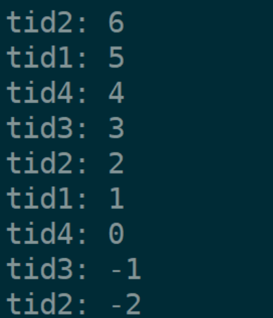
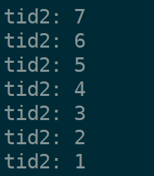
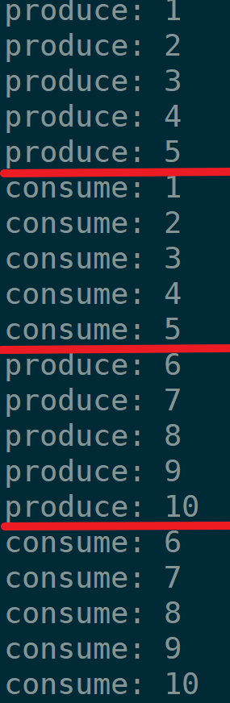

+++
date = 2026-05-25
title = "Linux多线程编程(二)：互斥锁与条件变量，手写生产者消费者模型"
description = ""
slug = ""
authors = []
tags = ["生产者消费者", "互斥锁", "条件变量", "原子操作"]
series = ["Linux系统编程"]
featuredImage = "assets/cover.png"
toc = true
+++


> 原创 于 2026-05-25 20:35:33 发布 · 公开 · 408 阅读 · 13 · 17 · 本内容遵循CC 4.0 BY-SA版权协议 版权声明：本文为博主原创文章，遵循 CC 4.0 BY-SA 版权协议，转载请附上原文出处链接和本声明。 GEO检测 · 编辑
> 文章链接：https://blog.csdn.net/2401_87889177/article/details/161277637

## 1、互斥问题

### 1.1、抢票问题

写一个模拟多线程抢票的代码：

```makefile
CC=g++
CFLAGS=-g
LDFLAGS=-lpthread
OBJS=Main.o #Thread.o

code: $(OBJS)
	$(CC) $(CFLAGS) -o $@ $^ $(LDFLAGS)

.PHONY: clean
clean:
	rm -rf code *.o
```

Main.cpp

```cpp
#include <pthread.h>
#include <unistd.h>
#include <stdio.h>
#include <string>

int ticket = 10000;

void* BuyTicket(void* arg)
{
    std::string* name = static_cast<std::string*>(arg);

    while(true)
    {
        if(ticket > 0)
        {
            usleep(1000);
            printf("%s: %d\n", name->c_str(), ticket);
            ticket--;
        }
        else
        {
            break;
        }
    }

    pthread_exit(nullptr);
}

int main()
{
    pthread_t tid1, tid2, tid3, tid4;

    std::string name1 = "tid1";
    std::string name2 = "tid2";
    std::string name3 = "tid3";
    std::string name4 = "tid4";

    pthread_create(&tid1, nullptr, BuyTicket, &name1);
    pthread_create(&tid2, nullptr, BuyTicket, &name2);
    pthread_create(&tid3, nullptr, BuyTicket, &name3);
    pthread_create(&tid4, nullptr, BuyTicket, &name4);

    pthread_join(tid1, nullptr);
    pthread_join(tid2, nullptr);
    pthread_join(tid3, nullptr);
    pthread_join(tid4, nullptr);
    return 0;
}
```

有10000张票，四个线程模拟抢票，最终票数会到负数：



### 1.2、原因分析

原因1：在 `if(ticket > 0)` 这个语句非原子性，分为两步：从内存读取ticket到寄存器，ticket与0比较。在判断后，执行 `ticket--` 之前，线程可能被调取切换，当再次调度当前线程，ticket已经到0了，可是还会执行 `ticket--` 。

原因2： `ticket--` 非原子性操作，分为三步：从内存加载ticket变量到cpu寄存器，寄存器内容减一，保存到内存中。当执行到一半线程被切走，OS会保存硬件上下文，当再次被调度时，加载上下文，线程看到的ticket是旧的，导致数据被覆盖。

原因3： `usleep(1000)` 模拟抢票行为，该函数为会阻塞线程，主动让出CPU。usleep、printf等函数会增加线程切换可能性。时钟中断也可能出现在 `if(ticket > 0)` 判断与 `ticket--` 之间。

注：判断某操作是否原子性最暴力的做法是查看汇编是否一行。

## 2、互斥锁

互斥锁的思想：任何时刻都只允许一个线程执行临界区代码。其它线程到没有拿到锁，会被阻塞。

### 2.1、互斥锁接口

互斥锁的类型是： `pthread_mutex_t` 。
动态初始化锁：

```c
int pthread_mutex_init(pthread_mutex_t *mutex, const pthread_mutexattr_t *mutexattr);
```

参数：

- mutex：需要初始化的锁。

- mutexattr：初始化锁的属性，大多数情况直接填空指针，使用默认属性即可。

静态初始化锁：

```c
pthread_mutex_t mutex = PTHREAD_MUTEX_INITIALIZER;
```

`PTHREAD_MUTEX_INITIALIZER` 是一个宏， `pthread_mutex_init` 第二个参数传递空指针则属性等于这个宏。

静态初始化的宏是一个常量，锁存储在静态区，编译时确定大小，不需要手动销毁。常用于全局变量锁，静态变量锁。

动态初始化锁是栈上一个变量，运行时确定大小，需要手动销毁。


锁的销毁：

```c
int pthread_mutex_destroy(pthread_mutex_t *mutex);
```

返回值：成功返回0。失败返回 `EBUSY` ，当线程持有锁时该函数执行失败。

---

加锁：

```c
int pthread_mutex_lock(pthread_mutex_t *mutex);
```

返回值：成功返回0。当锁没有初始化好旧加锁失败返回 `EINVAL` ，当已经加锁再次加锁失败返回 `EDEADLK` 。

尝试加锁：

```c
int pthread_mutex_trylock(pthread_mutex_t *mutex);
```

返回值：成功返回0。锁被占用失败返回 `EBUSY` ，锁没有初始化失败返回 `EINVAL` 。

与直接加锁的区别在于能加就加，不能加旧算了。直接加锁时，锁被别线程占用会阻塞。


解锁：

```c
int pthread_mutex_unlock(pthread_mutex_t *mutex);
```

返回值：成功返回0。锁没有初始化失败返回 `EINVAL` ，不是自己加的锁没权限解锁返回 `EPERM` 。

### 2.2、互斥锁实现原理

#### 2.2.1、硬件实现

硬件实现非常简单，在加锁时。禁用时钟中断等线程调度行为。直到解锁重新打开这些功能。

硬件实现极其危险，若忘记写解锁代码或解锁失败，则操作系统直接卡死。

因此现代操作系统都是采用软件实现。

#### 2.2.2、软件实现

大多数CPU架构指令集都提供了类似于 `swap` / `exchange` 这样的指令，这个指令是原子性的。

加锁伪代码：

```pseudocode
lock:
	movb $0 %al
	xchgb %al, mutex
	if(al寄存器内容 > 0){
		return 0;
	}
	goto lock;
```

锁的本质就是一个内存中的整数，加锁过程：

1. 清空al寄存器，执行完该指令后，线程可被切换，因为切换前会保存寄存器上下文到线程 `task_struct` 中。

2. 交换al寄存器内容与内存中变量mutex的值，该步骤是原子性。执行完可被切走，同理于步骤一，当其他线程需要锁时执行xchgb会拿到0。

3. 判断al寄存器内容，若为1(原mutex为1)，则拿到锁，加锁成功。

4. 若al寄存器为0，则没有拿到锁，重复lock行为，阻塞等待。

解锁伪代码：

```pseudocode
unlock:
	movb $1, mutex
	return 0
```

解锁过程就是将1写入内存mutex变量。

锁是否空闲看的事内存mutex是否为1。若为1，则说明锁没有被拿走，若为0，则说明锁被某线程拿到。

### 3.3、加锁的问题与原则

对于抢票代码的解决：

```cpp
// 全局锁
pthread_mutex_t mutex = PTHREAD_MUTEX_INITIALIZER;
void* BuyTicket(void* arg)
{
    std::string* name = static_cast<std::string*>(arg);

    while(true)
    {
        pthread_mutex_lock(&mutex); // 加锁
        if(ticket > 0)
        {
            usleep(1000);
            printf("%s: %d\n", name->c_str(), ticket);
            ticket--;
            
            pthread_mutex_unlock(&mutex); // 解锁
        }
        else
        {
            pthread_mutex_unlock(&mutex); // 解锁
            break;
        }
    }

    pthread_exit(nullptr);
}
```

效果：



加锁后的临界区代码时串行执行的，因此会降低效率，所以要保证临界区尽量小，加锁粒度尽量细。

互斥锁本身也是共享资源，互斥锁的安全底层是 `swap` / `exchange` 保证的。

### 2.3、封装互斥锁

本节源码已经上传至gitee【 [https://gitee.com/muyi-2580/learning-linux/tree/main/5_24](https://gitee.com/muyi-2580/learning-linux/tree/main/5_24) 】。

以下源码用C++封装一个pthread库中的互斥锁，然后使用一个类继续封装成RAII风格，使其生命周期结束后自动解锁。

Mutex.cc：

```cpp
#ifndef __MUTEX_H
#define __MUTEX_H

#include <pthread.h>

class Mutex
{
private:
    pthread_mutex_t mutex;
public:
    Mutex() 
    {
        pthread_mutex_init(&mutex , nullptr);
    }
    ~Mutex()
    {
        pthread_mutex_destroy(&mutex);
    }
    void Lock()
    {
        pthread_mutex_lock(&mutex);
    }
    void unLock()
    {
        pthread_mutex_unlock(&mutex);
    }
};

// RAII风格封装
class MutexGuard
{
private:
    Mutex& mutex;
public:
    MutexGuard(Mutex& mutex)
        :mutex(mutex) // 引用类型只能在初始化列表初始化
    {
        mutex.Lock(); 
    }

    ~MutexGuard()
    {
        mutex.unLock();
    }
};

#endif
```

Main.cc

```cpp
#include <pthread.h>
#include <unistd.h>
#include <string>
#include "Mutex.cc"

int ticket = 10000;

// 全局锁
Mutex mutex;
void* BuyTicket(void* arg)
{
    std::string* name = static_cast<std::string*>(arg);

    while(true)
    {
        { // 临界区代码
			// 加锁, RAII风格
	        MutexGuard mg(mutex);
	        if(ticket > 0)
	        {
	            usleep(1000);
	            printf("%s: %d\n", name->c_str(), ticket);
	            ticket--;
	        }
	        else
	        {
	            break;
	        }
        }
    }

    pthread_exit(nullptr);
}


int main()
{
    pthread_t tid1, tid2, tid3, tid4;

    std::string name1 = "tid1";
    std::string name2 = "tid2";
    std::string name3 = "tid3";
    std::string name4 = "tid4";

    pthread_create(&tid1, nullptr, BuyTicket, &name1);
    pthread_create(&tid2, nullptr, BuyTicket, &name2);
    pthread_create(&tid3, nullptr, BuyTicket, &name3);
    pthread_create(&tid4, nullptr, BuyTicket, &name4);

    pthread_join(tid1, nullptr);
    pthread_join(tid2, nullptr);
    pthread_join(tid3, nullptr);
    pthread_join(tid4, nullptr);
    return 0;
}
```

构造一个作用域可以提高代码可读性，一眼就能看出临界区。

## 3、同步与条件变量

### 3.1、同步与条件变量的概念

现有A、B、C三个线程竞争同一互斥锁（获得锁的线程执行相关任务）。开始A获得锁，执行完任务释放锁，A再次获得锁，执行完任务释放锁，A又获得锁……。B、C线程一直处于阻塞状态（阻塞状态也会被CPU调度），B、C无法完成自己的任务，且浪费CPU资源，这种情况叫做线程饥饿问题。

同步是只多个执行流协同执行的顺序。用人话说就是执行流访问资源按照某总顺序。同步常用条件变量实现。

pthread库提供了条件变量，条件变量在满足了某个条件时才继续执行。

条件变量底层原理是由一种唤醒机制和一个阻塞队列。当收到了其他线程的通知才能由阻塞到继续执行。在使用时一个唤醒 条件应该对应一个条件变量。

### 3.2、条件变量接口

条件变量是一个结构体，其类型是： `pthread_cond_t ` 。
动态初始化条件变量：

```c
int pthread_cond_init(pthread_cond_t *cond, pthread_condattr_t *cond_attr);
```

参数：

- cond：需要初始化的条件变量。

- cond_attr：初始化条件变量的属性，大多数情况下传空指针，使用默认属性。

静态初始化条件变量：

```c
pthread_cond_t cond = PTHREAD_COND_INITIALIZER;
```

动态初始化的需要手动销毁，静态初始化的不需要手动销毁。原因与互斥锁类似。


销毁条件变量：

```c
int pthread_cond_destroy(pthread_cond_t *cond);
```

返回值：成功返回0。当还有线程在等待条件变量时失败返回 `EBUSY` 。

---

阻塞等待条件变量：

```c
int pthread_cond_wait(pthread_cond_t *cond, pthread_mutex_t *mutex);
```

当前线程进入阻塞(依然能被调度)，等待条件变量的唤醒后再执行。

该函数需要传递锁是因为在该函数内部会释放锁，让其他线程获得资源。

---

唤醒一个指定的条件变量：

```c
int pthread_cond_signal(pthread_cond_t *cond);
```

会唤醒一个由该条件变量阻塞的线程，具体是哪一个就不确定了。


唤醒所有指定的条件变量：

```c
int pthread_cond_broadcast(pthread_cond_t *cond);
```

### 3.3、封装条件变量

做一个简单封装 ，4.2节会用到。

```cpp
#ifndef __CONDITION_CC
#define __CONDITION_CC
#include <pthread.h>

class Cond
{
public:
    Cond()
    {
        pthread_cond_init(&_cond, nullptr);
    }
    ~Cond()
    {
        pthread_cond_destroy(&_cond);
    }

    void Wait(pthread_mutex_t& mutex)
    {
        pthread_cond_wait(&_cond, &mutex);
    }

    void Signal()
    {
        pthread_cond_signal(&_cond);
    }
private:
    pthread_cond_t _cond;
};

#endif
```

## 4、生产者消费者模型

### 4.1、原理

生产者消费者模型(Producer-Consumer模型)是一种多线程的经典模型。

这个模型中有：

- 三种关系：生产者-生产者，生产者-消费者，消费者-消费者。

- 两种角色：生产者，消费者。

- 一种交易场所：共享容器。

这个模型中，生产者不断生产商品，消费者不断消费商品。交易场所能容纳的商品有限。当商品满了（或者达到指定数量，或者达到容量的百分之九十），就不能继续生产了。当没有商品就不能继续消费了。

如果使用线程模拟生产者、消费者，三种关系：

- 生产者-生产者：互斥。

- 消费者-消费者：互斥。

- 生产者-消费者：互斥/同步。

这个模型的优势在于：1、生产者与消费者线程解耦。2、生产过程可以与消费过程并发进行，提高效率。

在 [《管道通信深度剖析：从匿名管道到命名管道，手写进程池》](https://blog.csdn.net/2401_87889177/article/details/160566224?spm=1011.2415.3001.5331) 中的进程池也是一个生产者消费者模型。父进程扮演生产者，子进程扮演消费者，管道扮演交易场所。

### 4.2、单生产者单消费者实现

本节代码依赖【 [https://gitee.com/muyi-2580/learning-linux/blob/main/5_18/thread.cc](https://gitee.com/muyi-2580/learning-linux/blob/main/5_18/thread.cc) 】。

本节源码已上传至gitee：【 [https://gitee.com/muyi-2580/learning-linux/tree/main/5_25](https://gitee.com/muyi-2580/learning-linux/tree/main/5_25) 】。

Main.cc：

```cpp
#include "Mutex.cc"
#include "Thread.cc"
#include "BlockingQueue.cc"
#include <iostream>
#include <unistd.h>


int num = 1;
BlockingQueue<int> bq;
void ProducerRoutine()
{
    while(1)
    {
        std::cout << "produce: " << num << std::endl;
        bq.Enqueue(num);
        num++; 

        // 生产得慢
        usleep(100000);
    }
    pthread_exit(nullptr);
}


void ConsumerRoutine()
{
    while(1)
    {
        int data = 0;
        bq.Pop(&data);
        std::cout << "consume: " << data << std::endl;

        // 消费得快
        usleep(1000);
    }

    pthread_exit(nullptr);
}


int main()
{
    ThreadModule::Thread c(ConsumerRoutine);
    ThreadModule::Thread p(ProducerRoutine);

    c.start();
    p.start();

    c.join();
    p.join();

    return 0;
}
```

BlockingQueue.cc：

```cpp
#ifndef __BLOCKING_QUEUE_CC
#define __BLOCKING_QUEUE_CC
#include "Condition.cc"
#include <queue>
#include "Mutex.cc"

template<class T>
class BlockingQueue
{
public:
    BlockingQueue(int cap = 5)
        :_capacity(cap)
    {  }

    ~BlockingQueue()
    {  }

    void Enqueue(T& in) // 生产者，数据入队列
    {
        {
            _mutex.Lock();
            while(_que.size() == _capacity)
            {
                // 满了生产者等待
                _ProducerCond.Wait(_mutex.getMutex());
            }
            // 数据入队
            _que.push(in);

            // 通知消费者消费
            if(_que.size() == _capacity)
                _ConsumerCond.Signal();

            _mutex.unLock();
        }

    }

    void Pop(T* out) // 消费者，数据出队列
    {
        {
            _mutex.Lock();
            if(_que.empty())
            {
                // 没有数据，消费者等待
                _ConsumerCond.Wait(_mutex.getMutex());
            }
            // 消费(获取)数据
            *out = _que.front();
            _que.pop();

            // 如果队空，通知生产者生产
            if(_que.empty())
                _ProducerCond.Signal();

            _mutex.unLock();
        }

    }
private:
    Cond _ConsumerCond;
    Cond _ProducerCond;
    int _capacity;
    std::queue<T> _que;
    Mutex _mutex;
};

#endif
```

---

结果：



如上图，生产者生产5个(5个数据阻塞队列满)后就会通知消费至进行消费。

## 5、总结

**1. 互斥问题与原因分析** 

- 问题现象：多线程并发访问共享资源（如抢票）时，会出现数据不一致（票数为负）的问题。

- 根本原因：

  1. 判断非原子性： `if(ticket > 0)` 判断与后续操作之间可能被线程切换打断。

  2. 操作非原子性： `ticket--` 等操作在汇编层面是多条指令，执行中途可能被中断。

  3. 函数调用引发切换： `usleep` 、 `printf` 等函数会增加线程切换概率。

**2. 互斥锁（Mutex）解决方案** 

- 核心思想：通过锁机制保证同一时刻只有一个线程进入临界区。

- 接口使用：

  - 动态初始化： `pthread_mutex_init`

  - 静态初始化： `PTHREAD_MUTEX_INITIALIZER`

  - 加锁/解锁： `pthread_mutex_lock` / `pthread_mutex_unlock`

- 实现原理：

  - 硬件实现（禁用中断）风险高，现代系统采用软件实现。

  - 基于原子指令（如 `xchgb` ）实现锁的获取与释放。

- 封装实践：使用 C++ RAII 风格封装 `Mutex` 和 `MutexGuard` 类，实现自动加锁解锁。

**3. 同步与条件变量** 

- 同步概念：协调多个执行流访问资源的顺序，解决线程饥饿问题。

- 条件变量接口：

  - 初始化： `pthread_cond_init` / `PTHREAD_COND_INITIALIZER`

  - 等待： `pthread_cond_wait` （会自动释放锁）

  - 唤醒： `pthread_cond_signal` （单个） / `pthread_cond_broadcast` （全部）

- 封装实现：简单封装 `Cond` 类，便于后续使用。

**4. 生产者-消费者模型** 

- 模型组成：

  - 三种关系：生产者-生产者（互斥）、消费者-消费者（互斥）、生产者-消费者（互斥+同步）

  - 两种角色：生产者、消费者

  - 一个交易场所：共享容器（如阻塞队列）

- 优势：解耦生产与消费过程，支持并发执行，提高系统效率。

- 单生产者单消费者实现：

  - 使用阻塞队列作为共享容器

  - 队列满时生产者等待，队列空时消费者等待

  - 通过条件变量实现线程间的同步通知

**5. 关键编程原则** 

1. 临界区最小化：加锁范围应尽可能小，减少串行化带来的性能损失。

2. 锁的安全使用：互斥锁本身也是共享资源，其安全性由底层原子指令保证。

3. RAII 资源管理：通过对象的生命周期自动管理锁的获取与释放，避免忘记解锁。

4. 条件变量配合互斥锁：条件变量等待时会自动释放锁，唤醒后重新获取锁。
