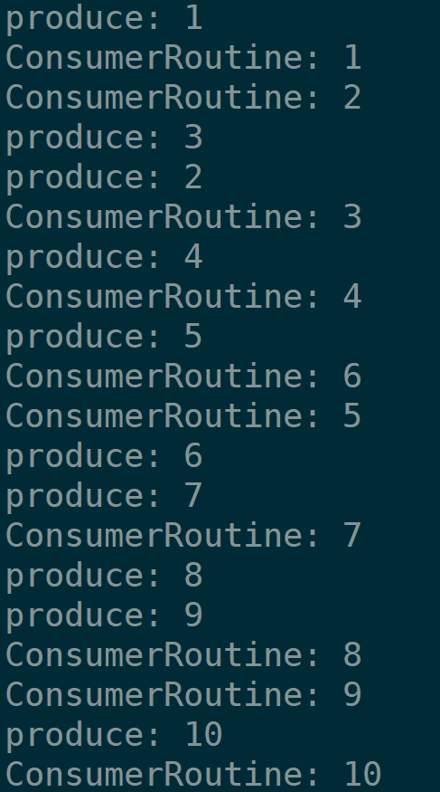
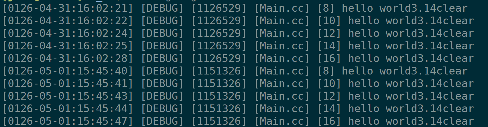
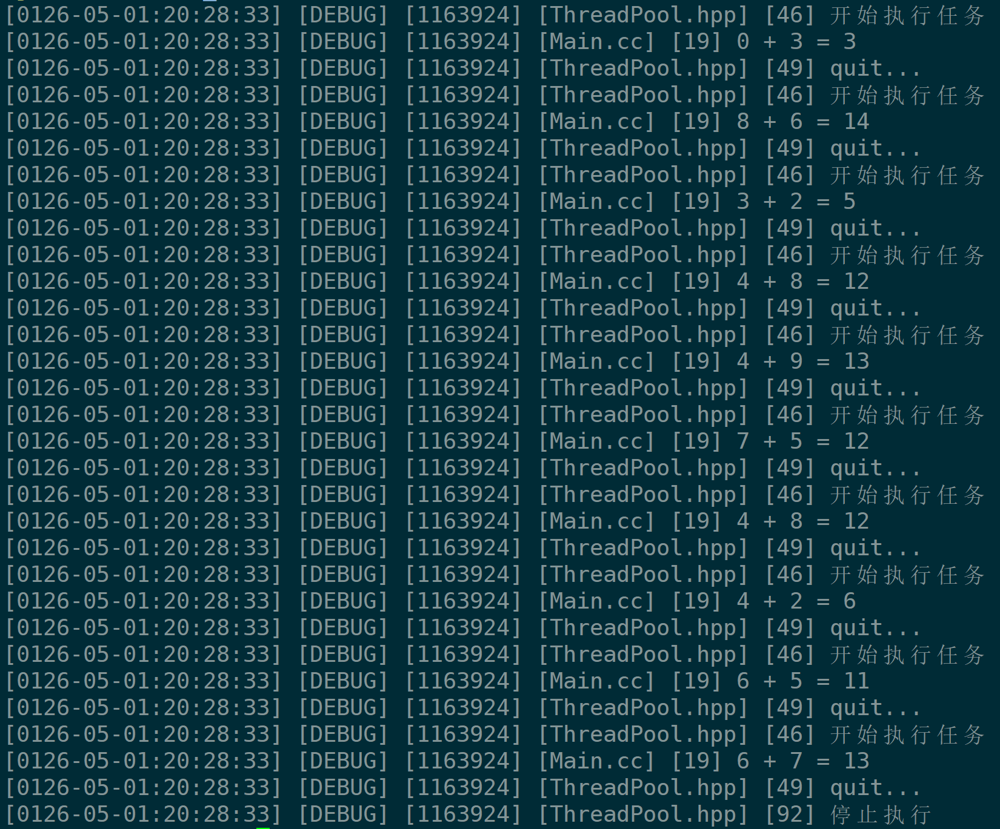

+++
date = 2026-06-06
title = "Linux多线程编程(三)：手写环形队列、日志系统与线程池"
description = ""
slug = ""
authors = []
tags = ["线程池", "信号量", "生产者消费者", "单例模式"]
series = ["Linux"]
featuredImage = "assets/cover.png"
toc = true
+++

# Linux多线程编程(三)：手写环形队列、日志系统与线程池

> 原创 于 2026-06-06 08:43:55 发布 · 公开 · 243 阅读 · 5 · 4 · 本内容遵循CC 4.0 BY-SA版权协议 版权声明：本文为博主原创文章，遵循 CC 4.0 BY-SA 版权协议，转载请附上原文出处链接和本声明。 GEO检测 · 编辑
> 文章链接：https://blog.csdn.net/2401_87889177/article/details/161461308

**文章目录**

[TOC]


## 1、POSIX信号量

POSIX信号量分为有名信号量、无名信号量。这里介绍无名信号量。

### 1.1、信号量简介

信号量用于进程/线程间同步/互斥机制。信号量本质是一个计数器，通过P(Proberen)操作减一、V(Verhogen)操作加一。

信号量是对资源的预定机制，资源预定后，其他执行流不能再访问。因此，信号量可以实现互斥锁。互斥锁就是一个二元信号量。

P操作：对计数器做原子性减一。如果计数器大于0，申请资源成功。如果计数器小于等于0，线程阻塞或失败返回。

V操作：对计数器做原子性加一。唤醒阻塞中的线程（如果有）。

### 1.2、信号量常用接口

初始化信号量：

```c
int sem_init(sem_t *sem, int pshared, unsigned int value);
```

参数：

- sem：需要初始化的信号量。

- pshared：为0时，在线程间共享。非0时，传递sem的共享内存区域，在进程间共享。

- value：初始化计数器的值。

销毁信号量

```c
int sem_destroy(sem_t *sem);
```

---

P操作：

```c
int sem_wait(sem_t *sem);
```

计数器减一。除此之外P操作还有尝试等待 `int sem_trywait(sem_t *sem);` 、超时等待 `int sem_timedwait(sem_t *restrict sem, const struct timespec *restrict abs_timeout);` 。

V操作：

```c
int sem_post(sem_t *sem);
```

计数器加一。

---

对信号量的封装：

```cpp
#ifndef __SEM__HPP
#define __SEM__HPP
#include <semaphore.h>

namespace NS_SEM_MODULE
{
    class Sem
    {
    public:
        Sem(int val)
        {
            sem_init(&_sem, 0, val);
        }
        void P()
        {
            sem_wait(&_sem);
        }
        void V()
        {
            sem_post(&_sem);
        }
        ~Sem()
        {
            sem_destroy(&_sem);
        }
    private:
        sem_t _sem;
    };
}

#endif
```

## 2、基于环形队列的生产者消费者模型

### 2.1、实现原理

上一文中写的是基于 **阻塞队列** 的生产者消费模型，通过互斥锁与条件变量实现。互斥锁保护的是整个队列，而基于 **环形队列** 的模型则是保护队列中具体元素。

C++中的stl容器进程增删查改都不是线程安全的。所以我们要自己写一个环形队列。队列中每一个元素都是线程安全的。

通过信号量保证不会有太多的线程访问队列，通过算法的设计保证不同的线程访问到的是队列中的不同元素。

一个环形队列中有两种资源：数据资源、空格资源。消费者关心数据资源，当数据资源没了就不能再用了。生产者关心空格资源，当空格资源没了就不能再生产了。

把空格和和数据同时看作资源，信号量的操作就是对资源的预定机制。

实现队列使用数组模拟， `_consumer_step` 和 `_producer_step` 指向队头和队尾，通过取模实现环形效果。

队列必须遵守4个原则：

1. 没有数据资源时，消费者必须等待。

2. 没有空格资源时，生产者必须等待。

3. 消费者不能超过生产者。

4. 生产者不能套圈消费者。

### 2.2、具体实现

本节代码已上传置gitee【 [https://gitee.com/muyi-2580/learning-linux/tree/main/5_30](https://gitee.com/muyi-2580/learning-linux/tree/main/5_30) 】。
RangQueue.hpp：

```cpp
#include <vector>
#include "Sem.hpp"
#include "Mutex.hpp"

template<class T>
class RangQueue
{
public:
    RangQueue(int cap)
        :_cap(cap)
        ,_consumer_step(0)
        ,_producer_step(0)
        ,_blank_sem(_cap)
        ,_data_sem(0)
    { 
        _rang_que.resize(_cap);
    }
    ~RangQueue()
    {  }

    void Enqueue(const T& in) // 生产者调用，数据入队
    {
        // 预定空格资源减少，P操作
        _blank_sem.P();

        {
            NS_MUTEX_MUDULE::LockGuard g_mutex(_d_mutex);
            _rang_que[_producer_step++] = in;
            _producer_step %= _cap;
        }
        
        // 数据资源增加，V操作
        _data_sem.V();
    }
    
    void Pop(T* out)    // 消费者调用，数据出队
    {
        // 预定数据资源减少，P操作
        _data_sem.P();


        {
            NS_MUTEX_MUDULE::LockGuard g_mutex(_b_mutex);
            *out = _rang_que[_consumer_step++];
            _consumer_step %= _cap;
        }
        
        // 空格资源增加，V操作
        _blank_sem.V();
    }

private:
    int _cap;                       // 大小
    int _consumer_step;             // 消费者位置
    int _producer_step;             // 生产者位置

    NS_SEM_MODULE::Sem _blank_sem;  // 空格资源
    NS_SEM_MODULE::Sem _data_sem;   // 数据资源
    NS_MUTEX_MUDULE::Mutex _d_mutex;// 生产者锁
    NS_MUTEX_MUDULE::Mutex _b_mutex;// 消费者锁

    std::vector<T> _rang_que;       // 环形队列
};
```

Main.cc

```cpp
#include "Mutex.hpp"
#include "RangQueue.hpp"
#include "Thread.hpp"
#include <iostream>
#include <memory.h>
#include <memory>
#include <unistd.h>

int num = 1;
std::unique_ptr<RangQueue<int>> rq(new RangQueue<int>(10));
NS_MUTEX_MUDULE::Mutex mutex;


int GetNum()
{
    static NS_MUTEX_MUDULE::Mutex mutex;
    NS_MUTEX_MUDULE::LockGuard lg(mutex);
    return num++;
}

void ProducerRoutine()
{
    while(1)
    {
        int val = GetNum();
        rq->Enqueue(val);
        {
            NS_MUTEX_MUDULE::LockGuard lg(mutex);
            std::cout << "produce: " << val << std::endl;
        }

        // 生产得慢
        usleep(100000);
    }
    pthread_exit(nullptr);
}

void ConsumerRoutine()
{
    while(1)
    {
        int data = 0;
        rq->Pop(&data);
        {
            NS_MUTEX_MUDULE::LockGuard lg(mutex);
            std::cout << "ConsumerRoutine: " << data << std::endl;
        }

        // 消费得快
        usleep(1000);
    }

    pthread_exit(nullptr);
}

int main()
{
    NS_THREAD_MUDULE::Thread c1(ConsumerRoutine);
    NS_THREAD_MUDULE::Thread c2(ConsumerRoutine);
    NS_THREAD_MUDULE::Thread c3(ConsumerRoutine);

    NS_THREAD_MUDULE::Thread p1(ProducerRoutine);
    NS_THREAD_MUDULE::Thread p2(ProducerRoutine);
    NS_THREAD_MUDULE::Thread p3(ProducerRoutine);

    c1.start();
    c2.start();
    c3.start();

    p1.start();
    p2.start();
    p3.start();

    c1.join();
    c2.join();
    c3.join();

    p1.join();
    p2.join();
    p3.join();

    return 0;
}
```

结果



注意图中的 `ConsumerRoutine: 2` 在 `produce: 2` 之前是完全正常的。因为这只能代表输出顺序，偶尔一两个是正常的，大面积出现时可能出问题。

## 3、日志与策略模式

### 3.1、策略模式

设计模式是一些经验丰富的大佬总结出来的一些方式，采用这些方式能使代码耦合度更低，更利于维护。常用的模式有23种，本大节使用策略模式设计一个日志。

策略模式原理是 **多态** ，基类指针或者引用指向派生类。



实现如下：

```cpp
enum class LogLevel
{
    INFO,
    WARNING,
    ERRNO,
    FATAL,
    DEBUG
};

class LogStrategy
{
public:
    LogStrategy(){  } 
    virtual void SyncLog(const std::string message) = 0;
private:
    NS_MUTEX_MUDULE::Mutex mutex;
};

class ConsoleStrategy : public LogStrategy
{
public:
    ConsoleStrategy() { }
    void SyncLog(const std::string message)
    {
        NS_MUTEX_MUDULE::LockGuard lockguard(mutex);
        std::cerr << message << '\n';
    }
private:
    NS_MUTEX_MUDULE::Mutex mutex;
};

class FileStrategy : public LogStrategy
{
public:
    FileStrategy(std::string path = "./log/", std::string filename = "log.txt")
        :_path(path)
        ,_filename(filename)
    {
        if(!_path.empty() && _path.back() != '/')
        {
            _path += '/';
        }
        try
        {
            std::filesystem::create_directories(_path);
        }
        catch(const std::filesystem::filesystem_error& e)
        {
            std::cerr << e.what() << '\n';
        }
    }
    void SyncLog(const std::string message) override
    {
        NS_MUTEX_MUDULE::LockGuard lockguard(mutex);
        std::ofstream out(_path + _filename, std::ios::app);
        if(!out.is_open())
        {
            std::cerr << "ofstream " << _path << _filename << '\n';
        }
        out << message << '\n';
        out.close();
    }
private:
    std::string _path;
    std::string _filename;
    NS_MUTEX_MUDULE::Mutex mutex;
};
```

### 3.2、日志类实现

日志格式如图：



代码的类关系图如下：



```cpp
#ifndef __LOGGER_HPP
#define __LOGGER_HPP

#include "Mutex.hpp"

#include <ctime>
#include <sys/time.h>
#include <unistd.h>

#include <string>
#include <memory>
#include <sstream>
#include <fstream>
#include <iostream>
#include <filesystem>
#include <unordered_map>
namespace NS_LOGGER_MUDULE
{
    const std::unordered_map<LogLevel, std::string> map = {
        {LogLevel::INFO, "INFO"},
        {LogLevel::WARNING, "WARNING"},
        {LogLevel::ERRNO, "ERRNO"},
        {LogLevel::FATAL, "FATAL"},
        {LogLevel::DEBUG, "DEBUG"}
    };

    std::string GetCurTime()
    {
        time_t t_t = time(0);
        tm t_m;
        localtime_r(&t_t, &t_m);

        char retstr[128];
        snprintf(retstr, sizeof(retstr), "%04d-%02d-%02d:%02d:%02d:%02d",
                t_m.tm_year,
                t_m.tm_mon,
                t_m.tm_mday,
                t_m.tm_hour,
                t_m.tm_min,
                t_m.tm_sec
                );
        return std::string(retstr);
    }

    class Logger
    {
    private:
        class LogMessage
        {
        public:
            LogMessage(LogLevel level, std::string& file, int line, Logger& logger)
                :_curtime(GetCurTime())
                ,_level(level)
                ,_pid(getpid())
                ,_file(file)
                ,_line(line)
                ,_logger(logger)
            {
                std::stringstream ss;
                ss << "[" << _curtime << "] " <<
                    "[" << map.at(_level) << "] " <<
                    "[" << _pid << "] " <<
                    "[" << file << "] " <<
                    "[" << line << "] ";

                _loginfo = ss.str();
            }
            template<class T>
            LogMessage& operator<<(const T& info)
            {
                std::stringstream ss; 
                ss << info;
                _loginfo += ss.str();
                return *this;
            }
            ~LogMessage()
            {
                _logger._strategy->SyncLog(_loginfo);
            }
        private:
            std::string _curtime;
            LogLevel _level;
            pid_t _pid;
            std::string _file;
            int _line;
            Logger& _logger;
            std::string _loginfo;
        };
    public:
        Logger()
        {
            UseConsoleStrategy();
        }
        void UseConsoleStrategy()
        {
            _strategy = std::make_unique<ConsoleStrategy>();
        }
        void UseFileStrategy()
        {
            _strategy = std::make_unique<FileStrategy>();
        }

        LogMessage operator()(LogLevel level, std::string file, int line)
        {
            return LogMessage(level, file, line, *this);
        }
    private:
        std::unique_ptr<LogStrategy> _strategy;
    };
}

NS_LOGGER_MUDULE::Logger logger;
#define ENABLE_CONSOLE_STRATEGY() logger.UseConsoleStrategy()
#define ENABLE_FILE_STRATEGY() logger.UseFileStrategy()

#define LOG(level) logger(level, __FILE__, __LINE__)
#endif
```

测试代码：

```cpp
#include "Logger.hpp"

int main()
{
    using namespace NS_LOGGER_MUDULE;
    ENABLE_FILE_STRATEGY();

    LOG(LogLevel::DEBUG) << "hello world" << 3.14 << "clear";
    sleep(1);
    LOG(LogLevel::DEBUG) << "hello world" << 3.14 << "clear";
    sleep(2);
    LOG(LogLevel::DEBUG) << "hello world" << 3.14 << "clear";
    sleep(1);
    LOG(LogLevel::DEBUG) << "hello world" << 3.14 << "clear";
    sleep(3);
    LOG(LogLevel::DEBUG) << "hello world" << 3.14 << "clear";
    return 0;
}
```

## 4、单例模式线程池

### 4.1、线程池实现

所有的池化技术都是为了提高效率，线程池也一样。

本节代码思路：在线程池构建函数创建线程，并使用数组管理。当调用 `Start` 方法时，所有线程执行 `HandlerTask` 处理任务。

`HandlerTask` 思路：无限循环，没有任务并且正在运行，则阻塞。没有运行并且没有任务就跳出循环。任务入队列，自动唤醒条件变量。

ThreadPool.hpp：

```cpp
#ifndef __THREAD_POOL_HPP
#define __THREAD_POOL_HPP

#include "Logger.hpp"
#include "Thread.hpp"
#include "Mutex.hpp"
#include "Condition.hpp"
using namespace NS_LOGGER_MUDULE;
using namespace NS_THREAD_MUDULE;
using namespace NS_MUTEX_MUDULE;
using namespace NS_CONDITION_MUDULE;

#include <vector>
#include <queue>

template<class T>
class ThreadPool
{
private:
    void HandlerTask()
    {
        while(1)
        {
            T task;
            {
                LockGuard lockguard(_mutex);
                
                // 没有任务时
                while(_tasks.empty() && _isrunnig)
                {
                    _slavers_sleep_num++;
                    _cond.Wait(_mutex);
                    _slavers_sleep_num--;
                }

                if(!_isrunnig && _tasks.empty())
                {
                    _mutex.unLock();
                    break;
                }

                task = _tasks.front();
                _tasks.pop();
            }
            LOG(LogLevel::DEBUG) << "quit...";
            LOG(LogLevel::DEBUG) << "开始执行任务";
            task();
        }
    }
public:
    ThreadPool(int slavers_num = 5)
        :_isrunnig(false)
        ,_slavers_sleep_num(slavers_num)
    {
        for(int i = 0; i < slavers_num; ++i)
        {
            // 创建线程
            _slavers.emplace_back([this]()
            {
                this->HandlerTask();
            });
        }
    }
    void Enqueue(T& task)
    {
        LockGuard lockguard(_mutex);
        _tasks.emplace(task);
        // 如果正在休息的子线程数量大于0, 则唤醒一个运行任务
        if(_slavers_sleep_num > 0)
            _cond.Signal();
    }

    void Start()
    {
        if(_isrunnig)
            return;

        _isrunnig = true;
        for(auto& slaver : _slavers)
        {
            slaver.start(); 
        }
    }

    void Stop()
    {
        if(!_isrunnig)
            return;

        LOG(LogLevel::DEBUG) << "停止执行";
        _isrunning = false;
        for(auto& slaver : _slavers)
        {
            slaver.stop(); 
        }
    }

    void Wait()
    {
        for(auto& slaver: _slavers)
        {
            slaver.join();
        }
    }

    ~ThreadPool()
    {  }
private:
    std::queue<T> _tasks; // 任务队列
    std::vector<Thread> _slavers;
    bool _isrunnig;
    int _slavers_sleep_num;
    Cond _cond;
    Mutex _mutex;
};

#endif
```

Main.cc

```cpp
#include "Logger.hpp"
#include "ThreadPool.hpp"
#include <memory>
#include <cstdlib>
#include <ctime>
#include <sstream>

class task
{
public:
    task() = default;
    task(int x, int y)
        :_x(x)
        ,_y(y)
    {  }
    void operator()()
    {
        _ret = _x + _y;
        LOG(LogLevel::DEBUG) << result();
    }
    std::string result()
    {
        std::stringstream ss;
        ss << _x << " + " << _y << " = " << _ret;
        return ss.str();
    }
private:
    int _x;
    int _y;
    int _ret;
};

int main()
{
    std::unique_ptr<ThreadPool<task>> tp = std::make_unique<ThreadPool<task>>();
    tp->Start();
    ENABLE_CONSOLE_STRATEGY();

    std::srand(time(nullptr) ^ getpid());
    int cnt = 10;
    while(cnt--)
    {
        task t(rand() % 10, rand() % 10); 
        tp->Enqueue(t);
        usleep(100);
    }

    tp->Stop();
    tp->Wait();
    return 0;
}
```

结果：



### 4.2、引入单例模式

单利模式：保证一个类在程序中只有一个实例对象，对外提供使用接口。

单例模式分为：

- 懒汉式单例模式：惰性加载，需要时创建。

- 饿汉式单例模式：程序开始时创建。

实践中要用懒汉式单例模式，因为这样可以加快程序启动效率。

下面代码引入懒汉式单例模式：

```cpp
template<class T>
class ThreadPool
{
private:
    void HandlerTask();
    // 私有化构造函数
    ThreadPool(int slavers_num = 5);
    ThreadPool(const ThreadPool<T>&) = delete;
    ThreadPool<T>& operator=(const ThreadPool<T>) = delete;
public:
    static ThreadPool<T>* Instance()
    {
    	if(_instance == nullptr)
    	{
            LockGuard lockguard(_lock);

            if(_instance == nullptr)
            {
                _instance = new ThreadPool<T>();
                _instance->Start();
                LOG(LogLevel::DEBUG) << "线程池创建...";
            }
        }
        return _instance;
    }
    void Enqueue(T& task);
    void Start();
    void Stop();
    void Wait();
    ~ThreadPool() = default;

private:
    std::queue<T> _tasks;
    std::vector<Thread> _slavers;
    bool _isrunnig;
    int _slavers_sleep_num;
    Cond _cond;
    Mutex _mutex;
	
	// 引入单利模式
    static ThreadPool<T>* _instance;
    static Mutex _lock;
};

template<class T>
ThreadPool<T>* ThreadPool<T>::_instance = nullptr;
template<class T>
Mutex ThreadPool<T>::_lock;
```

细节：

1. 私有化构造函数，删除掉复制构造和复制重载。保证只有一份实例。

2. `Instance` 接口必须静态化，否则创建第一个对像之前没有对象，无法调用。

3. 线程池本身也是资源， `Instance` 接口加锁，保证线程安全。

4. `Instance` 接口双if判断，避免后续重复加锁解锁，提高效率。

## 5、总结

1. POSIX信号量作为资源预定机制，通过P/V操作实现对共享资源的原子性管理，比互斥锁与条件变量的组合更简洁。

2. 环形队列生产者消费者模型利用两个信号量分别管理空格资源和数据资源，配合细粒度的生产者锁与消费者锁，实现了更高的并发度。

3. 日志系统采用策略模式设计，通过多态将日志输出方式（控制台/文件）与日志格式逻辑解耦，便于扩展和维护。

4. 线程池结合单例模式，实现了线程资源的复用与管理，避免频繁创建销毁线程的开销，并保证了全局唯一实例的线程安全。
