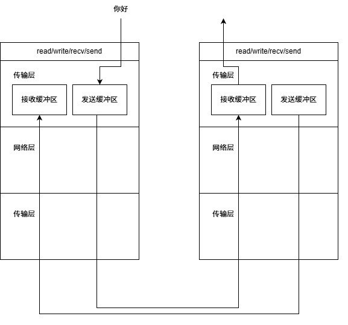
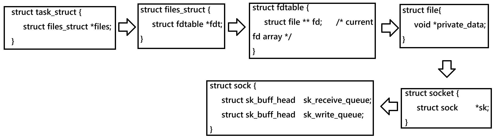
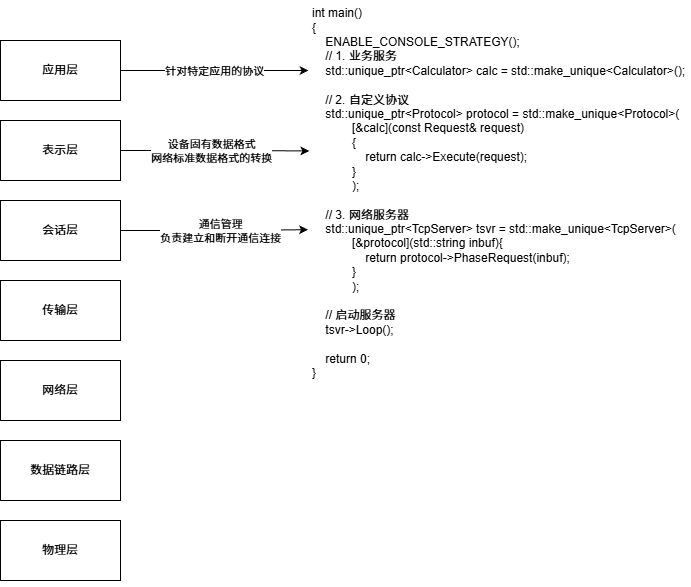

+++
date = 2026-07-17
title = "网络编程中的粘包问题及自定义协议设计"
description = ""
slug = ""
authors = []
tags = ["粘包", "JSON", "序列化", "自定义协议"]
series = ["Linux"]
featuredImage = "assets/cover.png"
toc = true
+++

# 网络编程中的粘包问题及自定义协议设计

> 原创 于 2026-07-17 16:41:32 发布 · 公开 · 251 阅读 · 7 · 4 · 本内容遵循CC 4.0 BY-SA版权协议 版权声明：本文为博主原创文章，遵循 CC 4.0 BY-SA 版权协议，转载请附上原文出处链接和本声明。 GEO检测 · 编辑
> 文章链接：https://blog.csdn.net/2401_87889177/article/details/162686901

**文章目录**

[TOC]


## 1、Socket编程缺陷

### 1.1、粘包问题

直接调用系统提供的 `read` / `write` / `recv` / `send` 只能能将数据写入发送缓冲区或者从接收缓冲区中提取数据如下图。

一台主机中既有接收缓冲区，又有发送缓冲区，所以能够同时发送、接收数据，即全双工。

再看，用户将协议栈作为一个黑盒模型，一台主机向协议栈中写入数据，另一台主机从协议栈中读出数据。这就是一个生产者-消费者模型。



TCP协议是基于数据流的协议，全称 `Transmission Control Protocol` (传输控制协议)。只保证数据发送、发送多少数据、什么时候发送、出错了，都由TCP协议保证。

例如，在一个 `remote-ssh` 工具中，A主机给B主机发送 `ls -a -l` 然后又发送一个 `pwd` 。A先将 `ls -a -l` 写入缓冲区，然后写入 `pwd` ，发送给了B，B接收到的可能是 `ls -a -lpwd` 。

这就是数据粘包问题。

下面linux2.6.18的缓冲区是TCP缓冲区：
 

### 1.2、解决方法

序列化：将数据变成特定的数据结构。
反序列化：将数据从特定的数据结构变成可用的数据。

一般序列化不选取结构体或者类，这是因为不同语言间结构体或者类内存布局不同。很多序列化操作（Protocol Buffers不是）都是采用字符串拼接，因为是编码的规定，可以实现跨平台向、跨语言性。

序列化和反序列化是为了自定义协议做准备。自定义一个协议格式为

```
{len}\r\n{data}\r\n
```

在接收端中检查是否数据内容长度小于len，如果小于就不做处理，说明没有读取完整。

UDP是基于数据报的协议，不存在数据粘包问题，但也需要业务层协议。

## 2、jsoncpp简介

常用的序列化方式有json，json可读性高。用jsoncpp就可以实现，操作也简单。

```bash
sudo apt apt install libjsoncpp-dev  # Ubuntu
sudo yum install jsoncpp-devel				# CentOS
```

### 2.1、数据->json字符串

```cpp
#include <iostream>
#include <jsoncpp/json/value.h>
#include <jsoncpp/json/writer.h>
#include <sstream>
#include <string>
#include <jsoncpp/json/json.h>

struct People
{
    std::string _name;
    int _age;
    std::string _sex;
};

int main()
{
    People shang3{ "ZhangSan", 21, "男" };
    Json::Value root;
    root["name"] = shang3._name;
    root["age"] = shang3._age;
    root["sex"] = shang3._sex;

    // version 1
    Json::FastWriter fwriter;
    std::string info1 = fwriter.write(root);
    
    // version 2
    Json::StyledWriter swriter;
    std::string info2 = swriter.write(root);

    // version 3
    Json::StreamWriterBuilder builder;
    std::unique_ptr<Json::StreamWriter>writer(builder.newStreamWriter());
    std::stringstream ss;
    writer->write(root, &ss);
    
    std::cout << info1 << std::endl;
    std::cout << info2 << std::endl;
    std::cout << ss.str() << std::endl;
    return 0;
}
```

`Json::Value` 是一个json对象，后续操作基本都是围绕json对象进行的。

jsoncpp库之所以简单就是因为操作有点像 `map` ，是通过运算符重载实现的key-value操作。

对于 `Json::FastWriter` 和 `Json::StyledWriter` ，两者基本一样，但是后者会添加换行符，有利于人的阅读；而前者读写操作更快。

对于version 3，先创建了一个 `Json::StreamWriterBuilder` 工厂类对象，这个工厂类用于生成 `Json::StreamWriter` 对象，该对象能直接写入Ostrem中。

编译：

```bash
# 需要指定链接jsoncpp库
g++ test.cpp -ljsoncpp -o test
```

结果：

```text
{"age":21,"name":"ZhangSan","sex":"\u7537"}

{
   "age" : 21,
   "name" : "ZhangSan",
   "sex" : "\u7537"
}

{
	"age" : 21,
	"name" : "ZhangSan",
	"sex" : "\u7537"
}
```

### 2.2、json字符串->数据

```cpp
#include <iostream>
#include <jsoncpp/json/reader.h>
#include <string>
#include <jsoncpp/json/json.h>

struct People
{
    std::string _name;
    int _age;
    std::string _sex;
};

int main()
{
    std::string json_string("{\"age\":21,\"name\":\"ZhangSan\",\"sex\":\"\u7537\"}");
    Json::Reader reader;
    Json::Value root;

    bool succes = reader.parse(json_string, root);
    if(!succes)
        return 1;
    
    People zhang3;
    zhang3._name = root["name"].asString();
    zhang3._age = root["age"].asInt();
    zhang3._sex = root["sex"].asString();

    std::cout << "name:" << zhang3._name << std::endl;
    std::cout << "age:" << zhang3._age << std::endl;
    std::cout << "sex:" << zhang3._sex << std::endl;
    return 0;
}
```

`Json:Reader` 是一个用于从json字符串中读取数据的对象。

`reader.parse(json_string, root)` 可以从json_string字符串中读取数据，写入root对象。返回值为bool类型。

Json::Value是一个万能容器，数据类型通过枚举和联合体实现的弱类型化。需要通过 `asString` 等类似的函数强转。

结果：

```text
name:ZhangSan
age:21
sex:男
```

### 2.3、其他操作

创建子对象：

```cpp
Json::Value root;
root["user"]["name"] = "Tom";
root["user"]["age"] = 18;
```

创建数组：

```cpp
Json::Value root;
root["nums"].append(1);
root["nums"].append(2);
root["nums"].append(3);
root["nums"].append(4);
```

数组中放对象：

```cpp
Json::Value arr;

Json::Value obj1;
obj1["id"] = 1;

Json::Value obj2;
obj2["id"] = 2;

arr.append(obj1);
arr.append(obj2);
```

## 3、网络计算器实现

本节源码已上传至【gitee： [https://gitee.com/muyi-2580/learning-linux/tree/main/7_6](https://gitee.com/muyi-2580/learning-linux/tree/main/7_6) 】。

### 3.1、服务端主要方法

```cpp
    void Loop() const
    {
        // 信号捕捉子进程退出
        signal(SIGCHLD, SIG_IGN);
        while(true)
        {
            InetAddr clientaddr;
            auto sockfd = _listensockfd->Acceptor(clientaddr);
            if(sockfd == nullptr)
                continue;

            LOG(LogLevel::DEBUG) << "accept from : " << clientaddr.ToString();
            if(fork() == 0)
            {
                // child
                sockfd->Close(_listensockfd);
                Service(sockfd, clientaddr);
                exit(SUCCESS);
            }
            // parent
            _listensockfd->Close(sockfd);
        }
    }
```

采用多进程+信号回收方式处理服务。

```cpp
    void Service(const std::shared_ptr<Socket> sockfd, const InetAddr& clientaddr) const
    {
        std::string inbuf;
        std::string outbuf;
        while(true)
        {
            outbuf.clear();
            int n = sockfd->Recv(&inbuf);
            if(n <= 0) 
                break;
            
            if(_handler)
                outbuf += _handler(inbuf); 
            
            if(outbuf.empty())
                continue;

            n = sockfd->Send(outbuf);
            if(n <= 0)
                break;
        }
    }
```

_handle（其类型为 `std::function<std::string(std::string)>` ）为回调函数或者lambda表达式。将从网络端收到的数据传到协议层处理。返回一个序列后、封包完整的数据，用于应答客户端。

`outbuf += _handler(inbuf)` 这里使用 `+=` 是为了解耦，_handler只负责一部分服务。

### 3.2、自定义协议实现

```cpp
// 请求
class Request
{
public:
    Request();
    Request(const double x, const double y, const char oper);
    // 序列化
    bool Serialize(std::string *out);
    // 反序列化
    bool DeSerialize(const std::string& in);
public: // 写成public不推荐
    double _data_x;
    double _data_y;
    char _oper;
};

// 应答
class Response
{
public:
    Response();
    // 序列化
    bool Serialize(std::string *out);
    // 反序列化
    bool DeSerialize(const std::string& in);
// private:
public:
    double _result;
    int    _code;
};
```

`Request` 类是客户端向服务端发起的请求， `Response` 类是服务端回复客户端的应答。

```cpp
const std::string gsep = "\r\n";
using handler_req_t = std::function<Response(Request&)>;
using handler_res_t = std::function<void(Response&)>;
```

自定义协议格式为： `{len}\r\n{json_string}\r\n` ，这里定义了分隔符、以及处理请求、处理应答的类型。

```cpp
class Protocol
{
public:
    Protocol(handler_req_t handler_req, const std::string& version = "0.0.1");
    Protocol(handler_res_t handler_res, const std::string& version = "0.0.1");
    std::string Packet(const std::string& json_string) const;

    /*
     * -1 : error
     *  0 : no error, but unpacket is empty
     *  1 : succes
     */
    int UnPacket(std::string& packet, std::string* json_string);
    
    std::string PhaseRequest(std::string& inbuf)
    {
        std::string result;
        while(true)
        {
            // 1. 解包
            int n = UnPacket(inbuf, &result);
            if(n < 0)
            {
                LOG(LogLevel::DEBUG) << "no way...";
                return "";
            }
            else if(n == 0)
            {
                LOG(LogLevel::INFO) << '\n' << result;
                LOG(LogLevel::INFO) << "Phase Request done!";
                return result;
            }

            // 2. 反序列化
            Request request;
            if(!request.DeSerialize(result))
            {
                LOG(LogLevel::DEBUG) << "Request DeSerialize error..." ;
                return "";
            }

            Response response;
            // 3. 交给上层服务
            if(_handler_req)
                response = _handler_req(request);

            // 4. 应答序列化
            if(!response.Serialize(&result))
            {
                LOG(LogLevel::DEBUG) << "Response Serialize error..." ;
                return "";
            }

            // 5. 封包
            result += Packet(result);
        }
    }

    std::string PhaseResponse(std::string inbuf)
    {
        while(true)
        {
            std::string json_string;
            // 1. 解包
            int n = UnPacket(inbuf, &json_string);
            if(n < 0)
            {
                LOG(LogLevel::DEBUG) << "no way...";
                return "";
            }
            if(n == 0)
            {
                LOG(LogLevel::INFO) << "Phase Response done!";
                return "";
            }

            // 2. 反序列化
            Response response;
            if(!response.DeSerialize(json_string))
                return ""; 

            if(_handler_res)
                _handler_res(response);
        }
    } 
private:
    std::string _version; 
    handler_req_t _handler_req;
    handler_res_t _handler_res;
};
```

`PhaseRequest` ：解包->反序列化->_handler_req处理->序列化->封包。是给TcpServer的回调方法。其中 `_handler_req` 是上层服务传递的方法作用是接收一个请求类，返回一个应答类。

`PhaseResponse` ：解包->反序列化->_handler_res处理。是给客户端处理结果的方法。

### 3.3、服务层实现

```cpp
class Calculator
{
public:
    Calculator()
    {} 

    Response Execute(Request request) const
    {
        double x = request._data_x;
        double y = request._data_y;

        Response response;
        switch(request._oper)
        {
            case '+':
                response._result = x + y;
                break;
            case '-':
                response._result = x - y;
                break;
            case '*':
                response._result = x * y;
                break;
            case '/':
                {
                    if(y == 0)
                        response._code = 1;
                    else
                        response._result = x / y;
                }
                break;
            default:
                response._code = -1;
                LOG(LogLevel::WARNING) << "Obtained illegal symbols!";
                break;
        }
        return response;
    }
};
```

`Execute` 接收一个请求并返回一个应答结果，支持加减乘除运算。用于回调传递给 `PhaseRequest` 。

## 4、总结



OSI 7层网络模型设计得非常好，本文设计的网络计算器就设计出了应用层、表示层、会话层。一个好的项目要想有较低的耦合度就应该按照7层模型实现。

本文简要介绍了一下数据粘包问题，jsoncpp的使用方法，以及序列化、反序列化、自定义协议。