+++
date = 2026-10-10
title = "Select多路转接使用细节与优缺点分析"
description = "select通过将I/O中的“等待”与“拷贝”分离，实现高效多路复用。它不负责数据读写，仅检测多个文件描述符是否就绪（读、写、异常），从而避免阻塞在无数据的连接上。结合非阻塞或定时等待机制，单个进程可管理大量连接，显著提升并发处理能力。其核心在于：先用select筛选出已就绪的fd，再由read/write进行实际数据拷贝，实现高并发服务器的关键优化。"
slug = ""
authors = []
tags = ["Select", "IO"]
series = ["Linux网络编程"]
featuredImage = "assets/cover.png"
toc = true
+++


## 1 为什么需要select：把 I/O 中的"等待"和"拷贝"分离

在学习网络编程时，一个核心概念是：

> I/O 的本质 = 等待 + 数据拷贝

以 `read` 、 `recv` 
为例，一个读取操作看似只是"读数据"，实际上包含两个阶段：

1. 等待数据到达。

2. 数据从内核缓冲区拷贝到用户空间。

传统阻塞 I/O 的问题在于：


如果服务器同时管理大量客户端，那么大量时间都会消耗在等待上。

例如：

- 客户端 A 没有发送数据；

- 客户端 B 正在发送数据；

- 客户端 C 已经断开连接。

如果服务器逐个调用 `recv` ：

```text
处理 A
  ↓
一直等待
  ↓
无法处理 B、C
```

这显然效率很低。

select 的思想就是：

> 单独设计一个函数，只负责等待多个文件描述符是否已经就绪。

当某个文件描述符可以读、可以写时，再让真正的数据处理函数执行。

---

select 属于多路转接技术。

它的定位非常明确：

> select 只负责检测事件是否就绪。

它不负责：

- `read`

- `recv`

- `write`

- `send`

它只告诉程序：

“某个文件描述符已经准备好了，可以进行下一步操作。”

整体流程：



因此：

- select 解决的是"等待问题"；

- read/recv 解决的是"数据拷贝问题"。

---

## 2 时间就绪机制

select 关注的是文件描述符上的事件。

常见事件有三类：

### 1. 读事件就绪

表示：

> 文件描述符对应的接收缓冲区中存在数据。

例如 TCP：

```text
客户端发送数据
        ↓
TCP接收缓冲区有数据
        ↓
select返回读事件
        ↓
recv读取
```

---

### 2. 写事件就绪

表示：

> 文件描述符对应的发送缓冲区有空间。

例如：

```text
发送缓冲区
      ↓
剩余空间足够
      ↓
可以继续发送数据
```

对于大多数 TCP 连接：

- 刚建立时写事件通常默认就绪；

- 只有发送大量数据导致缓冲区不足时，才可能不就绪。

---

### 3. 异常事件

例如：

- TCP连接异常关闭；

- 对端关闭连接后仍尝试写入。

select 可以通知程序处理异常情况。

---

## 3 select 函数参数分析

Linux中 select 原型：

```c
int select(
    int nfds,
    fd_set *readfds,
    fd_set *writefds,
    fd_set *exceptfds,
    struct timeval *timeout
);
```

---

### 3.1. nfds：最大的文件描述符 + 1

很多初学者会误认为：

> nfds 是监听文件描述符数量。

实际上不是。

它表示：

> 所有监听文件描述符中，最大值 + 1。

例如：

```text
监听 fd:

3
5
100
```

那么：

```text
nfds = 101
```

原因与 select 内部遍历 fd_set 有关。

---

### 3.2 timeout：等待方式

select 支持三种等待方式。

**非阻塞** 

```c
timeout = 0
```

立即返回：

- 有事件：返回；

- 无事件：也返回。

类似：

> 看一眼手机，没有消息继续干自己的事情。

---

**阻塞等待** 

```c
timeout = NULL
```

一直等待直到：

- 有文件描述符就绪；

- 出错。

类似：

> 一直盯着手机，直到有人回复。

---

**定时等待** 

例如：

```c
timeout = 5秒
```

表示：

最多等待 5 秒。

期间：

- 有事件立即返回；

- 没事件 5 秒后返回。

---

### 3.3 fd_set：select

select 可以同时等待多个文件描述符。

Linux 使用：

```c
fd_set
```

保存这些文件描述符。

它本质类似 **位图** ：

```text
bit位置  ---> 文件描述符编号
bit内容  ---> 是否关注
```

例如：

```text
fd:

1 3 5 7
```

对应：

```text
000010101010
```

其中某些 bit 被设置为 1。

---

### 3.4 select 的输入输出模型

select 的 fd_set 是输入输出参数。

调用前：

用户告诉内核：

> 我关心这些 fd 的哪些事件。

调用后：

内核告诉用户：

> 哪些 fd 已经发生事件。

例如：

调用前：

```text
fd_set:

fd 3 = 1
fd 5 = 1
fd 7 = 1
```

表示：

关注 3、5、7。

返回后：

```text
fd 5 = 1
```

表示：

5号文件描述符已经就绪。

---

## 4 基于 select 的服务器工作流程

select 服务器核心结构：



---

## 5 为什么 select 能实现高并发

传统模型：

```text
一个连接
    ↓
一个线程/进程
```

大量连接意味着：

- 创建大量线程；

- 上下文切换增加；

- 内存压力增加。

select：

```text
一个进程
    ↓
管理多个fd
    ↓
等待事件发生
    ↓
处理已经就绪的连接
```

因此：

> select 将服务器从"等待多个客户端"中解放出来。

一个单进程服务器也可以同时处理多个客户端连接。

---

## 6 select 服务器代码设计思想

基于 `select` 的 echoserver，gitee：「 [https://gitee.com/muyi-2580/learning-linux/tree/main/8_14](https://gitee.com/muyi-2580/learning-linux/tree/main/8_14) 」。

典型实现：

1. 创建监听 socket。

2. 创建辅助数组保存客户端 fd。

3. 每次循环：

   - 初始化 fd_set；

   - 将所有有效 fd 加入；

   - 调用 select；

   - 遍历判断哪些 fd 就绪。

新连接：

```text
accept
 ↓
获得新fd
 ↓
加入辅助数组
 ↓
下一轮select监听
```

客户端退出：

```text
recv返回0
 ↓
close(fd)
 ↓
从辅助数组删除
 ↓
select不再监听
```

---

## 7 内核实现思路

伪代码，省略很多错误处理和细节：

```c
int select(int nfds, fd_set *readfds, fd_set *writefds, fd_set *exceptfds,
           struct timeval *timeout)
{
    // 1. 将用户空间的 fd_set 拷贝到内核空间
    fd_set kernel_readfds, kernel_writefds, kernel_exceptfds;
    copy_from_user(&kernel_readfds, readfds, sizeof(fd_set));
    copy_from_user(&kernel_writefds, writefds, sizeof(fd_set));
    copy_from_user(&kernel_exceptfds, exceptfds, sizeof(fd_set));

    // 2. 初始化返回集合（内核最终会修改它们）
    fd_set res_readfds, res_writefds, res_exceptfds;
    FD_ZERO(&res_readfds); FD_ZERO(&res_writefds); FD_ZERO(&res_exceptfds);

    // 3. 计算最大等待时间（转换为绝对时间或 jiffies）
    unsigned long expire = calculate_expire(timeout);

    // 4. 循环尝试检测就绪事件（可能多次遍历）
    for(;;) {
        int ready = 0;
        // 遍历所有 fd（0 ~ nfds-1）
        for (int fd = 0; fd < nfds; fd++) {
            if (FD_ISSET(fd, &kernel_readfds)) {
                if (sock_poll(fd, POLLIN)) {   // 查询内核中该 fd 的接收缓冲区是否有数据
                    FD_SET(fd, &res_readfds);
                    ready++;
                }
            }
            // 同样处理 writefds 和 exceptfds ...
        }

        // 5. 如果有事件就绪，或者超时，或者被信号中断，则跳出循环
        if (ready > 0 || timeout_expired || signal_pending)
            break;

        // 6. 否则，当前进程需要阻塞等待
        //    为每个被监听的 fd 创建一个等待队列项，并添加到其等待队列
        for (int fd = 0; fd < nfds; fd++) {
            if (FD_ISSET(fd, &kernel_readfds)) {
                add_wait_queue(fd->wait_queue, current);
            }
            // 同样处理其他事件
        }
        // 将当前进程状态置为 TASK_INTERRUPTIBLE，然后调用 schedule() 让出 CPU
        set_current_state(TASK_INTERRUPTIBLE);
        schedule();

        // 被唤醒后，移除之前添加的所有等待队列项
        for (fd 遍历) remove_wait_queue(...);

        // 重新回到循环，再次遍历检查哪些 fd 现在就绪了
    }

    // 7. 将内核中的结果集合拷贝回用户空间
    copy_to_user(readfds, &res_readfds, sizeof(fd_set));
    copy_to_user(writefds, &res_writefds, sizeof(fd_set));
    copy_to_user(exceptfds, &res_exceptfds, sizeof(fd_set));

    // 8. 返回就绪文件描述符的总数
    return ready_count;
}
```

select 的核心函数 `sock_poll` 会将该进程挂到文件的阻塞队列，当事件就绪，进程被重新挂到运行队列。

一个进程要挂到多个文件等待队列，这就意味着效率非常慢。

## 8 select 的不足与后续发展

select 的主要问题：

1. 文件描述符数量有限，最大约 1024。

2. select 的输入参数会影响输出参数，这就意味着用户需要一个外部数组记录有效文件描述符。

3. 每次调用需要重新传递 fd 集合；用户态和内核态之间需要复制。

4. 需要遍历所有 fd：内核实现要遍历两次，用户使用也要多次遍历fd。

因此：


后续更高性能服务器通常采用 epoll。

---

## 9 总结

select 的核心思想可以概括为：

> 将 I/O 中的等待阶段独立出来，由 select
> 统一等待多个文件描述符事件，再由应用程序处理真正的数据读写。

理解 select 的关键不是记忆 API，而是理解：

1. I/O = 等待 + 拷贝。

2. select 只负责等待。

3. 文件描述符通过事件就绪通知应用层。

4. 一个进程可以管理多个连接。

5. select 是多路转接技术的基础实现。

