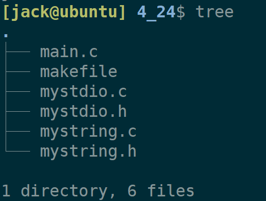
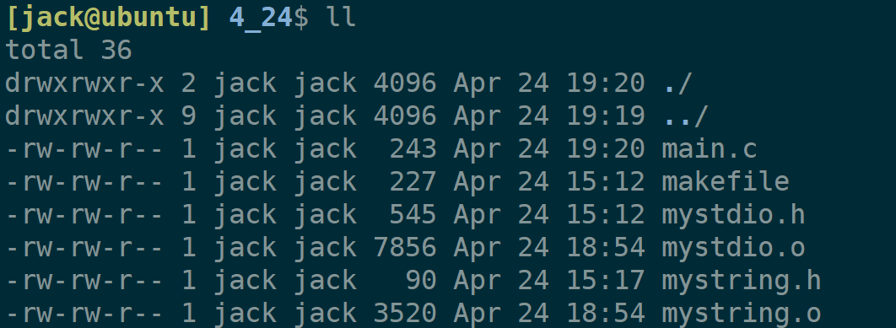
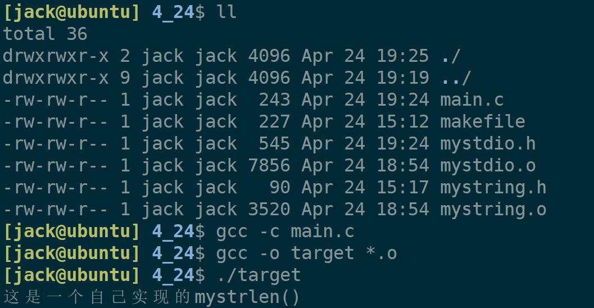
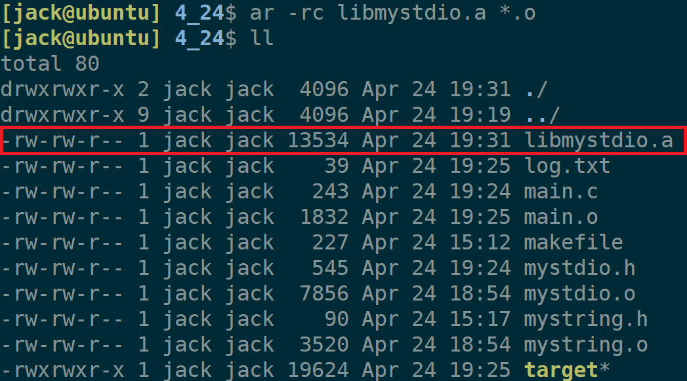
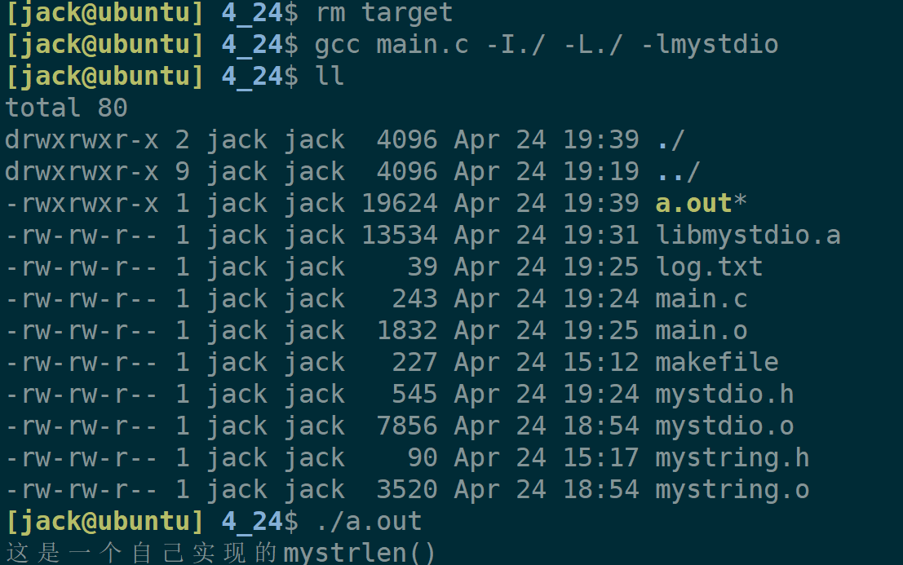
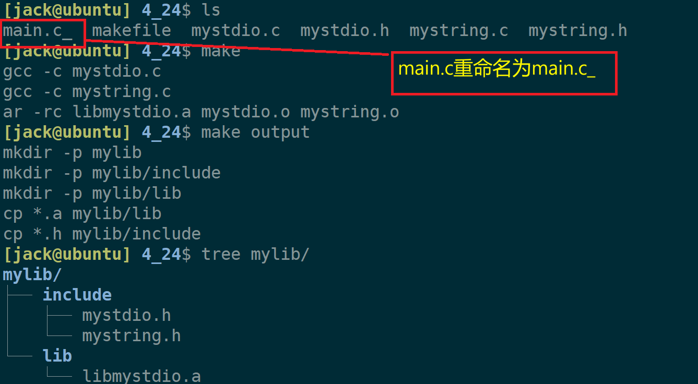
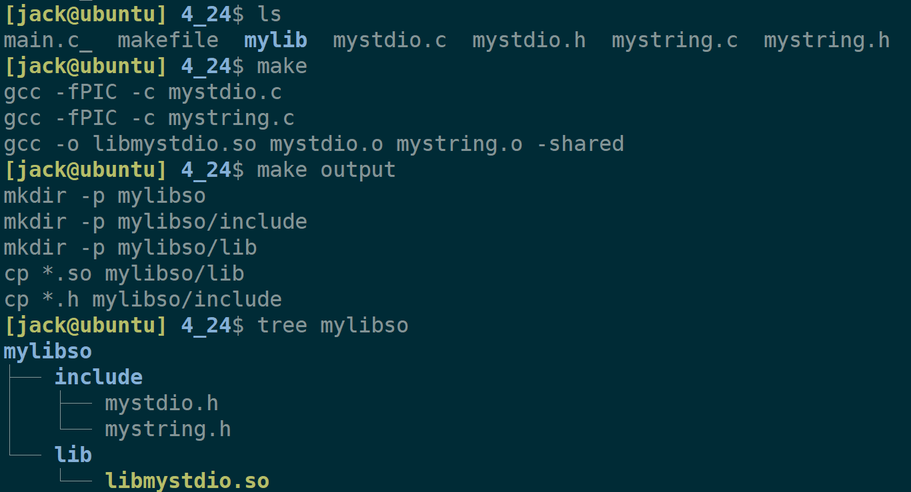
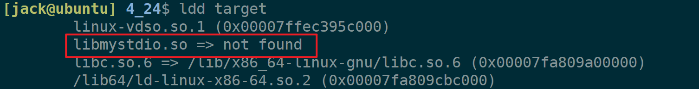
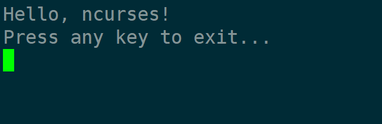

+++
date = 2026-04-25
title = "静态库与动态库详解：原理、制作与实际应用"
description = ""
slug = ""
authors = []
tags = ["静态库", "动态库", "GCC", "Makefile"]
series = ["Linux"]
featuredImage = "assets/cover.png"
toc = true
+++

# 静态库与动态库详解：原理、制作与实际应用

> 原创 已于 2026-04-25 12:39:57 修改 · 公开 · 372 阅读 · 15 · 14 · 本内容遵循CC 4.0 BY-SA版权协议 版权声明：本文为博主原创文章，遵循 CC 4.0 BY-SA 版权协议，转载请附上原文出处链接和本声明。 GEO检测 · 编辑
> 文章链接：https://blog.csdn.net/2401_87889177/article/details/160476136

**文章目录**

[TOC]


## 1、前言

本文使用到的源码基于这一期博客《 [使用系统调用封装stdio常用函数（个人学习使用）](https://blog.csdn.net/2401_87889177/article/details/160334805?spm=1011.2415.3001.5331) 》也可以在gitee上获取【 [gitee资源](https://gitee.com/muyi-2580/learning-linux/tree/main/4_20) 】。

在此源码上为了体现多文件效果，新增mystring.h和mystring.c文件以及对main.c内容调整。

**mystring.h** （新增）

```c
#ifndef __MY_STRING__
#define __MY_STRING__

#include <stdio.h>

void mystrlen();

#endif
```

**mystring.c** （新增）

```c
#include "mystring.h"

void mystrlen()
{
    printf("这是一个自己实现的mystrlen()");
}
```

**main.c** （调整后）

```c
#include "mystdio.h"
#include "mystring.h"

int main()
{
    myFILE* fp = myfopen("log.txt", "w");

    const char * str = "这是一条有myfwrite写入的数据\n";
    myfwrite(str, strlen(str), 1, fp);

    mystrlen();    
    return 0;
}
```

目录树为：



## 2、库的本质

如图为编译链接过程，在编译阶段（这里统称预处理、编译、汇编）多个文件都是单独编译的，不会有交集。这就意味着在main.c中声明一个外部变量 `extern int a;` ，编译器即使不知道a变量是否在其他文件存在，但是不会报错的。


这意味着可以把源码编译成.o，提供给其他人使用。

例如：现有多个.o文件和main.c文件，main.c中的调用的myfopen等函数。



只将main.c编译成main.o，然后通过gcc链接，依然能够生成目标文件。目标文件依然可以运行：



这就是C标准库实现的思路，把多个.o文件封装起来，给开发者使用。

得出结论： **库的本质就是多个.o文件的集合！** 

## 3、自制静态库

#### 3.1、静态库的制作

`ar` 是gnu归档工具， `rc` 表示(replace and create)



自制的库为libmystdio.a，库名为 `mystdio` 。库的命名是规范为前缀 `lib` 后缀 `.a.version` 。

#### 3.2、使用自制静态库

使用自制静态库可以将其拷贝到 `/lib64/` 下，也可以在/lib64/下创建软链接。

使用gcc的选项指定静态库 `gcc main.c -I头文件路径 -L库文件路径 -l库名` 。

```bash
gcc main.c -I./ -L./ -lmystdio
```

`-I` ：指定第三方头文件目录。
`-L` ：指定第三方库所在目录。
`-l` ：指定第三方库名。



使用自制的静态库也能达到理想效果。将来就能复用这个库了。

#### 3.3、打包静态库

给别人提供第三方库必须要提供库文件本身，还要提供头文件。头文件有两个作用：
1、用于预处理阶段头文件展开；
2、提供函数原型，用户才能直到函数参数、返回值等信息。

重写makefile文件，便于构建库文件

```makefile
libmystdio.a: mystdio.o mystring.o
	ar -rc libmystdio.a mystdio.o mystring.o

%.o:%.c
	gcc -c $<

.PHONY: clean
clean:
	rm -rf *.o *.a

.PHONY: output
output:
	mkdir -p mylib
	mkdir -p mylib/include
	mkdir -p mylib/lib
	cp *.a mylib/lib
	cp *.h mylib/include
```

**库文件不能包含main函数** ，这里给main.c重命名了。



## 4、自制动态库

#### 4.1、动态库的制作和打包

动态库需要用gcc制作，在.c编译成.o阶段加 `-fPIC` 选项（fPIC产生位置无关码），例如 `gcc -fPIC -c mystdio.c` 。

在多个.o文件打包成动态库文件的时候加 `-shared` 选项（表示生成共享库格式），例如 `gcc *.o -o mylib.so -shared` 。

再次修改makefile：

```makefile
libmystdio.so: mystdio.o mystring.o
	gcc -o $@ $^ -shared

%.o:%.c
	gcc -fPIC -c $<

.PHONY: clean
clean:
	rm -rf *.o *.so

.PHONY: output
output:
	mkdir -p mylibso
	mkdir -p mylibso/include
	mkdir -p mylibso/lib
	cp *.a mylibso/lib
	cp *.h mylibso/include
```

制作并打包成libmystdio.so文件：



#### 4.2、动态库路径查找问题

编译出可执行文件target：

```bash
gcc main.c -o target -I ./mylibso/include/ -L ./mylibso/lib/ -l mystdio
```

直接用./target是执行不了的。报错原因：gcc的-l、-L、-l选项是链接时起作用，而动态库是运行时动态加载与加载器有关。使用ldd查看链接信息：



解决方法：

1. 将自制动态库拷贝到/lib64。

2. 将自制动态库在/lib64下制作软链接。

3. 设置环境变量（export LD_LIBRARY_PATH=/path/to/mylib）

4. 配置/etc/ld.so.conf.d/

采用第4种解决方法，在/etc/ld.so.conf.d/下创建test.conf文件写入动态库路径（例如：/home/jack/code/4_24/mylibso/lib），执行ldconfig刷新链接配置文件。

```bash
sudo echo "/home/jack/code/4_24/mylibso/lib" >> /etc/ld.so.conf.d/test.conf
sudo ldconfig
```

再次执行./target：


## 5、安装第三方库并使用

以 `ncurses` 库为例，演示安装到使用的过程。ncurses是一个终端环境下构建界面的工具。

Ubuntu安装

```bash
sudo apt install -y libncurses5-dev
```

CentOS安装

```bash
sudo yum install -y ncurses-devel
```

写一段测试demo：

```c
#include <ncurses.h>

int main() {
    initscr();    
    cbreak(); 
    noecho();  
    keypad(stdscr, TRUE);  

    printw("Hello, ncurses!\n");
    printw("Press any key to exit...\n");
    refresh();   

    getch();   
    endwin(); 
    return 0;
}
```

编译运行

```bash
gcc -o target test.c -lncurses -lm
./target
```

使用 `-l` 指定链接的外部库。是所以不用使用 `-I` 和 `-L` 指定头文件位置和库位置，是因为包管理器已经将头文件和库拷贝到了gcc默认寻址头文件和库的路径下。



## 6、总结

1. 库的本质：多个.o文件的集合（代码复用的封装）

2. 编译 vs 链接：

   - 编译阶段：各文件独立，不检查符号是否存在。

   - 链接阶段：统一解析函数/变量

3. 静态库：使用ar制作，编译时指明链接路径（第三方库）

4. 动态库：使用gcc制作，编译和运行时都要指定路径（第三方库）
