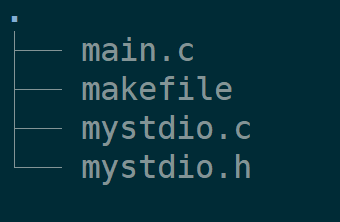

+++
date = 2026-04-22
title = "使用系统调用封装stdio常用函数（个人学习使用）"
description = ""
slug = ""
authors = []
tags = ["stdio", "系统调用", "封装", "缓冲区"]
series = ["Linux系统编程"]
featuredImage = "assets/cover.png"
toc = true
+++

> 原创 于 2026-04-22 08:00:00 发布 · 公开 · 238 阅读 · 4 · 4 · 本内容遵循CC 4.0 BY-SA版权协议 版权声明：本文为博主原创文章，遵循 CC 4.0 BY-SA 版权协议，转载请附上原文出处链接和本声明。 GEO检测 · 编辑
> 文章链接：https://blog.csdn.net/2401_87889177/article/details/160334805

## 1、项目准备

##### 1.1、项目结构树



##### 1.2、项目构建文件makefile

```makefile
BIN=testio
SRC=$(wildcard *.c)
OBJ:=$(SRC:.c=.o)        
CC=gcc
LFLAGS=-o
FLAGS=-c -Wall -g
RM=rm -f                 

$(BIN):$(OBJ)
	$(CC) $(LFLAGS) $@ $^

%.o:%.c
	$(CC) $(FLAGS) $<

.PHONY: clean
clean:
	$(RM) $(OBJ) $(BIN)
```

makefile的使用

```makefile
make  			//构建项目
makeclean		//清理项目
```

## 2、测试代码main.c

测试代码不是很难，通过这几个函数的测试即可。
主要测试内容：打开文件、向文件写入数据、刷新缓冲区、关闭文件。

```c
#include "mystdio.h"

int main()
{
    myFILE* fp = myfopen("log.txt", "w");
    if(fp == NULL)
    {
        exit(1);
    }

    const char * str = "这是一条有myfwrite写入的数据\n";
    myfwrite(str, strlen(str), 1, fp);

    myfflush(fp);

    myfclose(fp);

    return 0;
}
```

## 3、项目结构mystdio.h

mystdio.h主要定义了 `myFILE` 结构体以及缓冲模式。并且声明 `myfopen` 、 `myfwrite` 、 `myfflush` 、 `myfclose` 四个外部调用接口。

```c
#ifndef __MY_STDIO__
#define __MY_STDIO__


#include <fcntl.h>
#include <unistd.h>
#include <stdlib.h>
#include <string.h>

#define SIZE 1024

#define NONE_FULSH 1 // 无缓冲
#define LINE_FLUSH 2 // 行缓冲
#define ALL_FLUSH  4 // 全缓冲

typedef struct myFILE
{
    int fd;
    char outbuffer[SIZE];
    int pos;
    int flush;
} myFILE;

void myfflush(myFILE* stream);

myFILE* myfopen(const char* pathname, const char* flags);

int myfwrite(const void * ptr, int size, int num, myFILE* stream);


void myfclose(myFILE* stream);


#endif
```

## 4、核心函数实现mystdio.c

##### 4.1、myfflush、myfflushcore

`myfflushcore` ：刷新缓冲区的主要逻辑函数
`myfflush` ：为外部提供的刷新函数

```c
#include "mystdio.h"

#define TRY_FLUSH  1
#define MUST_FLUSH 2

static void myfflushcore(myFILE* stream, int flush_flags)
{
    if(stream->pos == 0) 
        return;
    if((stream->flush & NONE_FULSH) || (flush_flags & MUST_FLUSH))
    {
        write(stream->fd, stream->outbuffer, stream->pos);
        stream->pos = 0;
    }
    else
    {
        if(stream->flush & LINE_FLUSH)
        {
            if(stream->outbuffer[stream->pos - 1] == '\n')
                myfflushcore(stream, MUST_FLUSH);
        }
        else if(stream->flush & ALL_FLUSH)
        {
            if(stream->pos * 8 >= SIZE * 10) // 占用缓冲区80%再刷新
            {
                myfflushcore(stream, MUST_FLUSH);
            }
        }
    }
}

void myfflush(myFILE* stream)
{
    myfflushcore(stream, TRY_FLUSH);
}
```

##### 4.2、myopen

`myfopen` ：用于打开文件，并返回文件对象的指针。不支持"w+ r+ a+"打开模式

```c
myFILE* myfopen(const char* pathname, const char* flags)
{
    if(strlen(pathname) == 0)
        return NULL;

    int fd = -1;
    if(strcmp(flags, "r") == 0)
    {
        fd = open(pathname, O_RDONLY);
    }
    else if(strcmp(flags, "w") == 0)
    {
        fd = open(pathname, O_CREAT | O_WRONLY | O_TRUNC, 0666);

    }
    else if(strcmp(flags, "a") == 0)
    {
        fd = open(pathname, O_CREAT | O_WRONLY | O_APPEND, 0666);

    }
    else
    {
        return NULL;
    }
    
    myFILE* myfile = (myFILE*)malloc(sizeof(myFILE));
    if(myfile == NULL)
    {
        return NULL;
    }

    myfile->fd = fd;
    myfile->pos = 0;
    myfile->flush = LINE_FLUSH;
    return myfile;
}
```

##### 4.3、mywrite

`mywrite` ：用于向文件写数据

```c
int myfwrite(const void * ptr, int size, myFILE* stream)
{
    if(size == 0) // 没有数据写入
    {
        return 0;
    } 

    // 将数据放进缓冲区
    memcpy(stream->outbuffer + stream->pos, ptr, size * num);
    stream->pos += size * num;
    myfflush(stream);

    return size;
}
```

##### 4.4、myclose

`myclose` ：用于关闭文件，刷新缓冲区，清理文件对象资源

```c
void myfclose(myFILE* stream)
{
    // 刷新缓冲区
    myfflushcore(stream, MUST_FLUSH); 
    
    // fsync可选
    fsync(stream->fd);

    // 关闭文件
    close(stream->fd);

    // 释放文件对象
    free(stream);
}
```

## 5、测试与验证

编译运行并查看结果：

```bash
make
./testio
cat log.txt
```

输出：

```shell
这是一条有myfwrite写入的数据
```

## 6、总结与改进方向

只实现了4个主要的外部接口函数，能够对文件进行写入（包括二进制数据和字符串），仅支持的文件打开模式有"w"、“a”。

源码已上传至gitee： [https://gitee.com/muyi-2580/learning-linux/tree/main/4_20](https://img-home.csdnimg.cn/images/20230724024159.png?origin_url=https%3A%2F%2Fgitee.com%2Fmuyi-2580%2Flearning-linux%2Ftree%2Fmain%2F4_20&pos_id=img-j5cWCCUG-1776673509652) 。

声明：仅用于学习、理解封装的过程和缓冲区的概念。