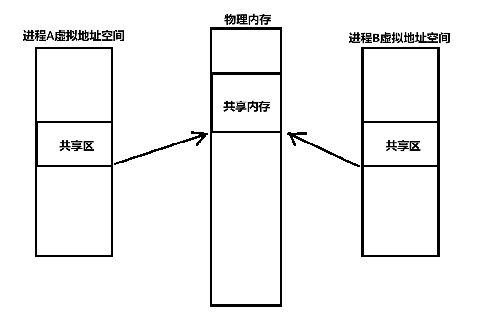
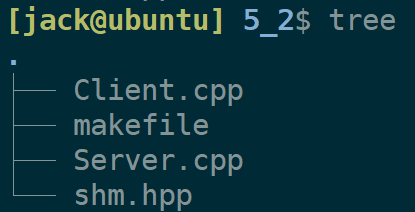
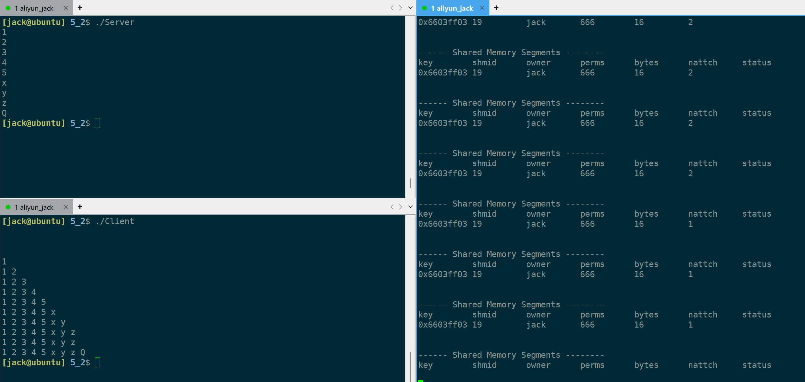
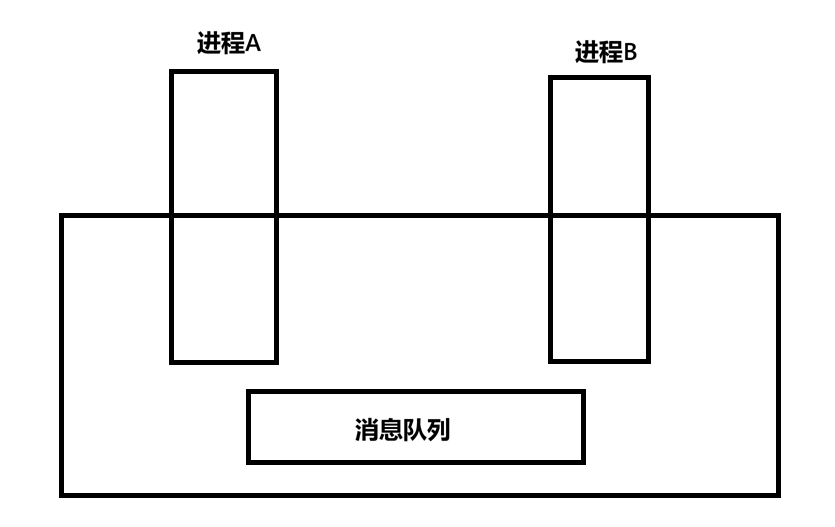

+++
date = 2026-05-07
title = "System V 进程间通信：共享内存、消息队列与信号量"
description = ""
slug = ""
authors = []
tags = ["System V IPC", "共享内存", "信号量", "消息队列"]
series = ["Linux系统编程"]
featuredImage = "assets/cover.png"
toc = true
+++


> 原创 已于 2026-05-07 12:52:11 修改 · 公开 · 422 阅读 · 13 · 13 · 本内容遵循CC 4.0 BY-SA版权协议 版权声明：本文为博主原创文章，遵循 CC 4.0 BY-SA 版权协议，转载请附上原文出处链接和本声明。 GEO检测 · 编辑
> 文章链接：https://blog.csdn.net/2401_87889177/article/details/160716067

**本文基于System V标准演示** 

## 1、共享内存简介与原理

共享内存通信是一种System V标准的进程间通信方式。进程间通信本质是让不同的进程能够访问不同的资源。

为了维护进程的安全，不能将私有内存暴露给其他进程，所以创建共享内存必须是由操作系统完成。

共享内存通信本质是让不同进程的虚拟内存地址通过页表映射到同一块物理内存，共享内存将被映射到虚拟地址空间的共享区，类似于动态库加载。



共享内存的生命周期随操作系统，因此，创建了共享内存一定要手动删除。

使用共享内存通信的步骤：

1. 创建共享内存

2. 映射（挂接/挂载）

3. 使用

4. 解除挂接（卸载）

5. 删除共享内存

## 2、共享内存API接口

### 2.1、shmget（创建/获取）

创建/获取共享内存：

```cpp
int shmget(key_t key, size_t size, int shmflg);
```

参数：

- size：开辟共享内存的大小，4kb对齐。例如填写4097，实际会开辟2 * 4kb，但能使用的只有4097。

- shmflg：标志位与权限，通常传递这两个宏（IPC_CREAT，IPC_EXCL）与0666。

  - IPC_CREAT：不存在则创建。

  - IPC_EXCL：存在则报错，创建失败。

- key：用于标识共享内存的唯一性的，由用户传递，理论上可以是任何数字。例如，写服务端的A和写客户端的B在写之前就约定好key使用0x112233，程序可以通过这个 数字在OS中找到对于的共享内存。

  也常用ftok函数。

  - `key_t ftok(const char *pathname, int proj_id);` 
    可以理解成传递一种算法：输入可访问路径和整数，输出一个整数（可以避免一些可以的数字给shmget函数）。

返回值：

- 成功：返回一个共享内存的标识符shmid，类似于文件描述符fd，操作共享内存都是用shmid。

- 失败：可能由相同的key参数引起，返回-1，设置errno。

### 2.2、shmat（映射）和shmdt（解除挂接）

映射（挂接）到虚拟地址空间：

```cpp
void *shmat(int shmid, const void *_Nullable shmaddr, int shmflg);
```

参数：

- shmid：需要映射的共享内存id。

- shmaddr：填写非空地址，则将共享内存映射到指定虚拟地址位置；填写nullptr（NULL）则由操作系统自动分配地址（常用）。

- shmflag：填写0，可读可写（常用）；填写SHM_RDONLY，只读。

返回值：

- 成功：返回挂接后的虚拟地址。

- 失败：返回-1，并设置errno。

解除挂接：

```cpp
int shmdt(const void *shmaddr);
```

参数：

- shmaddr：填写挂接时获取的地址。

返回值：

- 成功：返回0。

- 失败：返回-1，并设置errno。

### 2.3、shmctl（控制）

用于控制共享内存：

```cpp
int shmctl(int shmid, int op, struct shmid_ds *buf);
```

参数：

- shmid：需要控制的共享内存id。

- op：常用操作有：

  - IPC_STAT：拷贝共享内存信息。

  - IPC_RMID：删除共享内存。

  - IPC_SET：删除共享内存。

- buf：与op参数配合使用，op为IPC_STAT时，会将共享内存信息拷贝进buf指向的地址。

返回值：

- 成功：SHM_STAT返回shmid，其他操作返回0。

- 失败：返回-1，设置errno。

## 3、共享内存应用

思路：服务端负责创建和删除共享内存，在使用时不断从键盘输入字符写入共享内存（不操作共享内存大小），然后客户端不断从共享内存读取字符。遇到’Q’字符退出。

项目路径：



makefile构建文件：

```makefile
.PHONY:ALL
ALL:Client Server

Client:Client.cpp
	g++ -o Client -g Client.cpp

Server:Server.cpp
	g++ -o Server -g Server.cpp

.PHONY:clean
clean:
	rm Server Client
```

Server.cpp：

```cpp
#include "shm.hpp"

int main()
{
    SHM shmmem;
    // 创建共享内存
    shmmem.Create();
    // 映射到共享区
    shmmem.Attach();
    // 开始使用
    char* addr = (char*)shmmem.Addr();
    for(int i = 0; i < shmmem.Size(); ++i)
    {
        std::cin >> addr[i]; // 像普通内存一样使用。
        if(addr[i] == 'Q')
            break;
    }
    sleep(5);
    // 解除挂接
    shmmem.Detach();
    // 手删除共享内存
    shmmem.Delete();
    return 0;
}
```

Client.cpp

```cpp
#include "shm.hpp"

int main()
{
    SHM shmmem;
    // 获取共享内存
    shmmem.Get();
    // 映射到共享区
    shmmem.Attach();
    // 开始使用
    char* addr = (char*)shmmem.Addr();
    int i = 0;
    do
    {
        for(i = 0; i < shmmem.Size(); ++i)
        {
            std::cout << addr[i] << " ";
            if(addr[i] == 'Q')
                break;
        }
        std::cout << std::endl;
        sleep(1);
    }
    while(addr[i] != 'Q');
    // 取消挂接
    shmmem.Detach();
    return 0;
}
```

shm.hpp设计如下：

```cpp
#define __SHM_HPP__
#include <sys/ipc.h>
#include <sys/shm.h> 
#include <iostream>
#include <unistd.h>

#define PATHNAME "/tmp/"
#define PROJ_ID  0x79478766

class SHM
{
public:
    SHM()
    {}
    // 创建
    void Create()
    {
        GetHelper(IPC_CREAT | IPC_EXCL | 0666);
    }
    // 获取
    void Get()
    {
        GetHelper(0);
    }
    // 映射(挂接)
    void Attach()
    {
        _start_addr = shmat(_shmid, nullptr, 0); 
        if(_start_addr == (void*) -1)
        {
            std::cerr << "shmat:";
            exit(3);
        }
    }
    // 使用(获取共享内存起始地址)
    void* Addr()
    {
        return _start_addr;
    }
    // 解除映射
    void Detach()
    {
        int n = shmdt(_start_addr);
        if(n < 0)
        {
            std::cerr << "shmdt:";
            exit(4);
        }
    }
    // 删除
    void Delete()
    {
        int n = shmctl(_shmid, IPC_RMID, nullptr);
        if(n < 0)
        {
            std::cerr << "shmctl:";
            exit(5);
        }
    }

    int Size()
    {
        return size;
    }
private:
    key_t GetKey()
    {
        return ftok(PATHNAME, PROJ_ID);
    }
    void GetHelper(int flag)
    {
        key_t key = GetKey();
        if(key < 0)
        {
            std::cerr << "ftok:";
            exit(1);
        }

        _shmid = shmget(key, size, flag);
        if(_shmid < 0)
        {
            std::cerr << "shmget error:";
            exit(2);
        }
    }
private:
    int _shmid;
    void* _start_addr; 
    int size = 16;
};

#endif
```

这条语句每个一秒执行 `ipcs -m` ，可用于监控共享内存情况。

```bash
while true; do ipcs -m; sleep 1; done
```

执行结果：



## 4、消息队列（了解）

本文只对消息队列与信号量做简介，因为实际生产中这两种通信方式正在逐渐淘汰。

### 4.1、原理

消息队列在内核中是一个带类型的链表队列。进程按照队列选择性读取。同共享内存一样，内核中也用key标识唯一的消息队列。



### 4.2、API函数

获取/创建消息队列：

```cpp
int msgget(key_t key, int msgflg);
```

参数：

- key：与shmget一样，常用ftok获取。

- msgflag：与shmget一样，传递权限与（IPC_CREAT与IPC_EXCL）。

返回值：

- 成功：返回msqid（标识消息队列的唯一id）。

- 失败：返回-1，并设置errno。

发送数据：

```cpp
int msgsnd(int msqid, const void msgp[.msgsz], size_t msgsz, int msgflg);
```

参数：

- msqid：发送数据的消息队列id。

- msgp：发送的数据，必须是以long开头的数据块（常用结构体）如：

```cpp
struct msgbuf {
	long mtype;       /* message type, must be > 0 */ //用于标识类型
	char mtext[1];    /* message data */
};
```

- msgsz：除了mtype以外的大小，例如 `strlen(mtext)` 。

- msgflg：默认0（消息队列满了就阻塞），IPC_NOWAIT（满了就出错返回）。

返回值：

- 成功：返回0。

- 失败：返回-1，并设置errno。

接受数据：

```cpp
ssize_t msgrcv(int msqid, void msgp[.msgsz], size_t msgsz, long msgtyp, int msgflg);
```

参数：

- msqid：从目标消息队列id接受数据。

- msgp：接受数据缓冲区，与发送消息的结构体一样。

- msgsz：最多接受数据大小，不包含结构体中long类型。

- msgtyp：接受的类型（其他进程发送时设置的）。

- msgflg：默认0（没有数据，阻塞），IPC_NOWAIT（没有数据，立即返回ENOMSG）

返回值：

- 成功：实际接受数据的大小。

- 失败：返回-1，并设置errno。

控制信号量：

```cpp
int msgctl(int msqid, int op, struct msqid_ds *buf);
```

参数：

- msqid：控制的具体消息队列id。

- op：具体操作，有IPC_STAT，IPC_SET，IPC_RMID等。

- buf：搭配IPC_STAT使用，用于获取信号量具体信息。

返回值：

- 成功：MSG_STAT/MSG_STAT_ANY返回shmid，其他操作返回0。

- 失败：返回-1，并设置errno。

## 5、信号量（理解并发概念）

### 5.1、并发概念与信号量

并发常见问题：进程通信的本质是让多个进程访问同一份资源。那么，现有一份共享内存资源，多个进程同时对其进程操作，就会造成数据覆盖的安全性问题。这块共享内存就应该被保护起来，同一时间只能由一个进程对其进程操作。

涉及到的并发概念 ：

- 共享资源：多个执行流（进程）能看到的同一份资源。

- 临界资源：被保护起来的资源，又叫互斥资源。

- 互斥：保护资源的方式，同一时间只用由一个执行流访问临界资源。

- 同步：多个执行流访问资源具有一定的熟悉。

- 临界区：用来保护临界资源的代码片段。

- 原子操作（原子性）：一种操作只有做完和没做两种状态。

- 保护的本质：对访问临界资源的临界代码进程保护。

信号量用来保护共享资源，其本质是一个计数器，原理是当一个进程访问时减一，归还资源时加一。

信号量本身也是一个共享资源，但它的加减是原子操作，因此是安全的。

### 5.2、API函数

获取/创建信号量：

```cpp
int semget(key_t key, int nsems, int semflg);
```

参数：

- key：同shmget，常用ftok生成。

- nsems：一次性创建nasems个信号量。

- semflg：权限位与IPC_CREAT/IPC_EXCL。

返回值：

- 成功：返回标识信号量集的semid。

- 失败：返回-1，并设置errno。

控制函数（初始化/删除/查看）：

```cpp
int semctl(int semid, int semnum, int op, ...);
```

参数：

- semid：操作的信号量集semid。

- semnum：操作的具体信号量集semid中具体第几个信号量。

- op：常用的有IPC_RMID（删除信号量集），GET_VAL（获取信号量值），SET_VAL（设置信号量值）等。

- 可变参数：op参数为GETALL、SETALL时使用，用于设置信号量集中所有信号量值，获取所有信号量值。

返回值：

- 成功：GET系列宏返回获取的相应信息。IPC_INFO和SEM_INFO宏返回信号量在信号量集中下标。SEM_STAT和SEM_STAT_ANY返回semid。

- 失败：返回-1，并设置errno。

P/V操作函数semop：

```cpp
int semop(int semid, struct sembuf *sops, size_t nsops);
```

参数：

- semid：操作的信号量集semid。

- sops：该结构体内容为：

```cpp
unsigned short sem_num;  /* semaphore number */ // 操作的起始信号量
short          sem_op;   /* semaphore operation */ // 1(P)、-1(V)、0(等待变成0)
short          sem_flg;  /* operation flags */ //SEM_UNDO(进程退出自动归还信号量)、IPC_NOWAIT(不阻塞，失败错误返回)、0(阻塞)
```

- nsops：一次操作的信号量个数。

返回值：

- 成功：返回0。

- 失败：返回-1，并设置errno。

## 6、内核数据结构

### 6.1、内核如何组织IPC？


`struct_kern_ipc_perm` IPC公共“父类”（抽象出来的公共部分），统一管理IPC信息。 `struct ipc_id_ary` 中管理所有的kern_ipc_perm，又由 `struct ipc_ids` 三个不同的对象区分ipc_id_ary。

### 6.2、shm文件映射

由6.1节图所知，struct中有一个 `struct file * shm_file` 指针，可以看出共享内存是通过文件接口实现的，这也linux下符合一切皆文件的思想。

创建共享内存本质是创建一个文件对象，挂接的本质是通过页表和mmap将不同进程的虚拟地址空间映射到同一个文件的内核缓冲区。

这个文件对象不会刷新数据到磁盘，只需要物理内存中有它的信息就行了。

## 7、总结

1. 共享内原理是不同进程虚拟地址映射到同一物理地址。

2. 消息队列原理是在内核维护带类型的队列。

3. 信号量原理是底层维护一个整数，其加减是内核维护的原子操作。

4. 理解system v标准，几种通信方式的API接口都类似（xxxget、xxxctl）。

5. 信号量自带锁，消息队列能阻塞等待但不自带锁，共享内存没有任何自带保护机制。

6. 其中共享内存是读写最快的，因为没有系统调用开销，直接映射到的物理内存。
