+++
date = 2026-08-15
title = "TCP 可靠传输与性能优化核心机制详解"
description = ""
slug = ""
authors = []
tags = ["TCP", "可靠传输", "滑动窗口", "拥塞控制"]
series = ["Linux网络编程"]
featuredImage = "assets/cover.png"
toc = true
+++


> 原创 于 2026-08-15 22:02:27 发布 · 公开 · 408 阅读 · 10 · 8 · 本内容遵循CC 4.0 BY-SA版权协议 版权声明：本文为博主原创文章，遵循 CC 4.0 BY-SA 版权协议，转载请附上原文出处链接和本声明。 GEO检测 · 编辑
> 文章链接：https://blog.csdn.net/2401_87889177/article/details/163080479

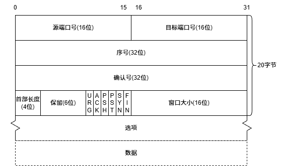

## 1 序列号与确认号

### 1.1可靠性的理解与确认应答机制

TCP为可靠传输协议，人们对可靠的 **误解** ：100%能将数据传输给对方。这是网络质量的问题，不是协议的问题。

正确理解可靠性：发送方知道数据传输是否成功，传输失败后该做哪些措施。

TCP 是一种双方地位对等的协议。A给B发送数据，B需要应答A，依靠B的应答，A判断是否成功发送。如果A收到B的应答没问题，则A给B发的数据成功传输。

但这不能代表B知道B对A的应答100%成功，因此，这个可靠性是保证过去的报文是否成功发送的可靠性。

---

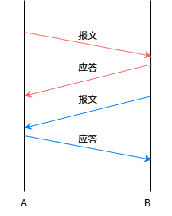

该图红色箭头保证 `A -> B` 方向传输数据的可靠性，蓝色箭头保证 `B -> A` 方向传输数据的可靠性。因此，TCP是全双工模式。

### 1.2 序列号

B成功收到A的数据，但A没有收到B的应答，会演示重发，序列号作用1：避免B重复收到相同的数据。

真实TCP传输数据可能是这样的：

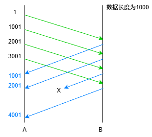

并发发送数据，由于网络问题、路径选择问题，可能导致后发的数据先被收到，先发的数据后被收到。序列号作用2：接收端根据序列号排序，得到正确的报文顺序。

### 1.3 确认号与捎带应答

确认号用于应答报文，确认号的值等于报文序列号值加数据长度加1。确认号保证该确认号之前的数据被正确收到，例如A向B发送4个报文，其序列号分别为：1、1001、2001、3001。若B都成功收到，则应答中确认号为1001、2001、3001、4001。

但是当A只收到B应答中的1001、2001、4001。则说明3001应答，4001说明序列号4000及之前序列号的数据被成功发送。不需要重发。确认号作用：减少重发次数。

若多个应答中的确认号为同一个，说明确认号后的报文对方没有接收成功。

同时需要序列号与确认号的原因是：现实中存在很多情况下，A要向B发送数据，同时B要向A发送数据。为了提高速度，采用捎带应答的机制。

捎带应答：在B对A的应答中，同时带上B要对A发送的数据。

三次握手中的第三次ack报文可以捎带应答，因为主动连接端已经认为完成三次握手。

### 1.4 超时重传

超时时间是规定出来的，若时间太短则会大量重发，导致效率降低；若时间太长，则会影响整体重传速率。

所以，这个时间应该与网络健康度有关，时间应该是弹性波动的。

Linux下这个时间被设定为：第 i 次重传应该延时 $2^i * 500$ ms。

## 2 标志位

| 缩写 | 英文全称 | 中文含义 |
|:---:|:---:|:---:|
| **SYN** | Synchronize | 同步（序列号） |
| **ACK** | Acknowledgment | 确认（确认号有效） |
| **FIN** | Finish | 结束（发送方完成发送） |
| **RST** | Reset | 重置（连接） |
| **PSH** | Push | 推送（立即交付应用层） |
| **URG** | Urgent | 紧急（紧急指针有效） |


### 2.1 ACK

常用的标志位有6个，内核中有8个，某些扩展中甚至有9个，保留位是留给扩展的标志位的。有的报文是用来建立连接、有的用来、发送数据、有的请求断开连接。协议栈使用标志位区分不同类型的报文。

标志位作用：标识报文的类型。

ACK 报文用于表示该报文中的确认号有效，是一个应答报文。

### 2.2 SYN

该标志位用于建立连接三次握手， `SYN` + `SYN + ACK` 保证C->S的方向能收发报文， `SYN + ACK` + `ACK` 保证S->C的方向能收发报文。


建立连接是有空间、时间成本的，内核会维护管理连接的结构体，具体如下图。连接建立的表现是创建 TCP 相关结构体和文件描述符！


三次握手是以最小成本验证全双工的方式。也是保证可靠性的方式之一。

三次握手也可以看作四次握手，中间那次 ACK + SYN可以分开，但是一般服务器都会无条件同意连接，所以合并在一起。

### 2.3 FIN

该标志位用于四次挥手，一组 `FIN` + `ACK` 标识一方发断开连接请求。


当四次挥手允许C单方面断开S连接，并且S依然可以向C发送报文。

四次挥手是以最小成本双方断开连接的方式。

其在内核中的表现形式是关闭文件描述符(close)。

极少情况下，C和S同时需要断开连接，中间那次 ACK 和 FIN可以合并，即三次挥手。

### 2.4 RST

三次握手中最后一次回复的 ACK，客户端并不知道服务端是否能够收到。第一次客户端向服务端发送 SYN 时报文是能够到达服务端的，这就意味着客户端在赌最后一次 ACK 也能到达服务端。

绝大多情况下，是能成功到达的。

如果出意外，客户端以为完成了三次握手，服务端没有收到 ACK ，服务端在缺失最后一次 ACK 报文情况下收到了数据，服务端会发送一个 RST 标志位置 1 的报文，要求 客户端重新发送请求，进行三次握手建立连接。

### 2.5 PSH

该标志位告诉接收方，不要等接收缓冲区到达低水位线，立即读走当前缓冲区中的数据。

这个标志位的报文数据会先被写入缓冲区，然后读走缓冲区所有内容。

应用层读取缓冲区内容用的是系统调用，系统调用会有开销。这会增加系统对调用次数。但有的场景必须要使用这个标志位。

使用场景：小数据实时传输。

ssh 就是一个典型例子，当用户输入 `ls\n` 用户需要立即得到结果，而不是等缓冲区到达设定值。

### 2.6 URG与紧急指针

URG 标识该报文的紧急指针是否有效。

紧急指针是从序列号开始算的偏移量，紧急数据是紧急指针指向之前的一个字节。

操作系统识别到 URG 后会有限处理紧急数据。

使用场景：需要应急处理的数据，如 SSH 中的 ctrl+c 。

## 3 其他部分

### 3.1 分离分用问题

TCP 报文解决报头与有效载荷分离：首部长度位报头长度(0000 ~ 1111)其单位位4字节，即报头长度范围为 20 ~ 60字节。在内核分离报头、数据的地方，每一个报文是独立的，所以知道报文大小、然后根据报头长度就能分离了。

TCP 报文解决分用问题：目标端口号。

接收缓冲区误解：接收缓冲区是放的不是报文。而是分离后的数据、这些数据是按顺序放在一起的，因此会出现粘包问题。

### 3.2 窗口大小

TCP的的接收缓冲区大小有限。A向B发送报文，当B缓冲区满了，理论上来说可以直接丢弃然后A重发，但是效率太低了。

A需要知道B缓冲区的接收能力（容量）。窗口大小用于衡量接收方的缓冲区接收能力，B在应答中填写窗口大小。当B的接收能力弱，A下一次就能发更少的数据。当B的接收能力强，A下一次发送更多数据。

窗口大小的一个重要作用：流量控制。

当应答中的窗口大小为0时，发送端会发送空报文（窗口试探）或者接收方主动发起报文通知接收方（窗口更新通知）。

## 4 连接管理

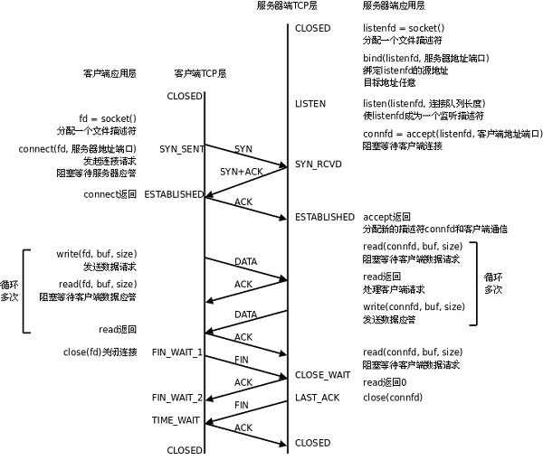

### 4.1 三次握手

三次挥手解决了什么问题：
1.确保双方网络信道通畅。
2.确认双方意愿。

三次握手是以最小成本验证网络通信、双方意愿的方式。

当调用 `connect` 时，客户端发起三次握手的请求。三次握手是由内核自动完成的，应用层根本感知不到。三次握手完成的标志是 connect 函数返回。

`listen` 的第二个参数 backlog 与底层连接队列的长度有关。队列长度等于 backlog + 1。

服务端 `accept` 的工作是提取底层连接队列中的一个连接，做内核数据结构与文件描述符之间的映射。

### 4.2 四次挥手

四次挥手解决了什么问题：
安全的关闭连接，确保没有数据再发送。

挥手的本质是确认本端不再发送数据（不代表不写数据「还能发送报头」、不一定彻底释放结构体）。

四次挥手是以最小成本确认双方断开连接意愿的最少次数。

当一方关闭后写时、还可以读，关闭读时还可以写，退化至半双工模式。其使用的函数是：

```c
int shutdown(int sockfd, int how);
```

第二个参数为：

- SHUT_RD：关闭读。

- SHUT_WR：关闭写。

- SHUT_RDWR：关闭读写，类比于 close。

---

发起四次挥手的一方会先进入 `TIME_WAIT` 状态，该状态的功能有：
1.确保最后一次 ack 完成，完成四次挥手。
2.避免陈旧数据污染新连接。

这个时间被设定为 2 * MSL（Maximum Segment Lifetime，最大报文段生存时间）。

即便进入 TIME_WAIT 也使用当前端口号进行绑定需要先调用：

```c
int setsockopt(int sockfd, int level, int optname,
                      const void optval[.optlen],
                      socklen_t optlen);
```

参数：

- level：该函数用与哪一层，常用 socket 层 `SOL_SOCKET` 。

- optname：具体的操作，地址复用为 `SO_REUSEADDR` 。

- optval：选项值。

- optlen：optval 的大小。

## 5 流量控制

应答报文中的窗口大小被设置为自己的大小，发送方根据接收方的接收能力发送小于等于的数据量的机制叫做流量控制。

这个机制是通过滑动窗口实现的，滑动窗口是 TCP 发送缓冲区的一部分。滑动窗口把发送缓冲区分为三个区域如下图(假设发送缓冲区数据为满状态)：


正确认应答区域是一段暂时不用收到应答也能直接发送的数据。这样就能实现一次发送一批报文了。

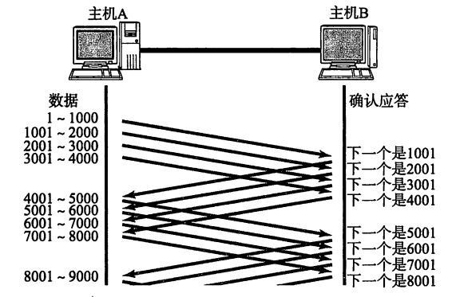

将滑动窗口中数据分段为多个报文，原因参考： [跳转至5 分片与组装](https://blog.csdn.net/2401_87889177/article/details/163332931?spm=1011.2415.3001.5331#5__177) 。

情况1，应答报文丢失：

若1001丢失，但是收到了2001，则说明1~2000数据发送成功。若是最后一个应答报文丢失，则会超时重传。

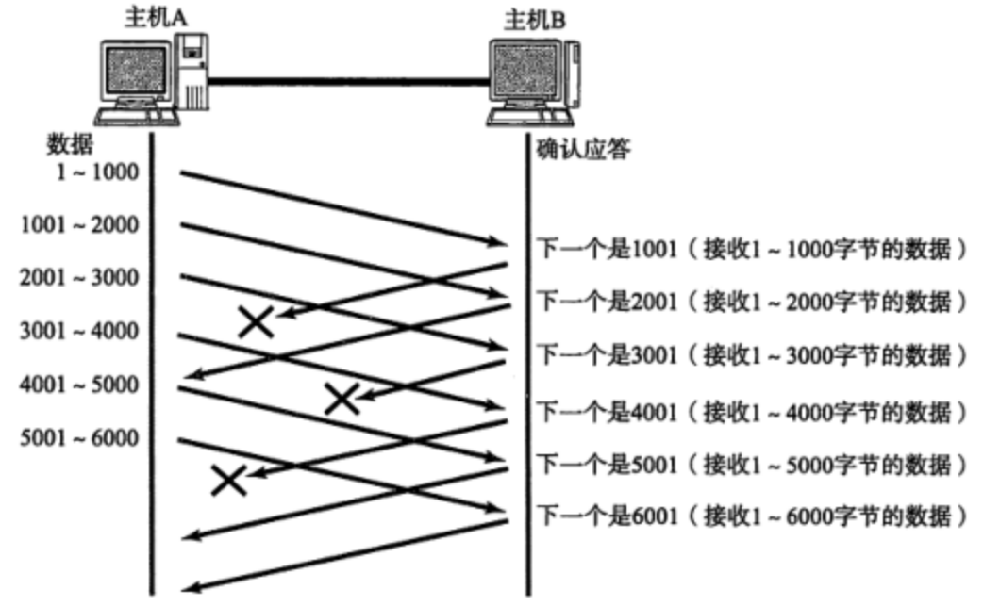

情况2，报文丢失：

报文丢失后，接收方应答的应答号会是重复的。当发送方收到的应答报文中确认号3次重复就认为报文丢失，重发。这个机制叫做高速重发控制(快重传)。

快重传和超时重传机制是同时生效的，双方保证 TCP 的可靠性。

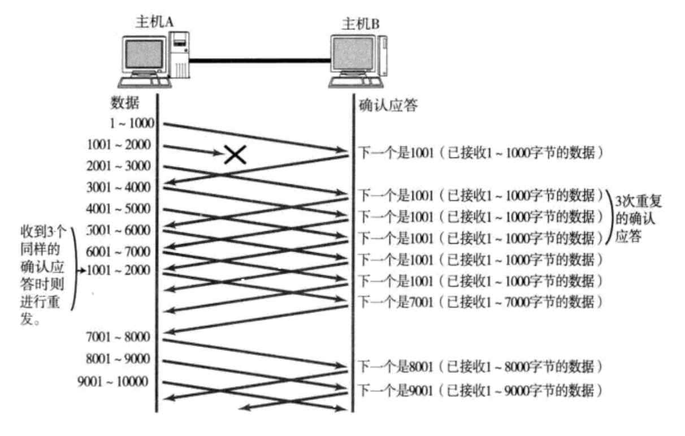

---

滑动窗口大小的计算：

- win_start：还未收到应答的最小序列号。

- win_end：win_start + ACK_WIN。

这就确保了滑动窗口只会向右滑动。实时调整滑动窗口大小。

按照滑动窗口分类，丢失报文变成了三种情况。

情况1，最左端报文丢失：

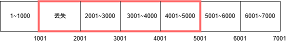

即便滑动窗口中其他报文正确发送、应答，应答报文中的确认号只会出现1001，超时重传、快重传机制报文重发。

情况2，中间丢失：
win_start：滑动到丢失、未应答的报文。
win_end：根据对方的 ACK_WIN 调整。

情况回到情况1：

情况3，最右侧丢失：
类比与情况2。

## 6 拥塞控制

拥塞控制是针对网络健康度采取的策略。

当网络情况不好时，开始出现大面积丢包时，可能是软件问题，可能是硬件问题。 TCP 协议只能解决一部分问题。

丢包率低时，属于正常情况，TCP 协议通过超时重传、快重传解决。

**当丢包率高时，属于网络问题，TCP 协议假设是由网络拥塞造成的** 。

网络拥塞出现的情况：当网络中存在大量报文时，路由器转发不及时，导致的堆积问题。不能重传、否则加重拥塞情况。

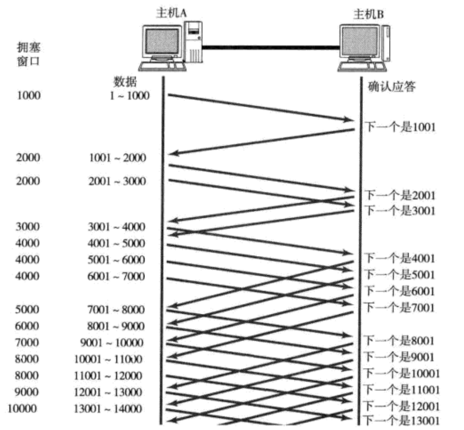

TCP 采用慢启动的策略。每隔一段时间发送1 个报文，若成功得到回复，则说明网络情况好转。下次发送2个报文，若成功下次发送4个报文.……。当然不可能一直按照 $2^n$ 增长发送报文。

之所以选择指数函数，是因为指数函数启动慢、恢复快。

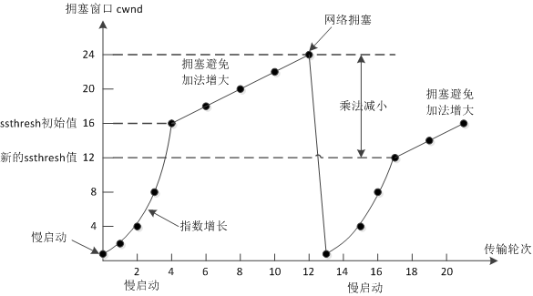

拥塞窗口是衡量网络健康程度的量。

当达到ssthresh值时转为线性增长，直到再次发生拥塞，设置新的ssthresh值为网络拥塞是的拥塞窗口的一般，然后重新慢启动，这是一个周期。

发送报文的数量取决于滑动窗口的大小。实际滑动窗口大小=min(窗口大小, 阻塞窗口大小)，即awnd = min(cwnd, rwnd)。

网络健康情况是随时发生变化的，TCP 的拥塞控制在每个周期内都在试探网络拥塞的阈值，然后调整发送速率。

## 7 延时应答

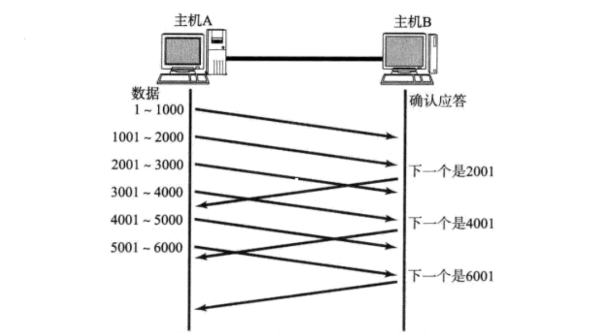

接收缓冲区大小为1MB，一次接收500KB数据，若立即应答，则窗口大小为500KB。若200ms后做应答，B的应用层可能就会读走一部分数据，则窗口大小大于500KB。这就是延时应答。

延时应答有两个策略：1. 每隔N个包应答一次；2. 超过最大应答时间应答一次。

Linux 下N取2，最大应答时间为ms。

延时应答的作用是减少ack应答报文，提高网络传输速率。

## 8 常见面试问题

### 8.1 面向字节流与粘包问题

字节流的理解：缓冲区中数据是调用 `write/recv` 写入缓冲区的，这些数据是没有封装成报文的数据，用户并不知道这些数据的边界。操作系统按照顺序将数据写入缓冲区，模糊了数据边界。

操作系统重发送缓冲区中取 `MSS` (Maximum Segment Size) 个数据，封装成报文，然后适当时机发送。

一个报文中的数据可能是半个 write 写入的、刚好一个 write 写入的、多个write写入的。

接收方的传输层报文分离，将数据写入接收缓冲区，每次接收的数据都按照顺序放入这个缓冲区，这时候的接收缓冲区就类似于一个文件流。

粘包问题解决的本质问题是 **明确数据包边界** 。

应用层一般采取方法：

1. 每条完整数据固定长度。

2. 特定分隔符。

3. 长度前缀。

### 8.2 TCP 异常

1. **进程异常终止** 
   文件描述符的生命周期随进程，当进程异常终止（除零错误），close关闭文件描述符发起四次挥手。误解：TCP 生命周期随进程。进程关闭后还有 TIME_WAIT状态。

2. **机器重启** 
   机器重启，操作系统会先结束各个进程。结束进程时自动关闭文件描述符。

3. **客户端掉电/拔网线** 
   没有机会四次挥手，服务端也不知道客户端掉线状态。每个连接有一个保活定时器，每次报文交流更新定时器时间。时间一到，发送试探报文，若探测无响应则清除连接。

4. **服务端掉电/拔网线** 
   客户端不知道服务端状态，以为还连接着。服务端再次启动，服务端与客户端没有连接。当客户端向服务端发送报文，检测到没有完成三次握手，服务端回复标志位 RST 的报文。然后两者建立连接。

### 8.3 UDP 实现可靠传输

如果要非常可靠的传输直接使用 TCP，若是某些方面的可靠传输可以效仿 TCP，如：

1. 引入序列号，确保数据顺序。

2. 引入确认应答，确保对端收到数据。

3. 引入超时重传。

4. ……

## 9 总结

TCP 可靠性的保证：

1. 校验和

2. 序列号（按序到达、去重）

3. 确认应答

4. 超时重传

5. 连接管理

6. 流量控制

7. 拥塞控制

TCP 提高性能：

1. 滑动窗口

2. 快重传

3. 延时应答

4. 捎带应答

其他：

1. 超时重传定时器

2. 保活定时器

3. TIME_WAIT 定时器
