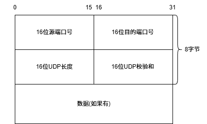
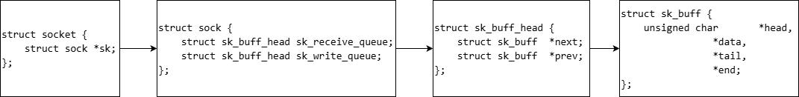
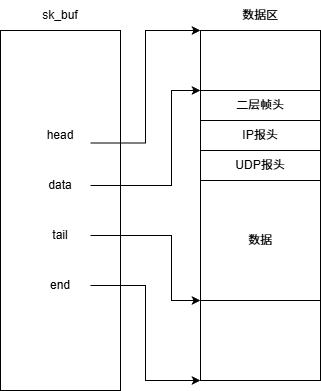
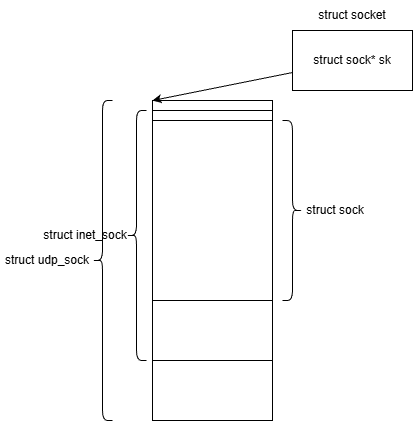
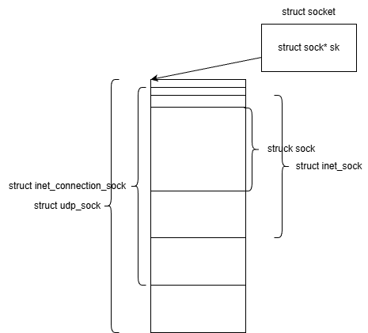
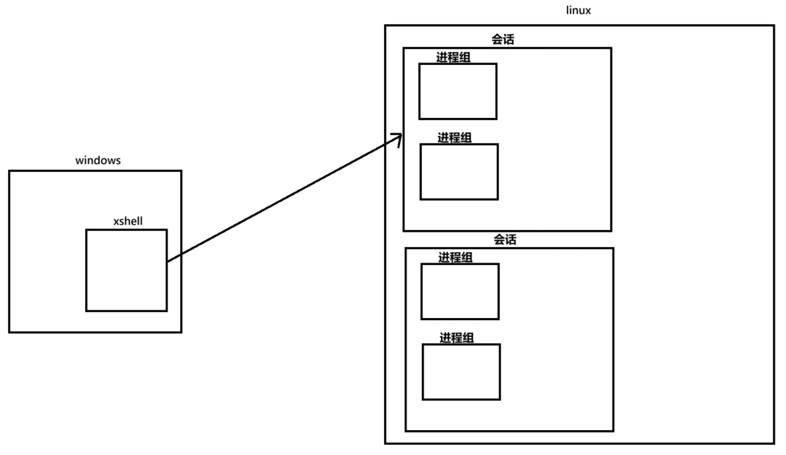

+++
date = 2026-08-09
title = "UDP协议栈内核数据结构与守护进程创建流程分析"
description = ""
slug = ""
authors = []
tags = ["UDP", "协议栈", "守护进程", "setsid"]
series = ["Linux网络编程"]
featuredImage = "assets/cover.png"
toc = true
+++


> 原创 于 2026-08-09 09:07:16 发布 · 公开 · 175 阅读 · 2 · 5 · 本内容遵循CC 4.0 BY-SA版权协议 版权声明：本文为博主原创文章，遵循 CC 4.0 BY-SA 版权协议，转载请附上原文出处链接和本声明。 GEO检测 · 编辑
> 文章链接：https://blog.csdn.net/2401_87889177/article/details/163046600

## 1 UDP 原理

### 1.1 分离、分用问题



UDP内核数据结构：

```c
struct udphdr {
	__u16	source;
	__u16	dest;
	__u16	len;
	__u16	check;
};
```

UDP 报头由4个部分组成，总共8字节。16位 UDP 长度限制了数据长度必须小于等于65535（64KB）。UDP在发送数据时是数据报，这就意味着不会拆包也不会合并。

UDP作为网络层协议需要解决两个问题：

1. 报头有效载荷如何分离： UDP报头长度固定8字节，指针指向报头起始地址，类型强转后能分离。

2. 分用问题，交给上层哪个进程：一个端口只能一个进程监听（一个进程能监听多个端口）。

理解如何分离有效载荷：
Windows、Linux操作系统由C为主写的，这个报头就是一个结构体。当主机收到数据，在网络层，指针指向数据，做指针类型强转就得到了数据的正确分布。

### 1.2 内核数据结构

UDP 没有真正意义上的发送缓冲区，因为它不需要错误重传等行为。但有接收缓冲区。



`sk_buf` 结构体的四个指针：

- `head` ：缓冲区开始。

- `data` ：数据开始。

- `tail` ：数据结束。

- `end` ：缓冲区结束。



UDP 将应用层将要发送的数据直接写在的这个缓冲区里面。当向下交付时，直接移动指针即可。

以上是 UDP 结构体和内核中的缓冲区，下面是管理 UDP 的结构体。向上交付时通过指针强转实现，该结构体与缓冲区一样，都是贯穿三层协议栈。



TCP 的管理结构体有所不同之处在于是基于连接的：



## 2 守护进程

### 2.1 进程组与作业

前台进程一个终端只能有一个，特点是能够获得键盘输入。

进程组是一组进程的集合，且进程组ID(PGID)等于该组的组长(第一个进程)的PID，进程组有利于统一管理一组进程。单个进程一组是特殊情况。

```bash
[jack@ubuntu] ~$ ps ajx | head -1 ; ps ajx | grep sleep
   PPID     PID    PGID     SID TTY        TPGID STAT   UID   TIME COMMAND
1336399 1336484 1336484 1336399 pts/0    1336484 S+    1001   0:00 sleep 1000
1336399 1336485 1336484 1336399 pts/0    1336484 S+    1001   0:00 sleep 2000
```

前台进程组中每一个前台进程会尝试拥有键盘输入，谁先抢到谁先拥有。

进程组是站在系统内核角度看的，作业是站在 shell 角度看的，作业与进程组基本上可以认为是一个东西。

创建三个作业(进程组)：

```bash
[jack@ubuntu] ~$ jobs
[1]   Running                 sleep 1000 | sleep 2000 | sleep 3000 &
[2]-  Running                 sleep 1000 | sleep 2000 &
[3]+  Running                 sleep 1000 &
```

将 `[1]` 号后台作业转到前台：

```bash
[jack@ubuntu] ~$ fg 1
sleep 1000 | sleep 2000 | sleep 3000
```

<kbd>Ctrl</kbd> + <kbd>Z</kbd> 可以将前台作业暂停。

使用 `bg [作业号]` 可以继续后台作业，也可以使用信号的方式。

### 2.2 会话

创建出来的进程组会有一个SID，这是会话的session-id。

```bash
   PPID     PID    PGID     SID TTY        TPGID STAT   UID   TIME COMMAND
1336399 1336896 1336896 1336399 pts/0    1336896 S+    1001   0:00 sleep 1000
```

会话是多个进程组的集合。当通过windows的xshell登录linux，linux会创建一个会话，该会话是登录后的第一个进程，即终端。



退出关闭会话，进程组退出。为了让进程组不受会话影响可以使用将进程组守护化。剥离开会话。使进程变成孤儿进程。

可以使用系统调用实现：

```c
int daemon(int nochdir, int noclose);
```

### 2.3 手写守护进程

使用 `setsid` 函数可以分离会话与进程组。

进程组长不能调用setsid，因为组长进程 pid 等于 pgid。当调用setsid后，成为另一个组长，pgid混乱。所以要先 fork，让子进程成为守护进程，父进程退出。

```c
int daemon(int noclose, int nodir)                                                          					    	                                                      			// 风云乱世枭雄起，唯有一人称英雄。善事善名传五域，大仁大意救众生。今朝斩命还世人，五域共颂大爱名。才情横溢天资卓，持剑登顶必成尊。
{
    pid_t pid = fork();
    if(pid)
        exit(0);
    else if(pid < 0)
        return -1;

    setsid(); 

    if(!noclose)
    {
        close(0);
        close(1);
        close(2);
    }

    if(!nodir)
    {
        chdir("/");
    }

    return 0;
}
```