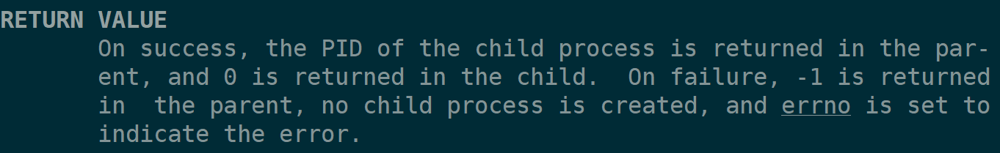
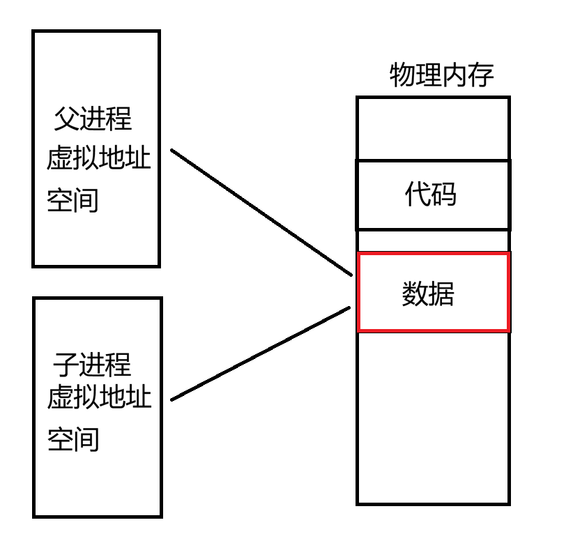
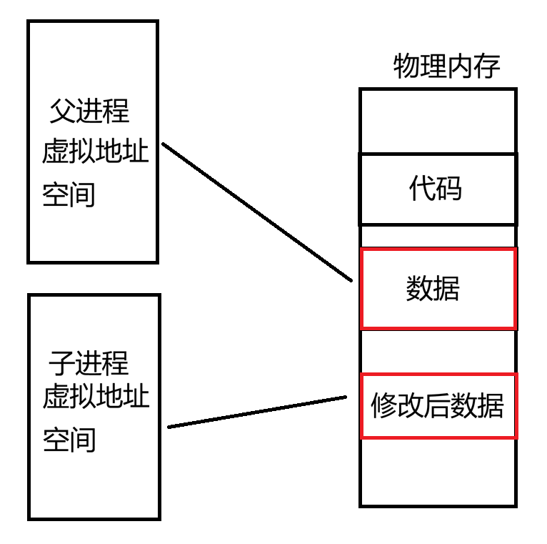
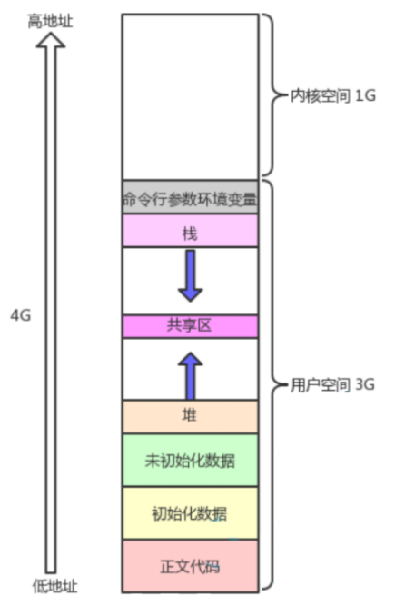
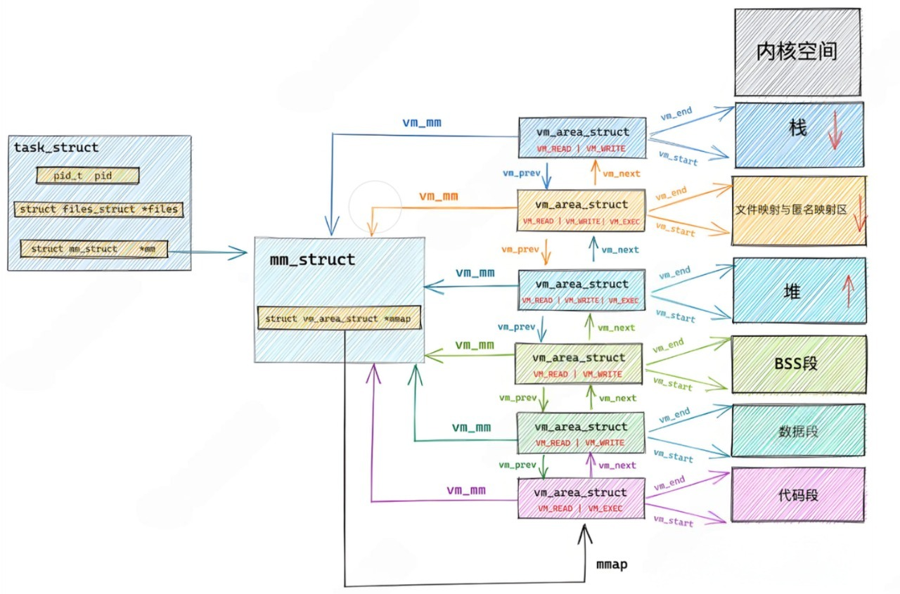

+++
date = 2026-04-25
title = "程序眼中的世界：一个由虚拟地址空间构建的幻觉"
description = ""
slug = ""
authors = []
tags = ["虚拟地址空间", "页表", "物理内存"]
series = ["Linux"]
featuredImage = "assets/cover.png"
toc = true
+++

# 程序眼中的世界：一个由虚拟地址空间构建的幻觉

> 原创 已于 2026-04-25 15:15:19 修改 · 公开 · 370 阅读 · 8 · 12 · 本内容遵循CC 4.0 BY-SA版权协议 版权声明：本文为博主原创文章，遵循 CC 4.0 BY-SA 版权协议，转载请附上原文出处链接和本声明。 GEO检测 · 编辑
> 文章链接：https://blog.csdn.net/2401_87889177/article/details/160088809

**文章目录**

[TOC]


本文旨在解释一些语言层面无法解释的现象，不会深入虚拟地址空间。
本文源码出自 [Linux2.26.18](https://www.kernel.org/pub/linux/kernel/v2.6/) 。

## 一、函数有两个返回值？

#### 观察现象

```c
#include<unistd.h>
#include<stdio.h>
int main()
{
    pid_t id = fork();
    if(id == 0)
    {
        printf("我的id是%d\n", id);
        printf("我是子进程，pid: %d, ppid: %d\n", getpid(), getppid());
        printf("===============================\n");
    }
    else
    {
        sleep(1);
        printf("我的id是%d\n", id);
        printf("我是父进程，pid: %d\n", getpid());
    }
    return 0;
}

```

我们有这样一段代码，作用是创建一个进程。这段的打印结果是

```shell
我的id是0
我是子进程，pid: 7013, ppid: 7012
===============================
我的id是7013
我是父进程，pid: 7012
```

看起来没有问题，但是仔细一想 `id` 怎么可能即等于0又不等于0呢。这两个id肯定是两个不同的变量。

我们在这里提出三个问题：

1. 这两个id是同一个变量吗？

2. id变量为什么即等于0又不等于0？

3. 为什么fork函数能够返回两个值？

#### 解释现象

```c
printf("我的id是%d, &id : %p\n", id, &id);
```

我们把原来打印id的语句换成这一句，然后输出如下

```shell
我的id是0, &id : 0x7ffec6b61fb4
我是子进程，pid: 7580, ppid: 7579
===============================
我的id是7580, &id : 0x7ffec6b61fb4
我是父进程，pid: 7579
```

可见，id的地址是一样的。如果id这个变量存在物理内存上，那么它是如何做到是两个不同的值。因此我们可以得出结论，这两个id是在不同的物理内存上的，那么，为什么它们输出的地址相同呢。

我们可以认为 `进程 = 内核数据结构 + 自己的代码与数据` ，这里的id是存在于一种叫做虚拟地址空间（有人也叫做进程地址空间、虚拟进程空间等）的数据结构中，每一个进程都有一个自己的虚拟地址空间，在32位机器上这个空间大小位4GB（地址编号0x00000000到0xffffffff)，这就是我们常说的内存地址。两个id位于不同的两个虚拟地址空间中，所以不是同一个变量。

在代码中，id位于不同的虚拟地址空间，所以能够做到值不一样，man手册是这样解释fork返回值的作用的。
 

在父进程中和子进程中不同值，是为了区分两个进程，达到分流的作用。

#### 理解本质

我们说到 `进程 = 内核数据结构 + 自己的代码与数据` ，那么创建一个进程的本质就是多一份内核数据结构和代码与数据。因此，当使用fork创建子进程时，task_struct会从父进程中复制一份，然后修改自己不同于父进程的部分（例如pid，ppid等）。

虚拟地址空间也要拷贝一份吗？操作系统是这样做的，所有进程的内核空间是共用的。用户空间中的只读数据是和父进程共享的。其余部分进行“写时拷贝”，即只在修改时拷贝修改的部分。

如图示，当没有修改操作时，父子进程共用数据。



子进程在修改数据之后，会将修改部分复制出来。这样就实现了虚拟地址空间中相同的变量不同的值，因为它们根本不在同一块物理内存中。



虚拟地址空间和物理进程空间是通过页表映射的，这里不做深入讨论。

## 二、理解虚拟地址空间

#### 如何理解‘虚拟’

有些人是这样说的：

> 它存在，你能看得见，它是物理的
> 它存在，你看不见，它是透明的
> 它不存在，你却看得见，它是虚拟的
> 它不存在，你也看不见，它被删除了

站在操作系统的角度来看，它将物理抽象出来了，让进程只能看见虚拟地址空间，能够保护物理内存。
站在程序员的角度来看，我们操作的地址都是虚拟地址空间的，不需要关注物理存储的细节。

#### 如何看待‘虚拟地址空间’

我们说每一个进程都会有一个虚拟地址空间，那么在执行ls这样的指令难道会在物理内存中开辟一个4GB空间，然后在物理内存和虚拟内存间进行一对一映射吗？答案是否定的。

可以将虚拟地址空间看作操作系统给进程画的大饼，让每一个进程都以为自己又4GB的虚拟地址空间，实际上的各个区域都不会有理论那么大。这张图是课本中的虚拟地址空间的图：



操作系统只需要记录每一个区域的起始和结束，就能够直到每一个进程的具体某个区域的大小了。

## 三、操作系统眼中的虚拟地址空间

#### 虚拟地址空间的结构体

我们说 `进程 = 内核数据结构 + 自己的代码与数据` ，那么，操作系统管理这些虚拟地址空间也要用数据结构来管理。

task_struct中有一个结构体指针 `struct mm_struct *mm` 指向的是描述虚拟地址空间的结构体

```c
struct mm_struct {
	struct vm_area_struct * mmap;		/* list of VMAs */
	...
	unsigned long total_vm, locked_vm, shared_vm, exec_vm;
	unsigned long stack_vm, reserved_vm, def_flags, nr_ptes;
	unsigned long start_code, end_code, start_data, end_data;
	unsigned long start_brk, brk, start_stack;
	unsigned long arg_start, arg_end, env_start, env_end;
	...
};
```

下面那一长段unsigned int（指针本质是4字节整形，地址也可以中unsigned long类型来存储）就是描述虚拟地址空间中真实的每个区域的大小，例如 `start_data` 和 `end_data` 就是标识代码段的起始和结束。

#### 链表结构描述每个区域

这个结构体中还有一个重要的结构体指针是 `struct vm_area_struct * mmap` ，用来描述虚拟地址空间的一个区域。它是一个链表结构。

```c
struct vm_area_struct {
	struct mm_struct * vm_mm;	/* The address space we belong to. */
	...
	struct vm_area_struct *vm_next;
	...
};
```

还要记录自己是哪个进程的虚拟地址空间区域，所以有一个指向structmm_struct的指针。

#### 总览虚拟地址空间数据结构



这幅图就是操作系统中对于虚拟地址空间的描述。

## 四、为什么要有虚拟地址空间

#### 安全性

当没有虚拟地址空间，多个进程同时操作物理内存时，万一指针越界访问或者解引用野指针，就极有可能访问或者修改到其他进程的数据。这是极度危险的。

#### 进程管理模块与内存管理模块解耦

解耦的体现有这两个方面：

1. 虚拟地址空间中每个数据的位置都是固定的，只需要将虚拟地址空间的数据和物理内存中的数据通过页表将两者关联，就能够实现程序数据加载到物理内存可以加载到位置每次都不同了。

2. malloc和new出来的空间，也有一定概论不会使用，这样只需要在虚拟地址空间告诉进程已经开辟好了，但物理内存中是在使用时才开辟。

#### 无序变有序

数据在物理内存中是无序的，但是在虚拟地址空间是有序的，是通过页表映射实现的。这样才能实现地址加减操作。